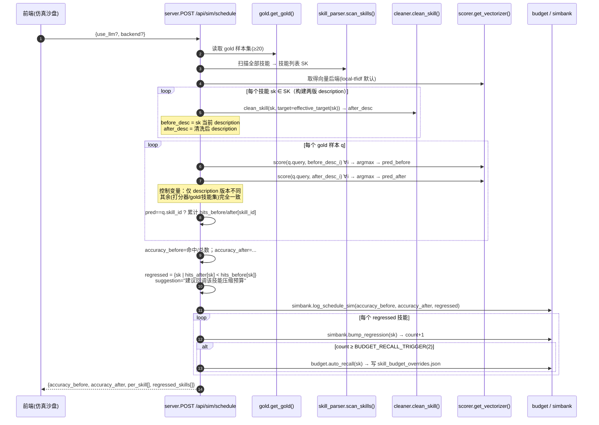
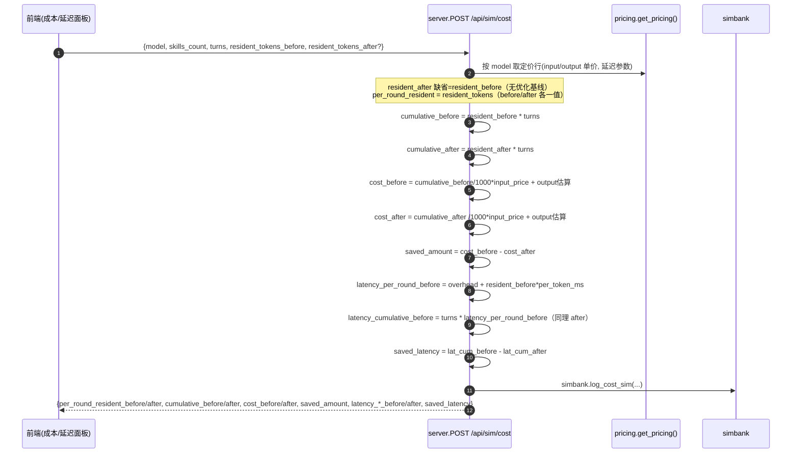
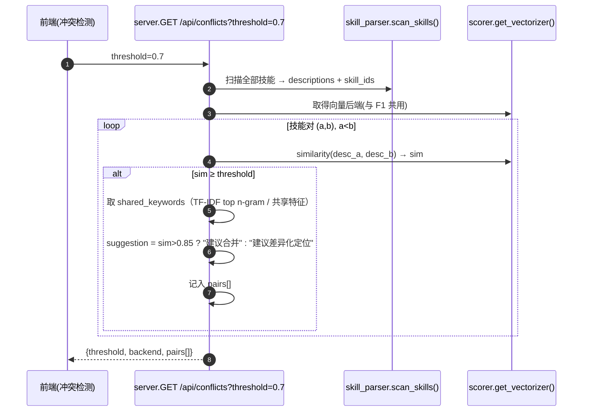
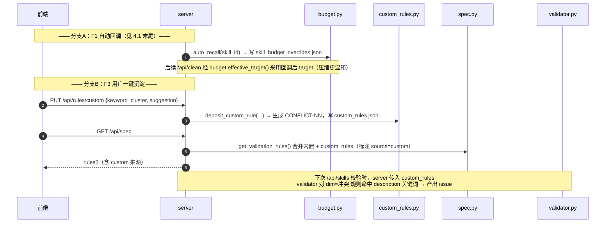
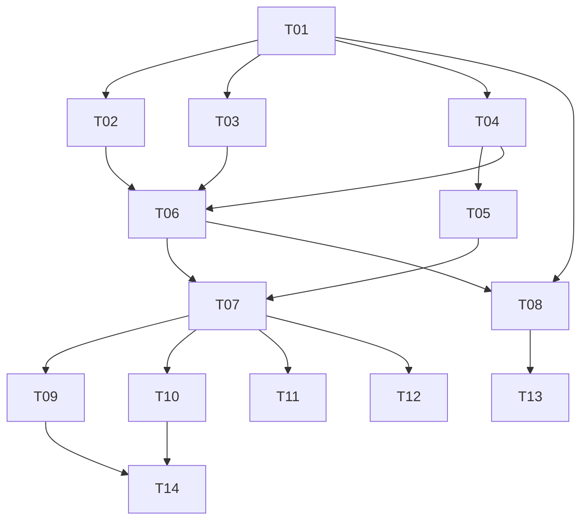

# SkillForge 自进化增量架构设计（arch-evo）

> 文档版本：ARCH-EVO-1.0　|　架构师：高见远（software-architect）
> 适用范围：在现有 SkillForge v1（FastAPI 后端 + 零构建原生前端）之上，增量实现 F1 调度反事实模拟器 / F2 Token→成本延迟仿真器 / F3 语义冲突检测，并落地"数据驱动"的自进化闭环。
> 约束：本文档只产出架构与任务分解，**不写实现代码**。所有待确认问题按 PRD §6 建议默认直接采用（Q1–Q8），不在本文重复讨论。

---

## 1. 实现方案 + 框架选型

### 1.1 核心难点

| 难点 | 说明 | 解法 |
|------|------|------|
| 离线相关性打分（F1/F3 共用） | 不能接真实 LLM/Agent，需确定性、可复现、零依赖的打分器 | 统一 `score/vectorizer` 接口；默认 `local-tfidf`（字符 n-gram + TF-IDF 余弦，纯 Python 实现），可选 `embedding`（urllib 调可配置 API） |
| 反事实控制变量 | "清洗前/后"必须仅 description 版本不同，其余（打分器、gold、技能集）完全一致 | F1 引擎对**同一份**技能解析结果，分别用"当前 description"与"cleaner 产出 description"各跑一遍 top-1 选择 |
| 回归抖动 | 单次模拟命中数下降不应立即回调预算 | 全局累计 `sim_regressions` 表，仅当某技能 `count≥2` 才自动回调（PRD Q4） |
| 配置可扩展、零依赖开箱 | gold / pricing / vectorizer / budget_overrides / custom_rules 必须可落盘、可编辑、缺失回退内置默认 | 全部放 `DATA_DIR`，新增模块统一"文件优先 → 内置默认"加载策略 |
| 闭环可审计 | 仿真信号要反哺清洗预算与校验规则 | SQLite 新表 `scheduling_sim` / `cost_sim` / `sim_regressions`；`skill_budget_overrides.json` 注入 cleaner；`custom_rules.json` 注入 spec/validator |

### 1.2 框架与库选型

- **后端**：继续沿用 **FastAPI**（0.115.0）+ **uvicorn**，零构建源码布局（`skillforge/` 包）。
- **前端**：继续沿用 **原生 HTML/CSS/JS**（零构建），新增「仿真沙盘」「冲突检测」两个视图，复用现有 `card / kpi / badge / tab / bar-row` 组件与 CSS 变量。
- **持久化**：复用现有 `DATA_DIR/skillforge.db`（SQLite，tracker 同库），仅新增 3 张表。
- **向量/打分**：纯 Python 实现 `local-tfidf`（字符 2–3 gram + 词频逆文档频 + 余弦相似度，仅用 `math` / `collections`），无需 numpy。embedding 后端仅用标准库 `urllib` 调 API。

### 1.3 依赖结论（重要）

> **本次增量零新增 pip 依赖。**
> `requirements.txt` 维持 `fastapi / uvicorn / pyyaml / tiktoken` 不变。所有新增能力（TF-IDF、余弦、SQLite 新表、JSON 配置、embedding 远程调用）均可用 Python 标准库 + 现有依赖完成，保证"克隆即跑、断网可运行"。

### 1.4 架构模式

保持现有"薄后端 + 原生前端"的单体结构，新增模块按职责分层：

```
scan_skills / get_skill_by_id (skill_parser)   ← 复用现有技能解析
        │
   ┌────┴───────────────────────────────────────────────┐
   │ 配置层   config.py（常量/路径） + DATA_DIR/*.json     │
   │ 能力层   scorer / gold / pricing / budget /          │
   │          custom_rules / simulator / simbank          │
   │ 接口层   server.py（新增 /api/sim/* 等 REST）         │
   └────────────────────────────────────────────────────┘
        │
   原生前端  index.html + app.js + style.css（两新视图）
```

---

## 2. 新增/修改文件列表（相对路径）

> 所有路径相对项目根 `skill-forge/`。`skillforge/` 为后端包，`frontend/` 为前端，`data/`（即 `DATA_DIR`）为运行时持久化目录。

### 2.1 后端新增模块（`skillforge/`）

| 文件 | 职责 |
|------|------|
| `skillforge/scorer.py` | **统一向量/打分后端**。定义抽象接口 `VectorizerBackend`，实现 `LocalTfidfBackend`（默认零依赖）与 `EmbeddingBackend`（可选）；提供 `get_vectorizer()` 工厂，按 `DATA_DIR/vectorizer.json` 选择后端。F1 的 `score(query, desc)` 与 F3 的 `similarity(a, b)` 共用同一实例。 |
| `skillforge/gold.py` | Gold 样本管理。`DEFAULT_GOLD`（内置 ≥20 条合成+典型样本）、`get_gold()`（优先读 `DATA_DIR/gold_samples.json`，缺失回退内置）、`set_gold(samples)`（校验后落盘）。 |
| `skillforge/pricing.py` | 模型定价表管理。`DEFAULT_PRICING`（内置 GPT-4o / Claude 3.5 Sonnet / 本地等快照价，标注日期与免责声明）、`get_pricing()`、`save_pricing(models)`（落盘 `DATA_DIR/pricing.json`）。 |
| `skillforge/budget.py` | 清洗预算覆盖管理。`load_overrides()`、`effective_target(skill_id)`（有覆盖取覆盖值，否则 `config.DESC_TARGET_TOKENS`）、`save_override(skill_id, target, reason)`（写 `DATA_DIR/skill_budget_overrides.json`）、`auto_recall(skill_id)`（回调一档 +20，封顶 `DESC_HARD_TOKENS`）。 |
| `skillforge/custom_rules.py` | 自定义校验规则沉淀。`load_custom_rules()`（读 `DATA_DIR/custom_rules.json`）、`deposit_custom_rule(rule)`（生成 `CONFLICT-*` id 并落盘）、`next_conflict_id()`。 |
| `skillforge/simulator.py` | **三大引擎 + 闭环逻辑**。F1 `run_schedule_sim()`、F2 `run_cost_sim()`、F3 `detect_conflicts()`；并在 F1 内调用 `simbank` 持久化 + `budget.auto_recall`（累计回归≥2 触发）。 |
| `skillforge/simbank.py` | 仿真结果持久化（复用 `config.DB_PATH` 同库）。建表 `scheduling_sim` / `cost_sim` / `sim_regressions`；提供 `log_schedule_sim()`、`log_cost_sim()`、`bump_regression()`、`get_regression()`、`get_schedule_trend()`、`get_cost_trend()`。 |

### 2.2 后端修改模块（`skillforge/`）

| 文件 | 修改点 |
|------|--------|
| `skillforge/config.py` | 新增常量与路径：`VECTORIZER_CONFIG`、`GOLD_PATH`、`PRICING_PATH`、`BUDGET_OVERRIDES_PATH`、`CUSTOM_RULES_PATH`、`CONFLICT_DEFAULT_THRESHOLD=0.7`、`CONFLICT_THRESHOLD_MIN=0.5`、`CONFLICT_THRESHOLD_MAX=0.95`、`BUDGET_RECALL_STEP=20`、`BUDGET_RECALL_TRIGGER=2`、`PRICING_AS_OF`（快照日期）。 |
| `skillforge/spec.py` | ① 将 `REDUNDANT-01` 文案改为动态读取 `config.DESC_HARD_TOKENS / DESC_TARGET_TOKENS`（消除 90/40 硬编码不一致，PRD Q5）；② 新增 `get_validation_rules()`，合并内置 `VALIDATION_RULES` 与 `custom_rules.load_custom_rules()` 并标注 `source=custom`。 |
| `skillforge/validator.py` | `validate(parsed, custom_rules=None)` 新增可选参数；对 `dim=="冲突"` 的自定义规则，检查 `keyword_cluster` 是否出现在 description 中，命中则产出 `warning/info` 级 issue（灰度可控，仅当传入 custom_rules 时生效）。 |
| `skillforge/cleaner.py` | 无需改函数签名（`clean_skill` 已支持 `target` 参数）；仅确认默认 target 走 `config.DESC_TARGET_TOKENS`。实际覆盖由 server 在调用前通过 `budget.effective_target()` 计算并传入。 |
| `skillforge/server.py` | 新增 9 类端点（见 §6）；`/api/clean` 改用 `budget.effective_target(skill_id)`；`/api/spec` 改用 `spec.get_validation_rules()`；`/api/skills`、`/api/skills/{id}` 的 `validate` 调用传入 `custom_rules`。 |
| `skillforge/__init__.py` | 版本号升至 `2.0.0-evo`（仅展示）。 |

### 2.3 前端修改（`frontend/`）

| 文件 | 修改点 |
|------|--------|
| `frontend/index.html` | 顶部导航新增「仿真沙盘」(`nav-sim`) 与「冲突检测」(`nav-conflicts`) 两个按钮；新增 `<section id="view-sim">` 与 `<section id="view-conflicts">` 两个视图骨架（内部子面板容器）。 |
| `frontend/app.js` | 新增 `bindSimNav()`、`renderSim()`（调度面板 + 成本面板，含 gold 导入导出、模型选择、slider、运行模拟、回调按钮）、`renderConflicts()`（冲突对列表、阈值 slider、沉淀按钮）；对接新端点；复用 `api() / toast() / el()`。 |
| `frontend/style.css` | 复用既有变量与组件；仅补充少量类（`.subtabs`、`.slider-row`、`.conflict-card`、`.kpi-sub`）以承载仿真/冲突视图布局，不引入新设计语言。 |

### 2.4 运行时持久化文件（`DATA_DIR/`，非代码，运行时生成）

| 文件 | 生成时机 | 说明 |
|------|----------|------|
| `data/gold_samples.json` | 首次 `POST/GET /api/sim/gold` 时若不存在则写入内置默认 | Gold 样本集（Q1） |
| `data/pricing.json` | 首次 `GET /api/sim/pricing` 时若不存在则写入内置快照价 | 模型定价表（Q2） |
| `data/vectorizer.json` | 用户切换后端时（`PUT /api/config/vectorizer`） | 向量后端配置（Q3） |
| `data/skill_budget_overrides.json` | 自动回调 / 手动回调时 | 清洗预算覆盖（Q4） |
| `data/custom_rules.json` | 用户沉淀冲突规则时（`PUT /api/rules/custom`） | 自定义校验规则（Q8） |
| `data/skillforge.db`（新增表） | 每次模拟运行时 | `scheduling_sim` / `cost_sim` / `sim_regressions`（Q7） |

---

## 3. 数据模型

### 3.1 SQLite 新增表 schema（复用 `skillforge.db`，建表 SQL）

```sql
-- 调度反事实模拟运行记录（F1 每次运行一行）
CREATE TABLE IF NOT EXISTS scheduling_sim (
    id               INTEGER PRIMARY KEY AUTOINCREMENT,
    ts               TEXT NOT NULL,
    accuracy_before  REAL,
    accuracy_after   REAL,
    regressed_skills TEXT,                 -- JSON 数组：["docx-editor", ...]
    note             TEXT
);

-- 成本/延迟仿真运行记录（F2 每次运行一行）
CREATE TABLE IF NOT EXISTS cost_sim (
    id                  INTEGER PRIMARY KEY AUTOINCREMENT,
    ts                  TEXT NOT NULL,
    model               TEXT,
    skills_count        INTEGER,
    turns               INTEGER,
    resident_before     INTEGER,
    resident_after      INTEGER,
    cost_before         REAL,
    cost_after          REAL,
    saved_amount        REAL,
    latency_before      REAL,             -- 每轮延迟(ms)
    latency_after       REAL,
    saved_latency       REAL
);

-- 回归技能累计表（闭环：累计≥2 自动回调预算）
CREATE TABLE IF NOT EXISTS sim_regressions (
    skill_id     TEXT PRIMARY KEY,
    count        INTEGER NOT NULL DEFAULT 0,
    last_target  INTEGER,
    updated_at   TEXT
);
```

> 实现：在 `simbank.py` 中复用 `tracker._conn()` 的连接方式（同一 `DB_PATH`，`executescript` 建表），不改动 `tracker.py` 既有 `events` 表。

### 3.2 JSON 配置文件 schema（统一放 `DATA_DIR`）

**`gold_samples.json`**（Q1，内置 ≥20 条，示例节选 3 条）
```json
[
  {
    "id": "g01",
    "query": "把本地 Word 文档改成可编辑内容",
    "skill_id": "docx-editor"
  },
  {
    "id": "g02",
    "query": "解析 PDF 提取里面的表格和文字",
    "skill_id": "pdf-reader"
  },
  {
    "id": "g03",
    "query": "用 Python 跑一个定时爬虫抓取网页",
    "skill_id": "web-crawler"
  }
]
```
> 内置默认集覆盖主流 WorkBuddy 内置技能（pdf / docx / xlsx / pptx / git / docker / web 等）+ 若干合成 query，保证 `count ≥ 20`。导入校验：缺 `query` 或 `skill_id` 即拒（400）。

**`pricing.json`**（Q2，快照价 + 免责声明）
```json
{
  "as_of": "2025-09",
  "disclaimer": "示例快照价，仅供仿真参考，实际请以各厂商官方为准。",
  "models": [
    {
      "model": "gpt-4o",
      "input_price_per_1k": 0.0025,
      "output_price_per_1k": 0.01,
      "latency_overhead_ms": 20,
      "latency_per_token_ms": 0.02,
      "context_window": 128000
    },
    {
      "model": "claude-3.5-sonnet",
      "input_price_per_1k": 0.003,
      "output_price_per_1k": 0.015,
      "latency_overhead_ms": 25,
      "latency_per_token_ms": 0.025,
      "context_window": 200000
    },
    {
      "model": "local-snapshot",
      "input_price_per_1k": 0,
      "output_price_per_1k": 0,
      "latency_overhead_ms": 2,
      "latency_per_token_ms": 0.002,
      "context_window": 32768
    }
  ]
}
```

**`vectorizer.json`**（Q3，默认 local-tfidf）
```json
{
  "backend": "local-tfidf",
  "embedding": {
    "api_url": "",
    "api_key_env": "EMBEDDING_API_KEY",
    "model": "text-embedding-3-small"
  }
}
```
> `backend` ∈ {`local-tfidf`, `embedding`}。切到 `embedding` 时若未配置 `api_url` 则回退 `local-tfidf` 并告警。

**`skill_budget_overrides.json`**（Q4，由闭环自动/手动写入）
```json
{
  "docx-editor": {
    "target": 80,
    "reason": "调度回归自动回调",
    "regress_count": 2,
    "updated_at": "2025-09-08T12:00:00+00:00"
  }
}
```
> `target` 初始值 = `DESC_TARGET_TOKENS + BUDGET_RECALL_STEP(20)`，每次自动回调再 +20，封顶 `DESC_HARD_TOKENS(120)`。

**`custom_rules.json`**（Q8，由冲突沉淀写入）
```json
[
  {
    "id": "CONFLICT-01",
    "dim": "冲突",
    "keyword_cluster": ["编辑", "文档", "写入"],
    "rule": "多个技能 description 不应同时高频包含 {编辑,文档,写入}，须差异化定位或合并。",
    "severity": "warning",
    "source": "conflict-detector"
  }
]
```

---

## 4. 程序调用流程（Mermaid 时序图）

### 4.1 F1 调度反事实模拟（含清洗前/后控制变量）



### 4.2 F2 Token→成本/延迟仿真



### 4.3 F3 语义冲突检测



### 4.4 闭环：回归自动回调预算 + 冲突沉淀为规则



---

## 5. 任务列表（有序、含依赖、按实现顺序）

> 粒度细化到工程师可直接落地；优先级 P0=必交付 / P1=重要；建议排期 M1(P0) → M2(P1)。

| 任务 | 名称 | 依赖 | 优先级 | 落地要点 |
|------|------|------|--------|----------|
| **T01** | 基础设施：配置常量 + SQLite 新表 schema | — | P0 | `config.py` 新增路径/阈值常量；`simbank.py` 建 `scheduling_sim/cost_sim/sim_regressions` 三表；确认零新增 pip 依赖 |
| **T02** | 向量/打分后端 `scorer.py` | T01 | P0 | 抽象接口 + `LocalTfidfBackend`（字符 2–3gram TF-IDF 余弦，纯 Python）+ `EmbeddingBackend`（urllib）；`get_vectorizer()` 工厂读 `vectorizer.json`，默认 local-tfidf |
| **T03** | Gold 样本 & 定价表管理（含内置默认数据） | T01 | P0 | `gold.py`（≥20 条内置样本 + 读写）、`pricing.py`（GPT-4o/Claude/本地快照价 + 读写）；落 `DATA_DIR` |
| **T04** | 预算覆盖 & 自定义规则模块 | T01 | P0 | `budget.py`（effective_target / save_override / auto_recall）、`custom_rules.py`（load / deposit / next_id） |
| **T05** | spec 口径统一 + 规则合并 | T04 | P0 | `spec.py` 中 `REDUNDANT-01` 改读 `config` 常量；新增 `get_validation_rules()` 合并 custom；`validator.py` 支持 `custom_rules` 参数 |
| **T06** | 仿真/冲突核心引擎 `simulator.py` | T02, T03, T04 | P0 | 实现 F1 `run_schedule_sim`（控制变量 + 回归判定 + 调 simbank/budget）、F2 `run_cost_sim`、F3 `detect_conflicts`（共享 vectorizer） |
| **T07** | 新增 REST 端点 `server.py` | T05, T06 | P0 | 见 §6 全部端点；`/api/clean` 用 effective_target；`/api/spec`、`/api/skills` 注入 custom_rules |
| **T08** | 仿真结果持久化（写/读联动） | T01, T06 | P1 | `simbank.log_*` 在 T06 引擎中调用；提供 `get_schedule_trend()` / `get_cost_trend()` 供看板 |
| **T09** | 仿真沙盘前端视图 | T07 | P0 | `index.html` + `app.js renderSim()`：gold 导入导出、模型选择、slider、运行调度/成本模拟、结果 KPI 与对比 |
| **T10** | 冲突检测前端视图 | T07 | P0 | `index.html` + `app.js renderConflicts()`：阈值 slider、冲突对卡片、重叠关键词、建议展示 |
| **T11** | 回归一键回调预算 UI | T07, T09 | P1 | 调度面板"回调该技能压缩预算"按钮 → `PUT /api/sim/budget`；回调后提示覆写生效 |
| **T12** | 冲突沉淀为规则 UI | T07, T10 | P1 | 冲突卡片"沉淀为新规则"按钮 → `PUT /api/rules/custom`；`/api/spec` 即时反映 custom |
| **T13** | 看板趋势联动 | T08 | P1 | 数据看板新增"调度准确率""成本节省"趋势卡，读 `simbank` 趋势；成本仿真初值取 `/api/skills` 全量 `desc_tokens` 之和（P1-1） |
| **T14** | 增强（P2，可选迭代） | T09, T10 | P2 | 多打分器横向对比、情景预设、冲突聚类视图、可解释调度 top-3、报告导出 |

> 任务依赖图（Mermaid）：



---

## 6. 关键接口契约（新增 REST 端点）

> 复用现有端点：`GET /api/skills`（全量技能，含 `desc_tokens`，用于成本仿真初值 & 冲突检测数据源）、`GET /api/skills/{id}`、`POST /api/clean`（本次改为支持预算覆盖）、`GET /api/spec`（本次改为返回合并规则）、`GET /api/health`。所有响应统一 `{...}` JSON；错误沿用 `HTTPException(detail=...)`（前端 `api()` 已处理）。

### 6.1 F1 — 调度反事实模拟

**GET `/api/sim/gold`**
- 响应：`{ "count": int, "samples": [ { "id": str, "query": str, "skill_id": str } ] }`

**POST `/api/sim/gold`**
- 请求体：`{ "samples": [ { "id"?, "query": str, "skill_id": str } ] }`
- 响应：`{ "count": int, "samples": [...] }`
- 错误：样本缺 `query`/`skill_id` → **400**

**POST `/api/sim/schedule`**
- 请求体（可选）：`{ "use_llm": bool=false, "backend": str? }`（backend 缺省走 `vectorizer.json`）
- 响应：
```json
{
  "accuracy_before": 0.82,
  "accuracy_after": 0.88,
  "per_skill": [
    { "skill_id": "pdf-reader", "hits_before": 8, "hits_after": 9, "delta": 1, "status": "improved" },
    { "skill_id": "docx-editor", "hits_before": 5, "hits_after": 3, "delta": -2, "status": "regressed" }
  ],
  "regressed_skills": [
    { "skill_id": "docx-editor", "hits_before": 5, "hits_after": 3, "suggestion": "建议回调该技能压缩预算" }
  ],
  "ran_at": "2025-09-08T12:00:00+00:00"
}
```
- 副作用：写 `scheduling_sim`；对 regressed 技能 `bump_regression`，`count≥2` 自动 `auto_recall` 写 `skill_budget_overrides.json`

### 6.2 F2 — 成本/延迟仿真

**GET `/api/sim/pricing`**
- 响应：`{ "as_of": str, "disclaimer": str, "models": [ { "model": str, "input_price_per_1k": float, "output_price_per_1k": float, "latency_overhead_ms": float, "latency_per_token_ms": float, "context_window": int } ] }`（≥3 条，本地模型 `input_price_per_1k=0`）

**PUT `/api/sim/pricing`**
- 请求体：`{ "models": [ ... ] }`
- 响应：`{ "models": [...] }`（持久化 `pricing.json`）

**POST `/api/sim/cost`**
- 请求体：`{ "model": str, "skills_count": int, "turns": int, "resident_tokens_before": int, "resident_tokens_after"?: int }`
- 响应：
```json
{
  "per_round_resident_before": 1200,
  "per_round_resident_after": 480,
  "cumulative_before": 1200000,
  "cumulative_after": 480000,
  "cost_before": 3.0,
  "cost_after": 1.2,
  "saved_amount": 1.8,
  "latency_per_round_before": 44.0,
  "latency_per_round_after": 29.6,
  "latency_cumulative_before": 44000.0,
  "latency_cumulative_after": 29600.0,
  "saved_latency": 14400.0
}
```
- 公式：`saved_amount = cost_before - cost_after`；`latency_cumul = turns * (overhead + resident * per_token_ms)`；`resident_after < before ⇒ saved_amount>0 且 saved_latency>0`

### 6.3 F3 — 语义冲突检测

**GET `/api/conflicts?threshold=0.7`**
- 响应：
```json
{
  "threshold": 0.7,
  "backend": "local-tfidf",
  "pairs": [
    {
      "skill_a": "docx-editor",
      "skill_b": "office-writer",
      "similarity": 0.83,
      "shared_keywords": ["编辑", "文档", "写入"],
      "suggestion": "建议差异化定位（前者偏编辑、后者偏生成）或合并"
    }
  ]
}
```
- 阈值经 query 即时重算；零依赖（未配 embedding）仍可产出

### 6.4 闭环 — 规则沉淀 / 后端配置 / 预算回调

**PUT `/api/rules/custom`**
- 请求体：`{ "keyword_cluster": [str], "suggestion": str, "rule"?: str, "severity"?: "warning"|"info" }`
- 响应：`{ "rule": { "id": "CONFLICT-01", "dim": "冲突", "keyword_cluster": [...], "rule": str, "severity": str, "source": "conflict-detector" } }`（落 `custom_rules.json`）

**GET `/api/config/vectorizer`**
- 响应：`{ "backend": "local-tfidf", "embedding": { "api_url": str, "api_key_env": str, "model": str } }`

**PUT `/api/config/vectorizer`**
- 请求体：`{ "backend": "local-tfidf"|"embedding", "embedding"?: {...} }`
- 响应：同 GET（落 `vectorizer.json`；embedding 未配 `api_url` 时回退 local-tfidf）

**PUT `/api/sim/budget`**（P1-2 手动回调 / 覆盖）
- 请求体：`{ "skill_id": str, "target"?: int }`（`target` 缺省 = `effective_target + STEP`）
- 响应：`{ "skill_id": str, "target": int, "regress_count": int }`（落 `skill_budget_overrides.json`）

### 6.5 复用现有端点的改造点

| 端点 | 改造 |
|------|------|
| `POST /api/clean` | 调用前 `target = budget.effective_target(skill_id)` 传入 `clean_skill(..., target=target)`，使闭环回调的 budget 生效 |
| `GET /api/spec` | 返回 `spec.get_validation_rules()`（合并内置 + custom_rules，标注 `source`） |
| `GET /api/skills` / `GET /api/skills/{id}` | `validate(parsed, custom_rules=load_custom_rules())`，使沉淀的冲突规则进入校验 |

---

## 7. 共享知识（跨文件约定）

### 7.1 `score` / `vectorizer` 接口签名（F1/F3 共用）

```python
# scorer.py
class VectorizerBackend:
    def score(self, query: str, description: str) -> float:
        """返回 [0,1]，query 与单条 description 的相关度（F1 选技能用）。"""
        ...
    def similarity(self, a: str, b: str) -> float:
        """返回 [0,1]，两条 description 的语义相似度（F3 冲突检测用）。"""
        ...

def get_vectorizer() -> VectorizerBackend:
    """读 DATA_DIR/vectorizer.json；backend='embedding' 且已配 api_url 时用 EmbeddingBackend，否则 LocalTfidfBackend。"""
    ...
```
- **确定性**：同一 `query+desc` 在同后端下多次打分结果稳定（TF-IDF 拟合一次后复用；embedding 走远程但同一输入幂等）。
- **F1/F3 共用**：两功能都通过 `get_vectorizer()` 取得同一后端实例；F1 用 `score()`，F3 用 `similarity()`，互不耦合。

### 7.2 配置加载顺序（统一"文件优先 → 内置默认"）

```
读取顺序：
  1) DATA_DIR/<file>.json 是否存在？
      是 → 解析并校验 → 使用
      否 → 使用模块内置 DEFAULT_*（gold / pricing / vectorizer / overrides 空 / custom_rules 空）
  2) 专属回退：vectorizer backend='embedding' 但缺 api_url → 回退 local-tfidf
               pricing 缺本地模型 → 始终补一条 local-snapshot(input=0) 作对照基线
```
> 所有配置模块（`gold/pricing/budget/custom_rules`）遵循此顺序，保证"零依赖开箱即跑"。

### 7.3 `budget_overrides` 如何影响 cleaner

```
server.POST /api/clean:
    target = budget.effective_target(skill_id)   # 有覆盖取覆盖值，否则 DESC_TARGET_TOKENS(60)
    result = cleaner.clean_skill(parsed, target=target)
# 自动回调：simulator 内 sim_regressions.count≥2 → budget.auto_recall(skill_id)
#   auto_recall: target = min(DESC_HARD_TOKENS, (当前覆盖或60) + 20); 写 skill_budget_overrides.json
# 效果：回归技能后续清洗更温和（压得更少），实现"不伤调度前提下的最大压缩"
```

### 7.4 `custom_rules` 如何注入 validator / spec

```
custom_rules.deposit_custom_rule(...) → 写 DATA_DIR/custom_rules.json（id=CONFLICT-NN, source=conflict-detector）

spec.get_validation_rules():
    rules = list(VALIDATION_RULES)                      # 内置
    for r in custom_rules.load_custom_rules():
        r["source"] = "custom"
        rules.append(r)
    return rules
# server.GET /api/spec → 返回合并后 rules（前端即时可见 custom 来源）

validator.validate(parsed, custom_rules=None):
    if custom_rules:
        for r in custom_rules where r["dim"]=="冲突":
            if any(kw in description for kw in r["keyword_cluster"]):
                issue(code=r["id"], severity=r["severity"], field="description",
                      message=f"与 {r['keyword_cluster']} 高度重叠，可能与其他技能冲突",
                      suggestion=r["rule"])
# 灰度可控：仅当 server 传入 custom_rules 时生效；未沉淀则不影响既有校验
```

---

## 8. 风险与待明确事项

> 以下为已识别风险；PRD §6 的 Q1–Q8 已按建议默认拍板，不再列出。

| 项 | 风险 / 待明确 | 缓解 / 建议 |
|----|---------------|-------------|
| R1 | `local-tfidf` 对极短 description（清洗后可能仅一句话）区分度有限，F1 选对率可能与真实 Agent 有偏差 | 默认即"离线近似"，UI 明确标注"模拟估计，非真实调度"；P2 提供 embedding 对比（P2-1）辅助校准 |
| R2 | 内置 ≥20 条 gold 样本的 `skill_id` 依赖用户实际安装的技能名；若用户技能集与内置样本不匹配，F1 命中率偏低 | gold 支持导入自有样本（Q1）；命中率按"样本正确技能是否在当前技能集中"做可用性提示，缺失技能的样本自动跳过并标注 |
| R3 | `auto_recall` 上调预算后若用户从未再跑 `/api/clean`，覆盖值长期滞留 | `skill_budget_overrides.json` 提供 `reason/updated_at/regress_count` 留痕；后续可加"清除覆盖"操作（P2） |
| R4 | 自定义冲突规则进 validator 可能为误报（关键词共现≠真冲突） | 默认 `severity=warning`；仅 `dim=冲突` 规则触发，且灰度可控（不传 custom_rules 不生效）；沉淀前用户在 F3 侧已人工确认 |
| R5 | 成本仿真 `output_price_per_1k` 与输出 token 估算在 PRD 中未给精确公式 | 本设计采用"常驻 token 折算金额"为主（`cost = cumulative_resident/1000 * input_price`），output 仅当提供时附加，避免臆造输出量；UI 注明"按常驻上下文估算" |
| R6 | SQLite 并发写入（多次模拟 + tracker 同时写） | 沿用 tracker 的单连接 `connect + executescript + commit + close` 模式，模拟为低频人工触发，冲突概率低；必要时串行化写入 |
| R7 | `spec` 文案改动态读取后，前端/报告若硬编码旧值需同步 | 已统一走 `get_validation_rules()`；`REDUNDANT-01` 文案仅在 `spec.py` 生成，前端只读 API |

---

> 交付物对应：本文档即 `docs/arch-evo.md`，覆盖实现方案、文件列表、数据模型（SQL+JSON schema）、调用时序（F1/F2/F3/闭环）、任务分解（T01–T14）、接口契约、共享知识、风险事项，可直接作为工程师落地指南。
