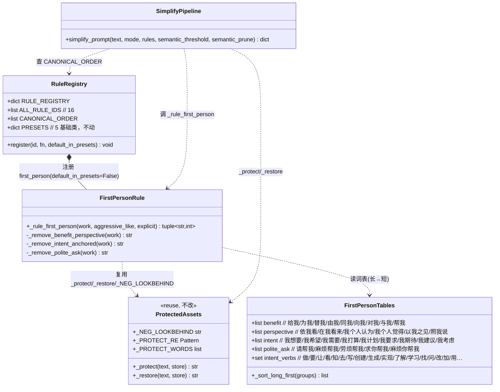
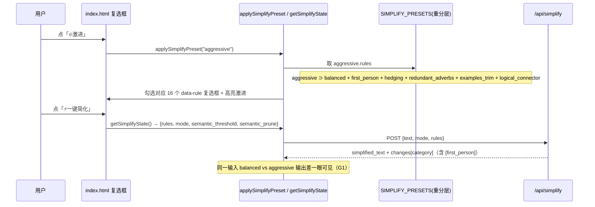
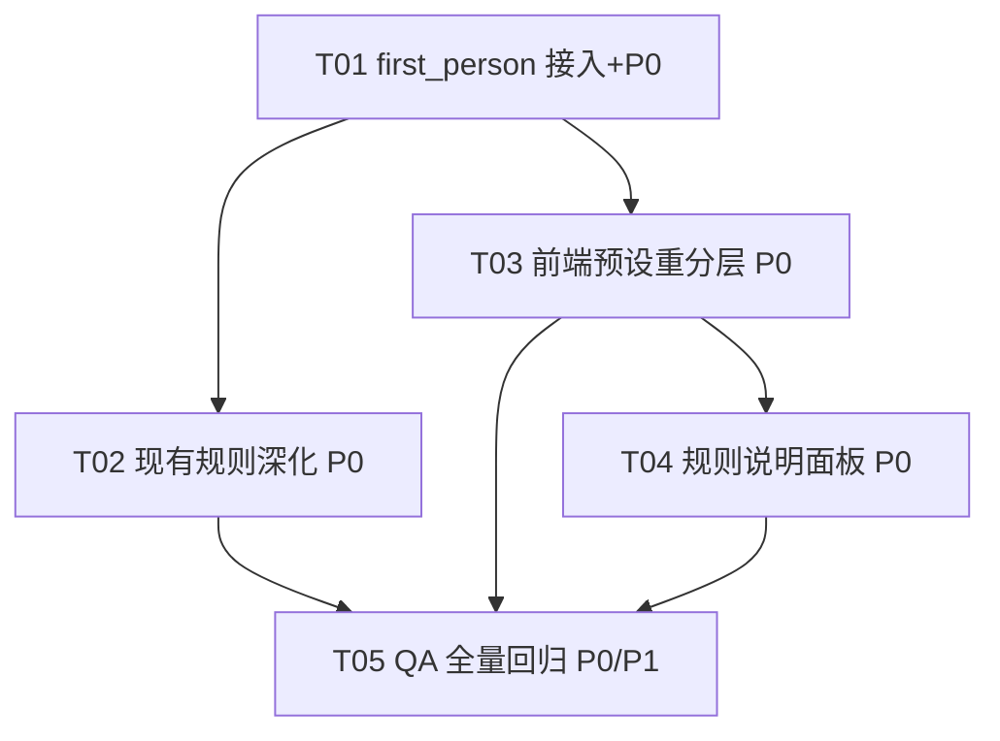

# 架构设计 · SkillForge 通用 Prompt 简化器（增量 evo2-11 · 规则规范化）

> 版本线：2.10-evo → 2.11-evo（版本号由主理人处理 `__init__`，本增量仅产出架构 + 任务分解）。
> 范围仅限「通用 Prompt 简化器」：`prompt_simplifier.py` / `/api/simplify` / 前端「简化」视图。不动 `cleaner.py` / SKILL.md 清洗。
> 本增量叠加于 v2.10 之上：15 类规则、`PRESETS`（5 基础类）、保护机制、`explicit = (rules is not None)` 契约一律沿用。
> 硬契约：`rules is None` 时后端走 `PRESETS`，`simplified_text` 必须逐字等于 v2.5。

---

## 1. 实现方案 + 框架选型

### 1.1 技术难点与选型

| 难点 | 方案 | 依据 |
|---|---|---|
| 消除第一人称自指冗余，且零误删 | 短语级 `replace` + 长词优先排序 + "我想"动词锚定正则 + 复用 `_NEG_LOOKBEHIND` 否定护栏 | 复用现有资产，不新增依赖 |
| 模式差异需"一眼可见" | **唯一落点 = 前端 `SIMPLIFY_PRESETS` 重分层**（aggressive 严格 ⊃ balanced + 追加类别 + 同类更深）；后端 `PRESETS` 不动 | 零回归红线：后端 `rules=None` 路径输出不可变 |
| 现有 15 条规则筛选标准规范化、深化 | hedging 去"应该"、redundant_adverbs 区分性保护、meta_comment 纯过渡才删、logical_connector 无序列表序列词保护 | 全部复用 `_protect/_restore/_NEG_LOOKBEHIND/_PROTECT_RE/_PROTECT_WORDS` |
| 前端规则可枚举展示 | 新增 `RULE_META` 16 类元数据表（筛选标准/命中示例/保留边界），由"规则说明"面板渲染 | 原生 JS，零构建 |

**框架选型结论**：
- 后端：**纯 Python 标准库 + 现有 `tokenizer` / `scorer`**，零新增 pip 运行时依赖（红线 C-1）。
- 前端：**原生 HTML/CSS/JS（零构建）**，无框架、无打包器。
- 架构模式：沿用现有「注册表 + 预设 + 管道」模式（`RULE_REGISTRY` / `PRESETS` / `CANONICAL_ORDER` / `simplify_prompt` 主循环），**增量仅扩展，不重构**。

### 1.2 复用资产清单（来自 `prompt_simplifier.py`，禁止重写）

- `_protect(text, store)` / `_restore(text, store)`：代码块/URL/行内代码/含「请」安全词冻结与还原。
- `_NEG_LOOKBEHIND`：1–3 字否定辖域前瞻（`不没别未无莫非勿`），first_person 与深化规则共用。
- `_PROTECT_RE` / `_PROTECT_WORDS`：冻结代码/URL/安全词，规则内部不触碰。
- `_tag(change, category, explicit)`：仅 `explicit=True` 时附加 `[category]` 标签，保障 `rules=None` 纯文本格式。
- `_CN_FILLERS_EXPANDED`：explicit 路径叠加的礼貌扩展集（含"帮我"等），first_person 与之存在词条重叠但执行顺序保证幂等。

---

## 2. 文件清单及相对路径（改动文件）

| 文件 | 改动类型 | 说明 |
|---|---|---|
| `skillforge/prompt_simplifier.py` | 修改 | 新增 `first_person` 词表 + `_rule_first_person`；`ALL_RULE_IDS`(15→16)、`CANONICAL_ORDER`（politeness 后插 first_person）、`RULE_REGISTRY`(+first_person, default_in_presets:False) 三处同步；`simplify_prompt` 主循环在 politeness 后插入 first_person 分支；深化 hedging/redundant_adverbs/meta_comment/logical_connector。**`PRESETS` 不动。** |
| `skillforge/server.py` | **不改** | `/api/simplify` 已透传 `rules`，`first_person` 经 `rules` 显式下发即生效，契约无变化。 |
| `frontend/app.js` | 修改 | `SIMPLIFY_RULE_IDS`(15→16)；`SIMPLIFY_PRESETS` 按 §5 重分层；新增 `RULE_META`（16 类元数据）；`localStorage` key 升 `v2_11`（迁移 `v2_9`/`v2_8`）。`getSimplifyState`/`doSimplify` 逻辑不变（仍读复选框）。 |
| `frontend/index.html` | 修改 | 「进阶精简」分组新增 `data-rule="first_person"` 复选框；新增"规则说明"展开区容器（`RULE_META` 由 JS 渲染）；更新预设说明文字（因 Q2 logical_connector 移出 balanced）。 |
| `tests/test_simplify_rules.py` | 修改 | 更新 `test_all_rule_ids_exact`(16)；`test_new_rule_ids_registered_not_in_presets` 增 first_person；新增 first_person 删/留、模式差异、深化、零回归测试（见 §5 / PRD §⑪）。 |
| `docs/arch-evo2-11.md` | 新增 | 本架构文档。 |

> 提交规范：Hyhyhyyy-only 提交，无 `Co-Authored-By`；不触碰 `nul` / `run.bat`（红线 C-3/C-4）。

---

## 3. 数据结构与接口

### 3.1 类图 / 字典结构（Mermaid）



### 3.2 `first_person` 词表组织（数据，长词优先）

四类词表，每类**按长度降序**排列避免短串误匹长串；"我想"因需动词锚定，不入 `intent` 的短语 replace 表，改用专项正则。

```python
# 第一人称自指冗余词表（长→短排序；短语级 replace；否定护栏复用 _NEG_LOOKBEHIND）
_FIRST_PERSON = {
    # 受益 / 对象标记（均 2 字，无重叠，顺序无关）
    "benefit":    ["给我", "为我", "替我", "由我", "同我", "向我", "对我", "与我", "帮我"],
    # 视角 / 意见标记（长→短）
    "perspective":["以我之见", "我个人觉得", "我个人认为", "在我看来", "依我看", "照我说"],
    # 意愿 / 需求标记（3 字在前，裸"我想"由动词锚定专项处理，不在此表）
    "intent":     ["我想要", "我希望", "我需要", "我打算", "我计划", "我要求",
                   "我期待", "我建议", "我考虑"],
    # 客套求助（长→短）
    "polite_ask": ["请帮我", "麻烦帮我", "劳烦帮我", "求你帮我", "麻烦你帮我"],
}
# "我想" 动词锚定集：仅当 "我想" 紧接下列动词之一才删（避免误删"我想你/我想家"）
_FIRST_PERSON_INTENT_VERBS = {
    "做","要","让","看","知","去","写","创","生","实","了","学","找","问",
    "改","加","用","试","听","说","想","看","帮","得","会","能","懂","搞","弄",
}
```

> **与 politeness 的责任切分（避免重复计数）**：`benefit` 中的"帮我"、`polite_ask` 中的"请帮我/麻烦帮我"在 explicit 路径已被 `politeness(_CN_FILLERS_EXPANDED)` 覆盖；因 `first_person` 在 `politeness` **之后**执行且删除幂等，这些词被 politeness 抢先后 first_person 自然不匹配——不产生重复计数或语义破坏。规则说明面板将标注其"双重归属"。

### 3.3 `_rule_first_person` 函数签名与返回

```python
def _rule_first_person(work: str, aggressive_like: bool, explicit: bool = False) -> tuple[str, int]:
    """第一人称自指冗余移除（explicit-only 由调用方控制；不进 PRESETS）。

    返回 (work, count)：
      - work: 移除自指标记后的文本（保护片段已由外层 _protect 冻结为占位符，本函数不触碰）。
      - count: 本规则移除的短语命中数（供 changes 日志 + _tag 标记）。
    实现顺序（均在 _NEG_LOOKBEHIND 否定护栏下）：
      1) benefit/perspective/polite_ask：长→短短语级 replace；
      2) intent（除"我想"）：长→短短语级 replace；
      3) "我想" + 动词锚定：正则 我想(?=[VERB_SET]) 仅删"我想"留动词。
    裸字"我"默认不删（仅在明确受益/意愿构式中才删），降低误删。
    """
```

### 3.4 与 `RULE_REGISTRY` 的接入方式

- `ALL_RULE_IDS`：在 `"politeness"` 后插入 `"first_person"`（15→16）。
- `CANONICAL_ORDER`：在 `"politeness"` 与 `"role_prefix"` 之间插入 `"first_person"`，使"请给我X"→politeness 删"请"→first_person 删"给我"→"X"（见 Q4）。
- `RULE_REGISTRY`：新增 `"first_person": {"fn": _rule_first_person, "default_in_presets": False}`。
- `PRESETS`：**完全不动**（维持 5 基础类，保障 `rules=None` ≡ v2.5）。
- `simplify_prompt` 主循环：在 politeness 分支后插入：
  ```python
  if "first_person" in rule_ids:
      work, n = _rule_first_person(work, aggressive_like, explicit)
      if n:
          changes.append(_tag(f"移除 {n} 处第一人称自指标记", "first_person", explicit))
  ```

---

## 4. 程序调用流程

### 4.1 后端 `simplify_prompt` 主循环（重点：first_person 插入点 + CANONICAL_ORDER）

```mermaid
sequenceDiagram
    participant U as 前端 / API
    participant SP as simplify_prompt
    participant PR as _protect / _restore
    participant REG as RULE_REGISTRY
    participant POL as _rule_politeness
    participant FP as _rule_first_person
    participant OTH as 其余规则(meta/hedging/...)

    U->>SP: simplify_prompt(text, mode, rules)
    SP->>SP: explicit = (rules is not None); aggressive_like = (mode=="aggressive")
    SP->>PR: _protect(original) + _protect_words(含请安全词)
    alt rules is None
        SP->>REG: PRESETS[mode]  → 5 基础类（≡v2.5，无 first_person）
    else rules 下发(list)
        SP->>REG: 过滤非法 + 按 CANONICAL_ORDER 排序
    end
    Note over SP: empty_items → duplicate_lines → duplicate_clauses → blank_lines
    SP->>POL: _rule_politeness(work, aggressive_like, explicit)
    POL-->>SP: work（删 请/帮我/您…；aggressive 叠加激进词表）
    SP->>FP: _rule_first_person(work, aggressive_like, explicit)
    FP-->>SP: work（删 给我/和我/依我看/我想…；Q4 后得 "X"）
    SP->>OTH: role_prefix → meta_comment → hedging → redundant_adverbs → examples_trim → logical_connector → filler_particles → punctuation_*
    SP->>PR: _restore(work) → 折叠/清理空行
    SP-->>U: {simplified_text, changes[category], tokens...}
```

### 4.2 前端 `SIMPLIFY_PRESETS` 重分层后 `getSimplifyState` / `doSimplify` 流转



---

## 5. 任务列表（有序、含依赖、按实现顺序）

> 硬约束：≤5 任务；按模块/层次分组；T01 为基础真源改动，其余依赖之。每个任务标注源文件与优先级（P0/P1/P2）。

### T01 — [P0] 后端：first_person 规则接入 + 三处真源同步
- **源文件**：`skillforge/prompt_simplifier.py`、`tests/test_simplify_rules.py`
- **依赖**：无
- **内容**：新增 `_FIRST_PERSON` / `_FIRST_PERSON_INTENT_VERBS` 词表（§3.2）；实现 `_rule_first_person`（签名见 §3.3）；`ALL_RULE_IDS`(15→16)、`CANONICAL_ORDER`（politeness 后插 first_person）、`RULE_REGISTRY`(+first_person, default_in_presets:False) 三处同步；`simplify_prompt` 主循环在 politeness 后插入 first_person 分支并 `_tag`；**`PRESETS` 不动**。测试：`test_all_rule_ids_exact` 更新为 16、`test_new_rule_ids_registered_not_in_presets` 增 first_person、新增 `test_first_person_removes_geiwo` / `test_first_person_keeps_wode` / `test_first_person_negated_preserved`。
- **优先级**：P0

### T02 — [P0] 后端：现有规则深化（P0-3）+ 无序列表序列词保护（P1-2）
- **源文件**：`skillforge/prompt_simplifier.py`、`tests/test_simplify_rules.py`
- **依赖**：T01
- **内容**：① hedging：从 `_HEDGING += [...]` 列表**移除"应该"**（强约束保护，`test_hedging_no_delete_yinggai_constraint`）；② redundant_adverbs：对"完全/绝对/彻底/十分/非常/极其"加区分性保护——后接"不同/相反/独立/新的/差异/区别/区分"时不删（正向前瞻）；③ meta_comment：对"需要注意的是/值得注意的是/明确地说/具体来说/具体而言"仅当句首且后接 `，`/`。` 才删；④ logical_connector：将无序列表行（`^\s*[-*•+]\s`）也纳入 `_SEQUENCE_CONNECTORS` 局部哨兵保护（P1-2）。测试：`test_hedging_keeps_yinggai_constraint` / `test_redundant_adverbs_keeps_discriminative` / `test_meta_comment_strict_transition_only` / `test_logical_connector_unordered_list_protected`。
- **优先级**：P0（P1-2 可标后续）

### T03 — [P0] 前端：规则真源同步 + 预设重分层 + localStorage 升版
- **源文件**：`frontend/app.js`、`frontend/index.html`
- **依赖**：T01（需 `ALL_RULE_IDS` 真源=16）
- **内容**：`app.js` 中 `SIMPLIFY_RULE_IDS` 在 `"politeness"` 后加 `"first_person"`（15→16），与后端逐字一致；`SIMPLIFY_PRESETS` 按 §5.1（Design A）重分层——balanced={5 基础 + meta_comment + filler_particles + duplicate_clauses + punctuation_compress + punctuation_normalize}（**不含 logical_connector**），aggressive = balanced ∪ {first_person, hedging, redundant_adverbs, examples_trim, logical_connector}（15，严格 ⊃）；`localStorage` key 升 `skillforge_simplify_v2_11`（迁移 `v2_9`/`v2_8`）。`index.html`：「进阶精简」分组新增 `data-rule="first_person"` 复选框；更新预设说明文字（line 95）反映 logical_connector 已移出 balanced。
- **优先级**：P0

### T04 — [P0] 前端：规则说明面板（P0-4，可枚举展示 16 类）
- **源文件**：`frontend/index.html`、`frontend/app.js`
- **依赖**：T03
- **内容**：`app.js` 新增 `RULE_META`（16 类，每类含 `{id, name, group, criteria, remove_examples, keep_examples, explicit_only, in_balanced, in_aggressive}`）；`index.html` 新增"规则说明"展开区容器（`<details>`），由 JS 从 `RULE_META` 渲染——逐条展示筛选标准/命中示例/保留边界，满足用户"全部列出来"（US-3）。`first_person` 条目标注与 politeness 的双重归属。
- **优先级**：P0

### T05 — [P0/P1] QA：全量回归 + 新规则 / 深化 / 模式差异测试
- **源文件**：`tests/test_simplify_rules.py`
- **依赖**：T01、T02、T03、T04
- **内容**：`test_rules_none_zero_regression`（PRESETS 仍 5 类、输出逐字 v2.5）、`test_mode_difference_perceptible`（同输入 balanced/aggressive 输出差一眼可见）、`test_all_rule_ids_exact`（15→16）、深化回归（T02 各测试）、前端预设一致性（aggressive ⊃ balanced 断言）。全量 `pytest` 须绿。
- **优先级**：P0

### 任务依赖图



---

## 6. 依赖包列表（红线 C-1：零新增）

```
无新增 pip 运行时依赖。
仅 Python 标准库（re / math）+ 现有 skillforge.tokenizer / skillforge.scorer。
前端零构建（原生 HTML/CSS/JS），无 npm 包。
```

---

## 7. 共享知识（跨文件约定）

1. **`explicit` 语义**：`explicit = (rules is not None)`。仅此标志控制"扩展词表叠加 / 单字「请」移除 / 新类别生效"；`rules=None` 永远等价 v2.5。
2. **`rules=None` 零回归契约**：后端走 `PRESETS`（仅 5 基础类），`simplified_text` 逐字 ≡ v2.5；任何 v2.11 新增行为不得改变该路径输出。
3. **新规则一律 `default_in_presets: False`**：`first_person` 及所有深化均不进 `PRESETS`；由前端默认勾选 + 显式下发 `rules` 生效。
4. **三处同步**：新增规则须同步 `ALL_RULE_IDS` / `CANONICAL_ORDER` / `RULE_REGISTRY` 三处（缺一不可，否则排序/注册/测试错位）。
5. **`_tag(..., explicit)` 标记**：变更日志仅在 `explicit=True` 时附 `[category]`，保障 `rules=None` 纯文本格式（parity 关键）。
6. **前后端真源一致**：前端 `SIMPLIFY_RULE_IDS` 必须与后端 `ALL_RULE_IDS` **逐字一致**（本次 15→16）。任何一端增删规则需同步另一端。
7. **`localStorage` key 升 `v2_11`**：`skillforge_simplify_v2_11`，迁移 `v2_9`/`v2_8`（用仍存在的 id 过滤后应用并写回）。
8. **politeness / first_person 分工**：politeness 管"对模型的客套/指令语气"（您/请/谢谢/你应该）；first_person 管"说话人自己的冗余自指标记"（给我/和我/依我看/我想）；可同开、互不替代。
9. **否定护栏复用**：first_person 与 hedging/redundant_adverbs 共用 `_NEG_LOOKBEHIND`（1–3 字辖域），被 `不没别未无莫非勿` 辖域覆盖的词不删。
10. **变更日志格式**：`"{动作} {n} 处{category描述} [category]"`（explicit 时），如 `移除 2 处第一人称自指标记 [first_person]`。

---

## 8. 待明确事项（PRD §⑨ Q1–Q5 推荐默认值 + 理由）

> 以下为架构师推荐默认值，供主理人/用户拍板。所有推荐均服从零回归红线与"复用现有资产"约束。

### Q1 · `first_person` 是否仅进 aggressive 预设？
- **推荐：仅进 aggressive，balanced 默认不含（保留自指 = 保守语义）。**
- 理由：① 与 §④ 原则 B（balanced 不做自指深度清理）一致；② 使 aggressive 在"类别集合"层比 balanced 多 4–5 类，差异一眼可见（G1）；③ 用户原话"给我/和我 为什么还在"可通过切换激进模式解决，而非破坏保守默认。balanced 用户仍可在复选框手动勾选 first_person。

### Q2 · `logical_connector` 是否从 balanced 移到 aggressive-only？
- **推荐：移出 balanced（adoption Design A，§5.1 表）。** 即 balanced={…不含 logical_connector}，aggressive ⊃ balanced ∪ {logical_connector…}。
- 理由：① §④ 原则 B 明确 balanced"不做连接词深度清理"；② 移出后两模式差距更大、更符合 G1"看得出的区别"；③ 当前 balanced 用户仍可在复选框手动勾选，非硬破坏。
- 代价（须同步处理）：① 当前 balanced 默认输出会变（不再删连接词）；② `index.html` line 95 说明文字"已含逻辑词过滤"需改为"激进含逻辑词过滤"；③ §5.2 示例中 balanced 删"并且"的注释需修正。已在 T03 标注。
- 若主理人倾向低扰动，备选：**保留 logical_connector 在 balanced**（差异仍由 first_person+hedging+redundant_adverbs+examples_trim 体现）。但本架构默认按 PRD §5.1 推荐表执行。

### Q3 · 否定辖域内的自指标记（"不要给我 X"）删不删？
- **推荐：保留（不删）在否定辖域内，复用 `_NEG_LOOKBEHIND` 现状。**
- 理由：① 红线要求"复用 `_NEG_LOOKBEHIND`"，其 1–3 字否定前瞻天然保护"别给我/不要给我"中的自指标记；② 保守零风险，与 hedging/redundant_adverbs 的护栏行为一致；③ "别给我发邮件"在此设计下保留（与 §6.4 括号例"→别发邮件"略有出入，但安全优先）。
- 备选（P1 后续）：若主理人要求"别给我发邮件→别发邮件"，需新增"否定辖域整体动作 vs 否定受益者"的细化护栏（超出 `_NEG_LOOKBEHIND` 能力，列为后续优化，不阻塞本增量）。

### Q4 · 删"给我"后，"请给我 X"→"请 X" 还是 "X"？
- **推荐：CANONICAL_ORDER 中 `first_person` 紧接 `politeness` 之后 → 最终 aggressive 输出 "X"。**
- 理由：① politeness 先删"请"（aggressive/explicit 路径）→"给我 X"；② first_person 再删"给我"→"X"；③ 符合 §⑨"深度清理"预期。两顺序在 aggressive 下终果同为 "X"（因二者皆删），但置于 politeness 之后避免 first_person 需感知"请"，职责更清晰。balanced 下 politeness 删"请"→"给我 X"，first_person 不在 balanced 预设→保留"给我 X"（Q1 生效）。

### Q5 · aggressive 是否默认开启 `semantic_compress`？
- **推荐：保持 explicit-only，不进任何预设（沿用 v2.9 决策）。**
- 理由：① 依赖本地 embedding，无则静默跳过，进预设会造成"开了没反应"的困惑；② 与零回归红线及"差异落点仅在前端预设"原则一致；③ 用户需主动勾选 semantic_compress 方生效。本增量不改动此决策。

---

## 附：关键设计决策固化小结

1. **零回归红线**：后端 `PRESETS` 维持 5 基础类不变；`first_person` 与所有深化一律 explicit-only（不进 PRESETS），由前端 `SIMPLIFY_PRESETS` 承担"模式差异"——唯一安全的差异落点。
2. **模式差异实体化**：前端 `SIMPLIFY_PRESETS` 改为真正分层（Design A）：aggressive 严格 ⊃ balanced；aggressive 在 balanced 基础上追加 `first_person` + `hedging` + `redundant_adverbs` + `examples_trim` + `logical_connector`（Q2 推荐移出 balanced）；同类规则（politeness/role_prefix）在 aggressive 下命中集更广（沿用 `aggressive_like`）。
3. **first_person 实现要点**：短语级 `replace`（长→短排序避免短串误匹长串）；"我想"须锚定后接动词避免误删"我想你"；裸"我"默认不删；复用 `_NEG_LOOKBEHIND` 否定护栏；与 politeness 分工明确。
4. **现有规则深化（P0-3）**：① hedging 移除"应该"误删（强约束保护，高优先）；② redundant_adverbs 对区分性用法加保护；③ meta_comment 仅纯过渡（句首且后接逗号/句号）才删；④（P1）logical_connector 无序列表序列词保护。
