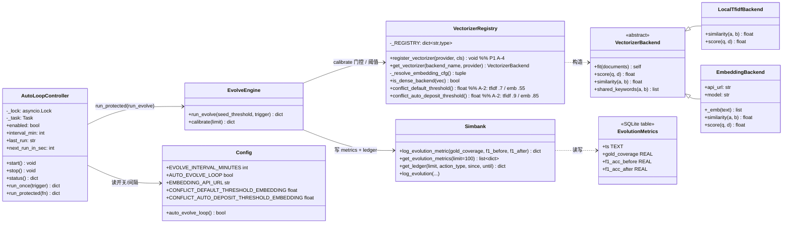
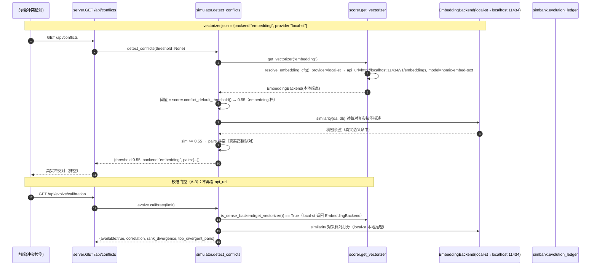
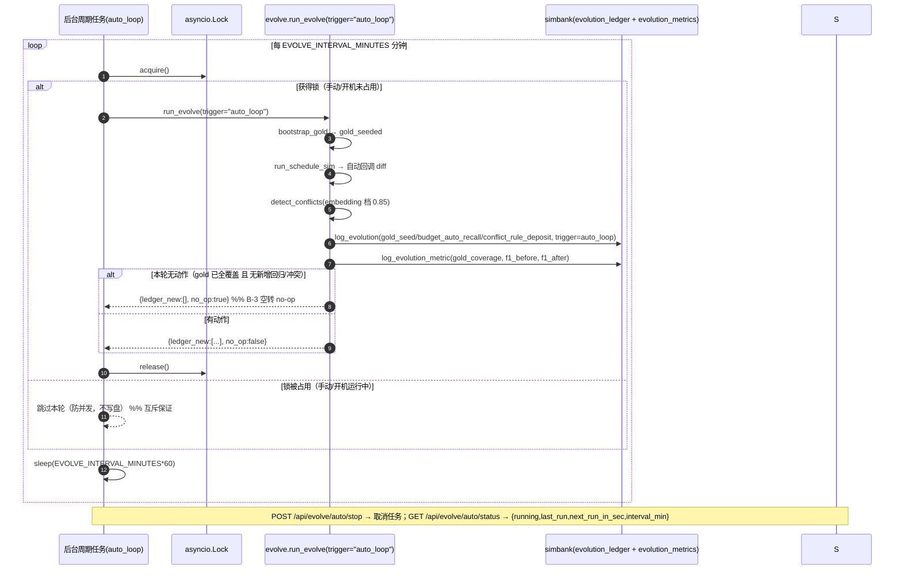
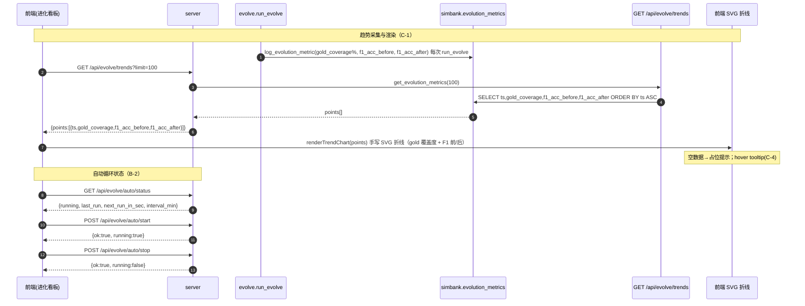
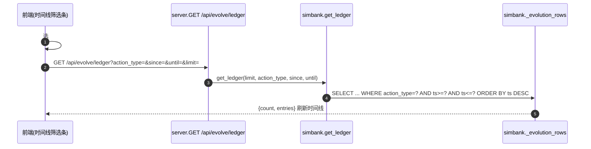
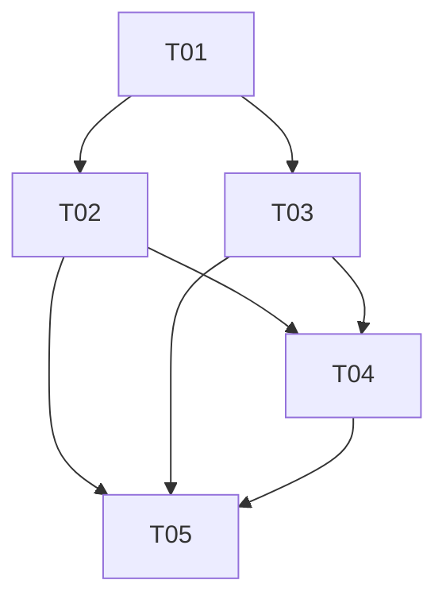

# SkillForge 增量架构设计 v2.2（真实 embedding 接入 · 自进化自动化 · 进化可视化）

> 文档版本：ARCH-EVO2-2.0　|　架构师：高见远（software-architect）
> 适用范围：在 v2.1（commit d3846b1 + 01c0eac，自主进化引擎 + 进化账本）之上，增量实现 **A 真实 embedding 接入 / B 自进化自动化 / C 前端进化视图增强 / D 文档 + 全量回归**。
> 约束：本文档**仅产出增量架构与任务分解，不写实现代码**。v2.1 已确定内容（`docs/arch-evo2.md`、`docs/prd-evo2.md`、以及 `skillforge/*.py` 真实签名）继续沿用，不再重议。配套 Mermaid：`docs/class-diagram-evo2-2.mermaid`、`docs/sequence-diagram-evo2-2.mermaid`。
> **硬约束（主理人已拍板）**：维持 v2.1「零新增 pip 依赖 / 零构建前端」，A-1 仅扩展 OpenAI 兼容 provider，本地 embedding 靠本地 OpenAI 兼容服务（ollama / text-embeddings-inference）接入，`local-st` 本质 = openai provider 指向本地端点。

---

## 1. 实现方案 + 框架选型

### 1.1 本次增量的核心难点与解法

| 方向 | 难点（来自真实代码） | 解法（增量，不重写 v2.1） |
|------|----------------------|---------------------------|
| **A 真实 embedding** | `scorer.get_vectorizer()` 仅支持 `embedding`（远程）/ 回退 `local-tfidf`，无 provider 可插拔；`calibrate()` 门控硬编码 `api_url`；阈值 0.7 对稠密向量几乎不命中 | ① 在 `scorer.py` 引入 **`_VECTORIZER_REGISTRY` 注册表** + `provider` 概念（`openai` / `local-st` 均映射 `EmbeddingBackend`，仅默认端点不同）；② 阈值随后端分档：`conflict_default_threshold()` / `conflict_auto_deposit_threshold()` 按 `backend==embedding` 取 0.55/0.85，否则 0.7/0.9；③ `calibrate()` 门控改为「当前后端是否为稠密向量后端（`get_vectorizer()` 返回 `EmbeddingBackend` 实例）」，不再看 `api_url` 非空 |
| **B 自动化** | v2.1 仅 `run_evolve()` 编排 + 开机一次性 hook；无周期后台任务、无状态可见、无并发保护 | ① 新增 `skillforge/auto_loop.py`（`AutoLoopController`）：进程内 `asyncio` 后台任务，按 `EVOLVE_INTERVAL_MINUTES`（默认 30）循环调用 `run_evolve(trigger="auto_loop")`；② 模块级 `asyncio.Lock` 保证「手动触发 / 自动循环 / 开机钩子」三者同时仅一个 `run_evolve` 在跑；③ 新增 `GET /api/evolve/auto/status`、`POST /api/evolve/auto/start`、`POST /api/evolve/auto/stop`；④ `AUTO_EVOLVE_LOOP` 默认 false，绝不静默写盘 |
| **C 前端增强** | v2.1 仅 KPI 数字卡 + 账本时间线（仅 limit）+ 校准面板；无趋势图、无类型/时间筛选、无自动进化开关 | ① 后端新增 `evolution_metrics` 小表（每次 `run_evolve` 写覆盖度/F1）；② `GET /api/evolve/trends` 返回升序 points；③ 前端**手写 SVG 折线**（零依赖，沿用 `scoreRing` 视觉）渲染 gold 覆盖度 + F1 前/后；④ 时间线新增「类型下拉 + 时间窗」调用 `GET /api/evolve/ledger?action_type=&since=&until=`；⑤ 保留 🌱/▶/🔬/📤，新增 ⚙ 自动进化开/关按钮联动 B-2 |

### 1.2 框架与库选型（重申零依赖/零构建）

- **后端**：沿用 **FastAPI（0.115.0）+ uvicorn**，源码布局 `skillforge/` 不变。
- **前端**：沿用**原生 HTML/CSS/JS**（零构建）。趋势图**手写 SVG 折线**，不引入任何图表库（ECharts/Chart.js 等均不用）。
- **持久化**：复用 `DATA_DIR/skillforge.db`（SQLite），`simbank.py` 的 `_conn()` 单连接**追加** `evolution_metrics` 一张表；`vectorizer.json` 增加 `provider` 字段；不新建 JSON 文件。
- **局部自进化（B）并发模型**：采用 **FastAPI 事件循环内的 `asyncio` 后台任务 + `asyncio.Lock`**（非守护线程，避免跨线程 SQLite/状态同步复杂度）。`run_evolve` 是同步阻塞函数，自动循环内用 `await asyncio.to_thread(evolve.run_evolve, ...)` 包住，避免长任务阻塞事件循环；锁保护确保同一时刻仅一个 `run_evolve` 执行。

### 1.3 依赖结论（重要）

> **本次增量零新增 pip 依赖；测试期亦零新增 pip 依赖。**
> - 运行时：`requirements.txt` 维持 `fastapi / uvicorn / pyyaml / tiktoken` 不变。新增能力（provider 注册表、阈值分档、`auto_loop`、`evolution_metrics`、手写 SVG）均用 Python 标准库（`json`/`sqlite3`/`asyncio`/`math`/`statistics`/`datetime`/`urllib`）+ 现有依赖完成。
> - 测试期：`tests/` 的 mock embedding 服务端用 **Python 标准库 `http.server` + `threading`** 实现（`MockEmbeddingServer` 返回确定性的稠密向量），**不引入 sentence-transformers / pytest 插件 / http 测试库以外的任何新包**。pytest 本身已在现有环境可用（见 `arch-evo2.md` 测试约定）；若环境未装 pytest，列为**唯一**可能的 test-only 依赖提示，但力求纯 stdlib + 现有依赖即可跑。

### 1.4 架构模式（增量叠加，标注新增/改动）

```
                      scan_skills(dirs)        get_gold/set_gold
   skill_parser ───────────────┐          gold ───────────┐
                               │                          │
   scorer（注册表+provider）    │   budget(overrides)      │   custom_rules(deposit)
     │ provider 解析           │        │                 │        │
     ▼                         ▼        ▼                 ▼        ▼
   ┌──────────────── evolve.py（run_evolve / calibrate，含 no-op 判定）────────────────┐
   │         ▲ 互斥锁保护（auto_loop）        │ 写                       │ 写
   │         │                                ▼                         ▼
   │   auto_loop.AutoLoopController    simbank.evolution_ledger   simbank.evolution_metrics（新表）
   └────────────────────────────────────────┬──────────────────────────────────────┘
                                             │ 读
                                  server.py（演进端点 + auto/* 三端点 + trends + ledger 筛选）
                                             │
                                  原生前端 进化看板（趋势 SVG / 筛选条 / ⚙自动进化按钮）
```

---

## 2. 文件列表及相对路径（修改 / 新增）

> 所有路径相对项目根 `skill-forge/`（`skillforge/` 后端包，`frontend/` 前端，`data/` 运行时目录，`tests/` 测试，`docs/` 文档）。标注：**修改**（在 v2.1 文件上增量改动） / **新增**。

### 2.1 后端

| 文件 | 标记 | 本次增量改动点 |
|------|------|----------------|
| `skillforge/scorer.py` | **修改** | ① 新增 `_VECTORIZER_REGISTRY` 字典 + `register_vectorizer(provider, cls)`（P1 · A-4）；② `get_vectorizer(backend_name, provider)` 改为按 `provider`（`openai`/`local-st`）解析端点，`local-st` 默认 `http://localhost:11434/v1/embeddings`、模型 `nomic-embed-text`；③ 新增 `_resolve_embedding_cfg()`、`is_dense_backend(vec)`、`conflict_default_threshold()`、`conflict_auto_deposit_threshold()`（A-2 阈值分档，含 A-5 的 vectorizer.json 分后端覆盖）；④ `get_vectorizer` 仍对 `api_url` 缺失回退 `LocalTfidfBackend` |
| `skillforge/config.py` | **修改** | 新增：`EVOLVE_INTERVAL_MINUTES=30`、`AUTO_EVOLVE_LOOP`（读环境变量，默认 false）、`EMBEDDING_API_URL`（默认 `http://localhost:11434/v1/embeddings`）、`CONFLICT_DEFAULT_THRESHOLD_EMBEDDING=0.55`、`CONFLICT_AUTO_DEPOSIT_THRESHOLD_EMBEDDING=0.85`；保留 v2.1 的 `CONFLICT_DEFAULT_THRESHOLD=0.7` / `CONFLICT_AUTO_DEPOSIT_THRESHOLD=0.9` 作为 tfidf 档；新增 `auto_evolve_loop()` 求值函数 |
| `skillforge/simulator.py` | **修改** | `detect_conflicts(threshold=None)` 的 `threshold` 默认取值改为 `scorer.conflict_default_threshold()`（A-2）；`_resolve_vectorizer` **不动**（因其按 `EmbeddingBackend` 类名探活，openai/local-st 同为 `EmbeddingBackend`，自愈逻辑天然适用） |
| `skillforge/evolve.py` | **修改** | ① `calibrate()` 门控由「`backend==embedding` 且 `api_url` 非空」改为「`scorer.is_dense_backend(get_vectorizer())`」（A-3），local-st 直接通过；② `run_evolve(seed_threshold=None, trigger="evolve_engine")` 新增 `trigger` 参数（auto_loop 传 `auto_loop`，手动传 `manual`，开机钩子仍走独立路径）；③ 内部 `bootstrap_gold`/`_capture_auto_recall`/冲突沉淀均使用传入 `trigger`，使自动循环条目 `trigger=auto_loop`（B-1）；④ 用 `scorer.conflict_auto_deposit_threshold()` 替代 `config.CONFLICT_AUTO_DEPOSIT_THRESHOLD`（A-2）；⑤ 每次运行末写 `evolution_metrics`（C-1 后端）；⑥ **no-op 判定（B-3）**：`gold_seeded==0 且 auto_recalled 空 且 deposited 空` → 返回 `{ledger_new:[], no_op:true}`，不写任何 ledger/metrics |
| `skillforge/auto_loop.py` | **新增** | `AutoLoopController`：模块级 `asyncio.Lock`、后台 `asyncio.Task`、`start()/stop()/status()/run_once(trigger)`、`run_protected(fn)`（统一经锁保护调用 `run_evolve`，手动/自动/开机三路共用）；`run_once` 内用 `asyncio.to_thread` 调 `evolve.run_evolve` |
| `skillforge/server.py` | **修改** | ① lifespan：保留 v2.1 开机 hook，且其内部 `run_evolve` 调用改走 `auto_loop.run_protected`；`AUTO_EVOLVE_LOOP=true` 时 `auto_loop.start()`；shutdown 时 `auto_loop.stop()`；② 新增 `GET /api/evolve/auto/status`、`POST /api/evolve/auto/start`、`POST /api/evolve/auto/stop`（B-2）；③ `POST /api/evolve/run` 改走 `auto_loop.run_protected`（互斥）；④ `GET /api/evolve/ledger` 增加 `since`/`until`（C-2）；⑤ 新增 `GET /api/evolve/trends`（C-1）；⑥ `GET /api/config/vectorizer` 返回 `provider`；`PUT /api/config/vectorizer` 接受并持久化 `provider` |
| `skillforge/simbank.py` | **修改** | `_SCHEMA` 追加 `evolution_metrics` 建表 SQL + 索引；新增 `log_evolution_metric(gold_coverage, f1_acc_before, f1_acc_after)`、`get_evolution_metrics(limit=100)`（按 `ts ASC`）；`get_ledger` 增加 `since`/`until` 透传到 `_evolution_rows`；复用 `_conn()` 单连接 |
| `skillforge/__init__.py` | **修改** | `__version__ = "2.2.0-evo"` |

### 2.2 前端

| 文件 | 标记 | 本次增量改动点 |
|------|------|----------------|
| `frontend/index.html` | **修改** | 进化看板视图新增：① 顶部状态徽标 `#autoStatus`（●运行中/○暂停 + 上次/下次运行时间）；② 趋势图容器 `#trendChart`（含 `#trendGold`、`#trendF1` 两个 SVG 占位）；③ 时间线筛选条 `#ledgerType`（类型下拉）与 `#ledgerWindow`（时间窗下拉），与现有 `#ledgerLimit` 共存；④ ⚙ 自动进化按钮 `#evolveAutoBtn` |
| `frontend/app.js` | **修改** | ① `renderTrendChart(points)`：手写 SVG 折线（gold 覆盖度 0~100% + F1 前/后），空数据占位，hover tooltip（C-4）；② `loadLedger()` 读取筛选条 `#ledgerType`/`#ledgerWindow` 拼 `action_type`/`since`/`until`；③ `bindEvolveNav()` 绑定 `#evolveAutoBtn` → `toggleAutoEvolve()`；④ 新增 `getAutoStatus()`、`toggleAutoEvolve()`、`loadTrends()`；⑤ `renderEvolve()` 中调用 `loadTrends()` + `getAutoStatus()` 刷新徽标 |
| `frontend/style.css` | **修改** | 新增少量类（不引入新设计语言）：`.trend-chart` / `.trend-svg` / `.trend-line-gold` / `.trend-line-f1` / `.auto-badge.on` / `.auto-badge.off` / `.ledger-filter` |

### 2.3 运行时持久化（非代码，运行时生成/变更）

| 文件 | 标记 | 说明 |
|------|------|------|
| `data/skillforge.db`（新增表 `evolution_metrics`） | 运行时 | 趋势采集点（C-1） |
| `data/vectorizer.json` | 运行时变更 | 增加 `provider` 字段（`openai` / `local-st`，缺省经 `backend` 推断）；可选 `thresholds.{local-tfidf,embedding}.{conflict_threshold,auto_deposit_threshold}`（A-5 P1） |

### 2.4 文档 + 测试（D 方向）

| 文件 | 标记 | 说明 |
|------|------|------|
| `docs/arch-evo2-2.md` | **新增** | 本文档（增量架构设计 + 任务分解） |
| `docs/delivery-evo2-2.md` | **新增** | 交付报告（D-1，含验收里程碑结论） |
| `docs/class-diagram-evo2-2.mermaid` | **新增** | 增量类图（注册表 / auto_loop / evolution_metrics / 端点签名） |
| `docs/sequence-diagram-evo2-2.mermaid` | **新增** | 增量时序图（embedding 切换+冲突命中 / 自动循环闭环 / 趋势采集+渲染） |
| `tests/conftest.py` | **新增** | fixtures：`tmp DATA_DIR` + `vectorizer.json`（provider=local-st 指向 mock）、`MockEmbeddingServer`（stdlib `http.server`，确定性稠密向量）、合成技能集 fixture |
| `tests/test_backend.py` | **新增** | A-1/A-2/A-3：provider 解析、阈值分档、calibrate 门控（local-st 通过） |
| `tests/test_evolve.py` | **新增** | run_evolve 编排、B-3 no-op（`ledger_new:[]`）、冲突自动沉淀 |
| `tests/test_auto_loop.py` | **新增** | B-1/B-2：start/stop/status、互斥锁（并发触发仅一个执行）、周期运行写盘 |
| `tests/test_trends.py` | **新增** | C-1：metrics 表写入 + `GET /api/evolve/trends` 升序 + 空数据 |
| `tests/test_endpoints.py` | **新增** | C-2：ledger `action_type`/`since`/`until` 过滤；`GET /api/config/vectorizer` 返回 `provider` |
| `run_regression.sh` | **新增** | `pytest tests/ -q` 一键运行 |
| `Makefile` | **新增（P1 · D-3）** | `make test` 入口 |
| `.github/workflows/regression.yml` | **新增（P1 · D-3）** | CI 重复运行回归，失败标注方向 |

---

## 3. 数据结构 / 接口（类图 Mermaid）

> 完整增量类图见 `docs/class-diagram-evo2-2.mermaid`。下方聚焦本次新增/改动的类与接口。



### 3.1 新增/改动的关键函数签名（对齐真实代码）

```python
# ---- scorer.py（A-1/A-2/A-3）----
_VECTORIZER_REGISTRY: dict[str, type[VectorizerBackend]] = {
    "openai": EmbeddingBackend, "local-st": EmbeddingBackend, "local-tfidf": LocalTfidfBackend,
}
def register_vectorizer(provider: str, cls: type[VectorizerBackend]) -> None: ...   # P1 A-4
def get_vectorizer(backend_name: str | None = None, provider: str | None = None) -> VectorizerBackend: ...
def is_dense_backend(vec: VectorizerBackend) -> bool: return isinstance(vec, EmbeddingBackend)
def conflict_default_threshold() -> float: ...        # backend==embedding → 0.55 否则 0.7
def conflict_auto_deposit_threshold() -> float: ...   # backend==embedding → 0.85 否则 0.9

# ---- auto_loop.py（B-1/B-2）----
class AutoLoopController:
    def start(self) -> None: ...                       # 启动后台 asyncio 任务
    def stop(self) -> None: ...                        # 取消任务
    def status(self) -> dict: ...                      # {running, last_run, next_run_in_sec, interval_min}
    async def run_protected(self, fn) -> dict: ...     # async with self._lock: return await asyncio.to_thread(fn)

# ---- simbank.py（C-1）----
def log_evolution_metric(gold_coverage: float, f1_acc_before: float, f1_acc_after: float) -> dict: ...
def get_evolution_metrics(limit: int = 100) -> list[dict]: ...   # 按 ts ASC

# ---- evolve.py（A-3/B-3/C-1）----
def run_evolve(seed_threshold: int | None = None, trigger: str = "evolve_engine") -> dict:
    # 返回含 ledger_new / no_op / gold_coverage 等；运行末写 evolution_metrics
def calibrate(limit: int = config.CALIBRATION_SAMPLE_PAIRS) -> dict:
    # 门控改为 is_dense_backend(get_vectorizer())；local-st 直接 available:true
```

### 3.2 新增 REST 端点（v2.2）

| 端点 | 方法 | 请求 | 响应 | 覆盖需求 |
|------|------|------|------|----------|
| `/api/evolve/auto/status` | GET | — | `{running:bool, last_run:str|null, next_run_in_sec:int|null, interval_min:int}` | B-2 |
| `/api/evolve/auto/start` | POST | — | `{ok:true, running:true, interval_min:int}`（已运行则返回 running 状态，幂等） | B-2 |
| `/api/evolve/auto/stop` | POST | — | `{ok:true, running:false}` | B-2 |
| `/api/evolve/trends` | GET | `?limit=100` | `{points:[{ts, gold_coverage, f1_acc_before, f1_acc_after}]}`（按 ts 升序） | C-1 |
| `/api/evolve/ledger` | GET | 新增 `since?` / `until?`（ISO） | 原结构 + 时间窗过滤（C-2） | C-2 |
| `/api/config/vectorizer` | GET | — | 原结构 + `provider` 字段 | A-1 |
| `/api/config/vectorizer` | PUT | 接受 `provider` | 持久化 `provider` | A-1 |
| `/api/evolve/run` | POST | 经 `auto_loop.run_protected`（互斥） | `run_evolve` 结果（含 `no_op` 字段 B-3） | B-2 |

### 3.3 `evolution_metrics` 表结构（复用 `skillforge.db`）

```sql
CREATE TABLE IF NOT EXISTS evolution_metrics (
    id             INTEGER PRIMARY KEY AUTOINCREMENT,
    ts             TEXT NOT NULL,            -- ISO-8601 UTC，每次 run_evolve 写入
    gold_coverage  REAL,                     -- 0~100：已装用户技能被 gold 覆盖的百分比
    f1_acc_before  REAL,                     -- run_schedule_sim 清洗前选对率 (0~1)
    f1_acc_after   REAL                      -- 清洗后选对率 (0~1)
);
CREATE INDEX IF NOT EXISTS idx_metrics_ts ON evolution_metrics(ts);
```

`gold_coverage` 计算（在 `run_evolve` 内）：`installed = scan_skills(dirs=[USER_SKILLS_DIR])`；`covered = len({s.name for s in installed} & {g.skill_id for g in gold.get_gold()})`；`gold_coverage = round(100*covered/max(1,len(installed)), 2)`。

---

## 4. 程序调用流程（Mermaid 时序图）

> 完整时序图见 `docs/sequence-diagram-evo2-2.mermaid`。以下包含要求的 ① embedding 后端切换+冲突检测真实命中；② 自动循环 run_evolve 闭环（含互斥锁+no-op）；③ 趋势采集与前端渲染。

### 4.1 ① embedding 后端切换 + 冲突检测真实命中（A-1 / A-2 / A-3）



### 4.2 ② 自动循环 run_evolve 闭环（含互斥锁 + no-op）（B-1 / B-2 / B-3）



### 4.3 ③ 趋势采集与前端渲染（C-1）+ 自动循环状态（B-2）



### 4.4 ④ 账本类型/时间筛选（C-2，补充）



---

## 5. 有序任务列表（按实现顺序，含依赖，覆盖 P0 + P1）

> 粒度细化到工程师可直接落地（含文件级 + 函数级改动点）。每个任务覆盖若干方向子项；依赖关系见 §5.1 图。
> 约束遵循：① T01 为「后端抽象基础设施」，是所有后续任务的前置；② 单任务文件数 ≥3；③ 按功能模块分组（A/B/C/D 四方向）。

| 任务 | 名称 | 依赖 | 优先级 | 覆盖方向/P项 | 落地要点（关键文件 + 函数级改动） |
|------|------|------|--------|--------------|-----------------------------------|
| **T01** | 方向A · 后端抽象 + 阈值分档（基础设施） | — | P0+P1 | A-1, A-2, A-3, A-4(P1), A-5(P1) | **scorer.py**：① 新增 `_VECTORIZER_REGISTRY={"openai":EmbeddingBackend,"local-st":EmbeddingBackend,"local-tfidf":LocalTfidfBackend}` + `register_vectorizer(provider,cls)`（A-4）；② `get_vectorizer(backend_name,provider)` 内调 `_resolve_embedding_cfg()`：`local-st` → `api_url=EMBEDDING_API_URL` 默认 `http://localhost:11434/v1/embeddings`、`model=nomic-embed-text`；`openai` → `api_url=emb.api_url or EMBEDDING_API_URL or ""`、`model=text-embedding-3-small`；`api_url` 空仍回退 `LocalTfidfBackend`；③ 新增 `is_dense_backend(vec)`、`conflict_default_threshold()`（embedding→0.55 否则 0.7）、`conflict_auto_deposit_threshold()`（embedding→0.85 否则 0.9；A-5：`_load_vectorizer_config().get("thresholds",{})` 分后端覆盖优先）。**config.py**：新增 `EVOLVE_INTERVAL_MINUTES=30`、`AUTO_EVOLVE_LOOP`（env 默认 false）、`EMBEDDING_API_URL` 默认 localhost、两个 embedding 档阈值常量 + `auto_evolve_loop()`。**simulator.py**：`detect_conflicts` 默认阈值改 `scorer.conflict_default_threshold()`。**evolve.py**：`calibrate()` 门控改为 `is_dense_backend(get_vectorizer())`（A-3）；`run_evolve` 冲突沉淀阈值改 `scorer.conflict_auto_deposit_threshold()`（A-2）。**__init__.py**：版本→`2.2.0-evo` |
| **T02** | 方向B · 自动循环（互斥锁 + 端点 + no-op） | T01 | P0+P1 | B-1, B-2, B-3 | **auto_loop.py（新增）**：`AutoLoopController` —— 模块级 `asyncio.Lock`；`start()` 起后台 `asyncio.create_task` 周期循环（间隔 `config.EVOLVE_INTERVAL_MINUTES*60`，用 `asyncio.to_thread(evolve.run_evolve, trigger="auto_loop")`）；`stop()` 取消任务；`status()` 返回 `{running, last_run, next_run_in_sec, interval_min}`（`next_run_in_sec` 按 `last_run`+间隔推算，未运行为 null）；`run_protected(fn)` 统一 `async with self._lock: await asyncio.to_thread(fn)`。**server.py**：lifespan 内 `AUTO_EVOLVE_LOOP` 真 → `auto_loop.start()`，shutdown → `auto_loop.stop()`；开机 hook 内 `run_evolve` 改走 `auto_loop.run_protected`；新增 3 端点（见 §3.2）；`POST /api/evolve/run` 改走 `auto_loop.run_protected`（互斥）。**evolve.py**：`run_evolve(seed_threshold=None, trigger="evolve_engine")` 新增 `trigger` 并下传 `bootstrap_gold`/`_capture_auto_recall`/冲突沉淀（使 auto_loop 条目 `trigger=auto_loop`）；B-3 no-op 判定：`gold_seeded==0 and not auto_recalled_entries and not deposited_rules` → 返回 `{ledger_new:[], "no_op":True}` |
| **T03** | 方向C-后端 · 趋势采集（evolution_metrics） | T01 | P0 | C-1(后端) | **simbank.py**：`_SCHEMA` 追加 `evolution_metrics` 建表 + `idx_metrics_ts`；新增 `log_evolution_metric(gold_coverage,f1_acc_before,f1_acc_after)`（复用 `_conn()`）、`get_evolution_metrics(limit=100)`（按 `ts ASC`）；`get_ledger` 增加 `since`/`until` 透传 `_evolution_rows`。**evolve.py**：`run_evolve` 计算 `gold_coverage`（见 §3.3）并从 `schedule_result` 取 `accuracy_before/after`，运行末调 `simbank.log_evolution_metric(...)`。**server.py**：新增 `GET /api/evolve/trends`（见 §3.2）；`GET /api/evolve/ledger` 增加 `since`/`until` 参数 |
| **T04** | 方向C-前端 · 进化视图增强（趋势图 + 筛选 + 自动按钮） | T02, T03 | P0+P1 | C-1(前端), C-2, C-3, C-4(P1) | **index.html**：进化看板加 `#autoStatus` 徽标、`#trendChart`（含 `#trendGold`/`#trendF1` SVG 占位）、筛选条 `#ledgerType`/`#ledgerWindow`、`#evolveAutoBtn`。**app.js**：`renderTrendChart(points)` 手写 SVG 折线（gold 覆盖度 0~100% + F1 前虚/后实，沿用 `scoreRing` 配色，空数据占位，C-4 hover tooltip）；`loadLedger()` 读筛选条拼 `action_type`/`since`/`until`；`bindEvolveNav()` 绑 `#evolveAutoBtn`→`toggleAutoEvolve()`；新增 `getAutoStatus()`/`toggleAutoEvolve()`/`loadTrends()`；`renderEvolve()` 调 `loadTrends()`+`getAutoStatus()`。**style.css**：新增 `.trend-chart`/`.trend-svg`/`.trend-line-gold`/`.trend-line-f1`/`.auto-badge.on`/`.auto-badge.off`/`.ledger-filter` |
| **T05** | 方向D · 文档 + 全量回归测试 | T02, T03, T04 | P0+P1 | D-1, D-2, D-3(P1) | **docs/arch-evo2-2.md（本文件）**、**docs/delivery-evo2-2.md**（D-1 交付报告）。**tests/**（全部新增）：`conftest.py`（`tmp_path` 设 `DATA_DIR` 环境变量 + 写 `vectorizer.json` provider=local-st 指向 `MockEmbeddingServer`、stdlib `http.server` 确定性稠密向量、合成技能 fixture）；`test_backend.py`（A-1/2/3）、`test_evolve.py`（编排 + B-3 no-op）、`test_auto_loop.py`（B-1/2 start/stop/status/互斥）、`test_trends.py`（C-1 metrics + trends 端点）、`test_endpoints.py`（C-2 ledger 过滤 + vectorizer provider）。**run_regression.sh**：`pytest tests/ -q`。**Makefile**（P1 D-3）：`make test`；**.github/workflows/regression.yml**（P1 D-3）：CI 重复运行。所有用例固定合成 fixture、mock embedding，**不依赖真实 `~/.workbuddy/skills` 与真实远程 API**，`pytest tests/ -q` 全绿 |

### 5.1 任务依赖图



> 依赖说明：A-1/A-2/A-3（T01）是 B/C 所有端点的前置（阈值解析、calibrate 门控、run_evolve 改造）；T03（趋势后端）与 T02（自动循环端点）共同为 T04（前端）提供 `/api/evolve/trends` 与 `/api/evolve/auto/*`；T05 测试依赖全部后端/前端就绪。「A-1 完成前 B-1 无法联调」「T03/T02 完成前 T04 无法联调」即为上述箭头含义。

---

## 6. 依赖包列表

> **运行时：无新增 pip 依赖。** `requirements.txt` 维持 `fastapi / uvicorn / pyyaml / tiktoken` 不变。

| 类别 | 包 | 说明 |
|------|----|------|
| 运行时 | （无新增） | 维持 v2.1 依赖；provider 注册表 / 阈值分档 / auto_loop / evolution_metrics / 手写 SVG 均基于 Python 标准库 + 现有依赖 |
| 测试期 | （无新增 pip 依赖） | mock embedding 服务端用 **Python 标准库 `http.server` + `threading`**；`pytest` 若环境缺失则列为唯一可选 test-only 依赖（非本仓库新增，属测试运行环境） |
| 测试期（mock，test-only） | `MockEmbeddingServer`（自研，stdlib 实现） | 仅测试使用，返回确定性稠密向量；**不引入 sentence-transformers / 任何第三方 embedding 实现**，以严守零依赖约束 |

---

## 7. 共享知识（跨文件约定）

### 7.1 配置项命名约定
- embedding 相关统一前缀 `EMBEDDING_*`：`EMBEDDING_API_URL`（默认 `http://localhost:11434/v1/embeddings`，供 `local-st` 与 `openai` 回退）。
- 阈值常量：`CONFLICT_DEFAULT_THRESHOLD=0.7` / `CONFLICT_AUTO_DEPOSIT_THRESHOLD=0.9`（**tfidf 档**，v2.1 沿用）；新增 `CONFLICT_DEFAULT_THRESHOLD_EMBEDDING=0.55` / `CONFLICT_AUTO_DEPOSIT_THRESHOLD_EMBEDDING=0.85`（**embedding 档**）。运行时取值一律经 `scorer.conflict_default_threshold()` / `scorer.conflict_auto_deposit_threshold()`（按 `backend==embedding` 切换，A-5 支持 vectorizer.json 分后端覆盖）。
- 自动循环：`EVOLVE_INTERVAL_MINUTES`（默认 30）、`AUTO_EVOLVE_LOOP`（默认 false，读环境变量每次求值）、`AUTO_EVOLVE_ON_START`（v2.1 沿用，仍默认 false）。

### 7.2 provider 与 backend 语义
- `vectorizer.json`：`backend` ∈ `local-tfidf` / `embedding`（沿用）；新增 `provider` ∈ `openai` / `local-st`（仅 `backend==embedding` 时生效，缺省由 `backend` 推断为 `openai`）。
- `local-st` 本质 = `EmbeddingBackend` 指向本地 OpenAI 兼容端点（默认 `http://localhost:11434/v1/embeddings`，模型 `nomic-embed-text`）；`openai` = `EmbeddingBackend` 指向远程（默认 `text-embedding-3-small`）。两者共用 `EmbeddingBackend` 类，`_resolve_vectorizer` 按类名探活自愈逻辑**无需改动**。
- 自定义 provider（A-4 P1）：`register_vectorizer(provider, cls)` 注入；自定义 `cls` 构造函数签名应与 `EmbeddingBackend(api_url=, model=)` 兼容。

### 7.3 `evolution_metrics` 写入时机（C-1）
- 由 `evolve.run_evolve()` 在「播种 + 调度模拟 + 冲突沉淀」全部完成后、返回前写入一行；`gold_coverage` 取自 `USER_SKILLS_DIR` 已装技能被 gold 覆盖的百分比，`f1_acc_before/after` 取自 `run_schedule_sim` 结果。
- 经 `simbank.log_evolution_metric()` 复用 `_conn()` 单连接；与 `evolution_ledger` 同一事务隔离级别（SQLite 串行化由单连接保证）。
- B-3 no-op 轮次：**不写** `evolution_metrics`（与 ledger 一致，避免空转刷屏）。

### 7.4 互斥锁变量名 / 作用域（B-2）
- 变量：`auto_loop._lock`（`asyncio.Lock`，模块级单例），所有 `run_evolve` 调用路径（手动 `POST /api/evolve/run`、自动循环任务、开机 hook）**必须**经 `auto_loop.run_protected(fn)` 进入，确保同时仅一个 `run_evolve` 执行。
- 状态单例：`auto_loop._state`（dict：`enabled`/`task`/`last_run`/`interval_min`），`status()` 只读暴露。

### 7.5 前端新增 DOM id / class 命名规范
- 新增 id：`#autoStatus`（状态徽标）、`#trendChart` / `#trendGold` / `#trendF1`（趋势图容器/SVG）、`#ledgerType`（类型下拉）、`#ledgerWindow`（时间窗下拉）、`#evolveAutoBtn`（自动进化开关）。
- 新增 class：`.trend-chart`、`.trend-svg`、`.trend-line-gold`、`.trend-line-f1`、`.auto-badge.on`、`.auto-badge.off`、`.ledger-filter`。沿用既有 `.card`/`.kpi`/`.btn`/`.ledger-row` 等，不引入新设计语言。
- 端点对接：`loadTrends()`→`GET /api/evolve/trends`；`getAutoStatus()`/`toggleAutoEvolve()`→`GET|POST /api/evolve/auto/{status,start,stop}`；`loadLedger()` 筛选→`GET /api/evolve/ledger?action_type=&since=&until=`。

### 7.6 复用的现有接口（签名已核对，不改动）
- `gold.get_gold()/set_gold()`、`budget.load_overrides()/effective_target()`、`custom_rules.deposit_custom_rule()`、`simulator.run_schedule_sim()/detect_conflicts()`、`simbank._conn()/log_evolution()/get_ledger()/build_report()`、`skill_parser.scan_skills(dirs)` 全部沿用。
- `scorer.LocalTfidfBackend/EmbeddingBackend` 的 `similarity/score` 接口不变；`get_vectorizer` 仅扩展 `provider` 解析。

---

## 8. 待明确事项（假设 / 需主理人/用户确认，均不阻塞 P0）

| 编号 | 事项 | 本设计采用假设 | 建议 |
|------|------|----------------|------|
| Q1 | `local-st` 默认 embedding 模型名 | 取 `nomic-embed-text`（ollama 常用），可由 `vectorizer.json.embedding.model` 覆盖 | 若用户常用其它本地模型，确认默认名即可，不影响架构 |
| Q2 | `gold_coverage` 口径 | 采用「`USER_SKILLS_DIR` 已装技能被 gold 覆盖的百分比 (0~100)」 | 若需改为绝对覆盖数或全技能集（含项目级）口径，调整 `run_evolve` 内一处计算即可 |
| Q3 | 自动循环并发模型 | 采用「FastAPI 事件循环内 asyncio 后台任务 + `asyncio.Lock` + `asyncio.to_thread` 跑 `run_evolve`」 | 与 v2.1 单进程模型一致；跨进程文件锁列为 P2（B-5），本次不做 |
| Q4 | `run_evolve` 内部 ledger 条目 trigger | 传入 `trigger` 统一下传到 gold_seed/budget_auto_recall/conflict_rule_deposit（自动循环 → `auto_loop`） | 与 v2.1「evolve_engine/f1_schedule/f3_conflict」细粒度 trigger 不同；若需保留细粒度又要可识别自动来源，可在 `note` 注明，本设计选统一 trigger 以直满足 PRD B-1 |
| Q5 | 测试 `pytest` 可用性 | 假设环境已装 `pytest`；若未装，列为唯一 test-only 运行环境依赖（非仓库新增） | 可在 `run_regression.sh` 加 `pip install pytest` 兜底（仅本地/CI，不入库到 runtime requirements） |
| Q6 | `next_run_in_sec` 计算精度 | 基于 `last_run` + `interval_min*60` 推算，睡眠中被打断则以实际剩余为准 | 仅用于前端展示，无需强一致 |

> 以上事项均为非阻塞假设；M1（P0）与 M2（P1）排期不受影响，工程师可按本设计直接落地，遇 Q1–Q6 任一分歧以本设计假设为准实现后再微调。

---

*交付物：`docs/arch-evo2-2.md`（本文档）+ `docs/class-diagram-evo2-2.mermaid` + `docs/sequence-diagram-evo2-2.mermaid`。本文覆盖实现方案（零依赖/零构建）、文件列表（修改/新增 + diff 逻辑）、数据结构与接口（注册表/auto_loop/evolution_metrics/端点签名）、调用时序（embedding 切换+冲突命中 / 自动循环闭环+no-op / 趋势采集+渲染 / 账本筛选）、任务分解 T01–T05（覆盖 P0+P1 + 依赖图）、依赖包列表（零新增）、共享知识（配置/provider/写入时机/互斥锁/前端命名）、待明确事项。可直接作为工程师落地指南。*
