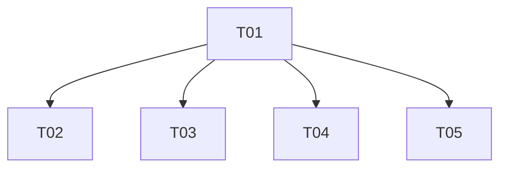

# SkillForge 增量架构设计 v2.3（闭环随时间真正演进 · 看板打磨 · 健壮多实例 · embedding 开箱即用）

> 文档版本：ARCH-EVO2-3.0（增量）　|　架构师：高见远（software-architect）
> 适用范围：在 v2.2（真实 embedding 生效 / 全自动闭环 / 进化可视化可观测 / 全量 pytest 回归）之上，增量修复"自进化一次性收敛即空转"的核心断层，并打磨趋势图/看板、加固健壮性（多实例文件锁）、让真实 embedding **开箱即用**。
> 约束：本文档**仅产出增量架构与任务分解，不写实现代码**，不重写 v2.2 既有内容（真实后端抽象 / 自动循环 / 趋势采集 / 防刷屏 no-op 等已交付项继续沿用，详见 `arch-evo2-2.md`）。配套 Mermaid：`docs/class-diagram-evo2-3.mermaid`、`docs/sequence-diagram-evo2-3.mermaid`。
> **硬约束（主理人已拍板，不得违反）**：① 零新增 pip 依赖（仅 Python 标准库 + 现有 fastapi/uvicorn/pyyaml/tiktoken；跨进程锁用 fcntl/msvcrt 标准库，ollama 探测用 urllib 标准库）；② 零构建前端（原生 HTML/CSS/JS，趋势图手写 SVG，不引入任何图表库）；③ GitHub 提交仅 Hyhyhyyy（代码不带 agent/CNB 标记）；④ 版本 `__version__` `2.2.0-evo → 2.3.0-evo`。

---

## 1. 实现方案 + 框架选型

### 1.1 本次增量的核心难点与解法

| 方向 | 难点（已核对 v2.2 真实代码） | 解法（增量，不重写 v2.2） |
|------|------------------------------|---------------------------|
| **A 闭环随时间演进** | ① no-op 轮次不写 `evolution_metrics`（evolve.py:244-250 完全跳过）→ 趋势图只有 1 个点；② 闭环对用户技能集增删改无感知；③ 覆盖度跌破阈值无自愈 | ① 新增 `skillforge/skill_signature.py`：对 `USER_SKILLS_DIR` 已装技能算 sha256 内容签名，存 `DATA_DIR/skills_signature.json`；`run_evolve` 进入时比对得 changeset，非空 → 触发再播种 + 写 `skill_signature_change` 账本 + 更新签名；② 改造 `run_evolve`：**无论是否 no-op，运行末都写一条 `evolution_metrics`（heartbeat）**，连续时间序列；③ `gold_coverage < GOLD_COVERAGE_LOW_WATERMARK(80)` 时主动再 `bootstrap_gold`（**已确认幂等**，仅补缺失项，详见 §2.2） |
| **B 趋势图/看板打磨** | ① `renderTrendChart` 在 `points.length<2` 无横线/无提示（app.js:716/738）；② 无 accuracy 暴跌 / coverage 下降异常高亮；③ 无下次运行实时倒计时 | ① `points.length<2` 画水平参考线 +「样本不足」提示；② 相邻点比较（f1 降幅 ≥`ANOMALY_F1_DROP` / coverage 下降 ≥`ANOMALY_COV_DROP`）告警色描点 + `<title>`，图例「存在 N 处异常」；③ `getAutoStatus` 取 `next_run_in_sec` 经 `setInterval(1000)` 徽标实时递减，与异常高亮共存 |
| **C 健壮性/多实例** | ① `auto_loop.start()` 用 `asyncio.ensure_future(_loop())`（auto_loop.py:103）抛 DeprecationWarning；② 无跨进程文件锁（simbank 每 `_conn()` 新建连接）；③ 测试隔离与 CI 失败归属不清 | ① 改为 `asyncio.get_running_loop().create_task(_loop())`；② 新增 `skillforge/filelock.py`（fcntl/msvcrt 标准库，锁文件 `DATA_DIR/.skillforge.lock`）上下文管理器，经 `auto_loop.run_protected/run_once` 包裹 `run_evolve`，占用安全跳过；③ 测试 fixture 每用例独立临时 `DATA_DIR`/`USER_SKILLS_DIR`（conftest 已有基础，加固锁可禁用/超时）；`run_regression.sh` 与 CI 按 A/B/C/D 分组标注失败 |
| **D 真实 embedding 开箱即用** | ① `data/vectorizer.json` 不存在时首次使用需手写；② 无 ollama 可用性探测与自动回退；③ 校准面板不提示"当前后端来源" | ① 仓库内置 `data/vectorizer.local-st.json` 预设（provider=local-st，api_url=localhost:11434，model=nomic-embed-text）；② `scorer.probe_ollama(url)`（urllib 1s 超时）启动/lifespan 与显式刷新时探测，可用且未显式配置则据预设复制落地 `vectorizer.json`，否则回退 local-tfidf；③ `GET /api/config/vectorizer` 增加 `backend_source`+`ollama_available`；前端校准面板/状态区显示当前后端来源 |

### 1.2 框架与库选型（重申零依赖/零构建）

- **后端**：沿用 **FastAPI + uvicorn**，源码布局 `skillforge/` 不变。
- **前端**：沿用**原生 HTML/CSS/JS**（零构建）。趋势图**手写 SVG 折线**，不引入任何图表库。
- **持久化**：复用 `DATA_DIR/skillforge.db`（SQLite）。新增 JSON：`DATA_DIR/skills_signature.json`（技能签名存储，模板 `data/vectorizer.local-st.json` 仓库内置）。
- **跨进程并发**：采用 **标准库 `fcntl`（POSIX）/ `msvcrt`（Windows）文件锁**，锁文件 `DATA_DIR/.skillforge.lock`，**仅包裹 `run_evolve` 整体**（不锁读操作），与进程内 `auto_loop._lock`（asyncio.Lock）共存。锁占用安全跳过（不阻塞、不崩溃）。
- **探测**：采用 **标准库 `urllib.request`** 对 `http://localhost:11434/v1/embeddings` 做 1s 超时 POST 探测，结果缓存于 `scorer` 模块级变量，仅启动/lifespan 与显式刷新时探测。

### 1.3 依赖结论（重要）

> **本次增量零新增 pip 依赖；测试期亦零新增 pip 依赖。**
> 新增能力（签名模块、跨进程锁、ollama 探测、heartbeat 改写、低水位再播种、前端异常高亮/倒计时/后端源显示）均用 Python 标准库（`hashlib`/`json`/`fcntl`/`msvcrt`/`urllib`/`asyncio`/`threading`）+ 现有依赖完成。`requirements.txt` 维持 `fastapi / uvicorn / pyyaml / tiktoken` 不变。

### 1.4 架构模式（增量叠加，标注新增/改动）

```
                      scan_skills(dirs)        get_gold/set_gold
   skill_parser ───────────────┐          gold ───────────┐
                               │                          │
   scorer（注册表+provider+probe_ollama+resolve_backend_source） │  budget(overrides)
     │ provider 解析 + 探测落地 vectorizer.json            │        │
     ▼                         ▼        ▼                 ▼        ▼
   ┌──────────────── evolve.run_evolve（A-1 签名比对 / A-2 heartbeat / A-3 低水位）────────────────┐
   │   入口：skill_signature.detect_external_change → 外部变化触发再播种 + skill_signature_change  │
   │   末尾：log_evolution_metric 始终写（heartbeat）                                    │
   │   互斥：auto_loop（asyncio.Lock）+ filelock（跨进程）保护            │ 写   │ 写
   │                                                                   ▼        ▼
   │                                              simbank.evolution_ledger   simbank.evolution_metrics
   └────────────────────────────────────────┬──────────────────────────────────────────────────┘
                                             │ 读
                                  server.py（trends / auto/* / config/vectorizer + backend_source）
                                             │
                                  原生前端 进化看板（趋势 SVG 横线/异常高亮 / 1s 倒计时 / 后端源）
```

---

## 2. 文件列表及相对路径（修改 / 新增）

> 所有路径相对项目根 `skill-forge/`。标注：**修改**（在 v2.2 文件上增量改动） / **新增**。函数级改动点明确到关键函数。

### 2.1 后端

| 文件 | 标记 | 本次增量改动点 |
|------|------|----------------|
| `skillforge/__init__.py` | **修改** | `__version__ = "2.3.0-evo"`（由 `2.2.0-evo` 升版） |
| `skillforge/config.py` | **修改** | 新增配置（全部读环境变量，带默认值）：`GOLD_COVERAGE_LOW_WATERMARK=80`（A-3）、`ANOMALY_F1_DROP=0.1`（B-2）、`ANOMALY_COV_DROP=5`（B-2）、`FILELOCK_TIMEOUT_SEC=5`（C-4）、`LOCK_PATH=DATA_DIR/".skillforge.lock"`（C-2）、`SKILLS_SIGNATURE_PATH=DATA_DIR/"skills_signature.json"`（A-1）、`VECTORIZER_PRESET_ST_PATH=Path(__file__).resolve().parent.parent/"data"/"vectorizer.local-st.json"`（D-1）、`EMBEDDING_PROBE_URL`（默认同 `EMBEDDING_API_URL`）。`DATA_DIR` 创建早于这些常量（保持现有顺序，新常量置于文件尾部） |
| `skillforge/skill_signature.py` | **新增** | 技能签名侦测模块（A-1）：`compute_signatures(skills_dir)`（对 `USER_SKILLS_DIR` 每个 `SKILL.md` 算 sha256 内容签名，返回 `{name: hex}`）、`load_saved_signatures(path)`、`compare_signatures(current, saved)`（返回 `{added,removed,changed}`）、`save_signatures(sigs, path)`、`detect_external_change(skills_dir, path)`（计算 current 比对 saved，返回 `(changeset, external_change)`）。默认算法 sha256 文件内容（Q4 默认）；mtime 模式留 P1 |
| `skillforge/filelock.py` | **新增** | 跨平台文件锁上下文管理器（C-2/C-4，零依赖）：`FileLock(lock_path, timeout=FILELOCK_TIMEOUT_SEC, enabled=True)`。`__enter__` 尝试获取排他锁，超时则 `self.acquired=False` 并返回 self（调用方据此跳过）；POSIX 用 `fcntl.flock`、Windows 用 `msvcrt.locking`；`__exit__` 释放。`enabled=False` 时直接 `acquired=True`（测试可禁用） |
| `skillforge/scorer.py` | **修改** | ① 新增模块级 `_ollama_available: bool\|None = None` 缓存；② 新增 `probe_ollama(url, timeout=1.0) -> bool`（urllib POST 探测，超时/异常返回 False）；③ 新增 `set_ollama_available(flag)` / `get_ollama_available()`；④ 新增 `ensure_default_vectorizer()`（若 `VECTORIZER_PATH` 不存在：ollama 可用→复制 `VECTORIZER_PRESET_ST_PATH` 为 `vectorizer.json`（provider=local-st），不可用→写 `{backend:"local-tfidf"}`；已存在则不动）；⑤ 新增 `resolve_backend_source() -> dict`（返回 `{backend_source, ollama_available, provider, backend}`：实际后端为 EmbeddingBackend 时 provider==local-st→`"local-st"` 否则 `"openai"`，否则 `"local-tfidf"`）。`get_vectorizer`/`_VECTORIZER_REGISTRY`/`is_dense_backend` 等接口**不变** |
| `skillforge/evolve.py` | **修改** | ① 顶部 `from . import skill_signature`；② `run_evolve(...)` 改造（A-1/A-2/A-3）：**入口**调 `skill_signature.detect_external_change()` 得 `(changeset, external_change)`；若 `external_change`：常规 `bootstrap_gold`（added 技能因已在磁盘自然入 gold）+ `_refresh_changed_gold(changed_names)`（更新"已改"技能 gold query，经 `gold.get_gold/set_gold`，不改动 gold.py）+ `simbank.log_evolution("skill_signature_change", "", "", json.dumps(changeset), "pressure", "外部技能集变化")`；**A-2 heartbeat**：将 `log_evolution_metric(...)` 由 `if not is_no_op:` 块内**移出到末尾无条件执行**（值取本轮 `gold_coverage` + `schedule_result["accuracy_before/after"]`）；**A-3 低水位**：`_compute_gold_coverage()` 后若 `gold_coverage < config.GOLD_COVERAGE_LOW_WATERMARK` 则再 `bootstrap_gold(trigger="low_watermark")`（幂等，仅补缺失）；**末尾** `skill_signature.save_signatures(current)` 更新签名；`is_no_op` 判定逻辑保持不变（仅当有实际业务动作时为 False，维持 ledger 不刷屏）。③ 新增 `_refresh_changed_gold(changed_names) -> int`（A-1 辅助）。`bootstrap_gold` / `calibrate` 接口**不变**（calibrate 门控仍是 v2.2 的 `is_dense_backend`，沿用） |
| `skillforge/auto_loop.py` | **修改** | ① `start()`（C-1）：`:103` 由 `asyncio.ensure_future(_loop())` 改为 `asyncio.get_running_loop().create_task(_loop())`；② 新增私有 `_with_filelock(fn)`（C-2）：`with FileLock(config.LOCK_PATH, timeout=config.FILELOCK_TIMEOUT_SEC) as fl: if not fl.acquired: return 跳过占位； else: return await asyncio.to_thread(fn)`；③ `run_once(trigger)` / `run_protected(fn)`（C-2）内部在 asyncio.Lock 保护**外层**再包 `_with_filelock`（先跨进程锁、后进程内锁）；文件锁 `enabled` 可由测试经 `config` 或参数禁用。`_get_lock`/`_loop`/`stop`/`status` 接口不变 |
| `skillforge/server.py` | **修改** | ① `lifespan`（D-2）：`if config.auto_evolve_on_start()...` 之前/之中调用 `scorer.probe_ollama(config.EMBEDDING_PROBE_URL)` 并 `set_ollama_available(...)`，再 `scorer.ensure_default_vectorizer()`（首次启动落地 `vectorizer.json`）；② `get_vectorizer_config()`（D-2）：返回体新增 `backend_source`（来自 `scorer.resolve_backend_source()`）+ `ollama_available`；③ 新增 `POST /api/config/vectorizer/probe`（D-2）：重新 `probe_ollama` + `ensure_default_vectorizer` + `resolve_backend_source` 返回刷新结果（显式刷新探测，满足 Q8）；④ `/api/evolve/run`、`/api/evolve/bootstrap-gold` 经 `auto_loop.run_protected`（已含文件锁，无需改调用）。其余端点不变 |

### 2.2 `bootstrap_gold` 幂等性结论（关键，回应 PRD 核心担忧）

> **结论：`bootstrap_gold` 当前实现是幂等的，heartbeat / no-op / 低水位轮次反复调用不会插入重复 gold。**
>
> 依据（evolve.py:104-150，已 Read 核对）：
> - 它先 `existing = gold.get_gold()` 取全部现有样本，`existing_ids = {g["skill_id"] for g in existing}`；
> - `missing = [s for s in installed if s["name"] not in existing_ids]` —— **只对"不在现有 gold 中的已装技能"播种**；
> - 当 `not missing` 时直接返回 `{seeded:0, ...}`（不写盘）；
> - `set_gold(merged)` 仅在有 `seeded` 时调用，且新样本 id 从现有最大 `g(\d+)` 序号 +1 起分配，避免 id 冲突；
> - 注释明确"仅追加 name 不在现有 gold 中的已装技能（幂等，不删不改既有样本）"。
>
> 因此：A-2 heartbeat（每轮都跑 `run_evolve`→`bootstrap_gold`）、A-3 低水位（反复再 `bootstrap_gold`）、v2.2 既有每轮调用，**均安全**——同一技能不会重复入库。本设计**无需改造 `bootstrap_gold` 签名或语义**，直接复用。唯一新增语义是 A-1 的"_refresh_changed_gold"（更新已改技能的 gold query），由 evolve.py 内新增辅助函数经 `gold.get_gold/set_gold` 实现，**不改动 gold.py 接口**。

### 2.3 前端

| 文件 | 标记 | 本次增量改动点 |
|------|------|----------------|
| `frontend/index.html` | **修改** | ① `#ledgerType` 下拉新增 `<option value="skill_signature_change">skill_signature_change</option>`（A-1 筛选）；② 状态区（`#autoStatus` 同行或校准卡内）新增 `#backendSource` 元素（D-2 显示当前后端来源）；③ 趋势图容器 `#trendGold`/`#trendF1` 保留，异常高亮/横线由 app.js 渲染 |
| `frontend/app.js` | **修改** | ① `renderTrendChart(points)`（B-1）：`points.length<2` 时由 `_drawTrend` 画水平参考线 + 注入「样本不足，建议运行进化」提示（`==0` 维持空占位）；② `_drawTrend(sel, points, opt)`（B-2）：新增相邻点比较，对命中 `ANOMALY_F1_DROP`/`ANOMALY_COV_DROP` 的点用 `var(--red)` 描点 + `<title>` 说明，图例统计「存在 N 处异常」；③ `getAutoStatus()`（B-3）：把 `next_run_in_sec` 存入模块变量并由 `setInterval(1000)` 倒计时刷新徽标文案，与异常高亮共存；切换/离开视图时清理 interval；④ 新增 `loadBackendSource()`（D-2）：`GET /api/config/vectorizer` 读 `backend_source`+`ollama_available` 渲染 `#backendSource`；⑤ `badgeClass` 增加 `skill_signature_change`（A-1 账本配色） |
| `frontend/style.css` | **修改** | 新增：`.trend-ref-line`（水平参考线）、`.trend-anomaly`（异常点/告警色描点）、`.trend-insufficient`（样本不足提示）、`.backend-source`（后端来源标签）、复用既有 `.auto-badge.on/off`；不引入新设计语言 |

### 2.4 运行时持久化（非代码，运行时生成/变更）

| 文件 | 标记 | 说明 |
|------|------|------|
| `data/vectorizer.local-st.json` | **新增（仓库内置预设）** | D-1 预设模板：`{backend:"embedding", provider:"local-st", embedding:{api_url:"http://localhost:11434/v1/embeddings", api_key_env:"EMBEDDING_API_KEY", model:"nomic-embed-text"}}` |
| `DATA_DIR/skills_signature.json` | 运行时新增 | A-1 技能内容签名存储（sha256 映射），由 `skill_signature` 读写 |
| `DATA_DIR/.skillforge.lock` | 运行时新增 | C-2 跨进程锁文件（fcntl/msvcrt） |
| `DATA_DIR/vectorizer.json` | 运行时变更 | D-2 首次启动由预设复制落地（不覆盖已存在）；增加 `provider` 字段（v2.2 已支持） |

### 2.5 测试 + CI（C-3）

| 文件 | 标记 | 说明 |
|------|------|------|
| `tests/conftest.py` | **修改** | C-3 加固：每个 fixture 已用 `tmp_path/data` + `tmp_path/skills` 作为独立 `DATA_DIR`/`USER_SKILLS_DIR`（不污染真实 `~/.workbuddy/skills`）；新增文件锁可禁用/超时支持（monkeypatch `config.FILELOCK_TIMEOUT_SEC` 或 `FileLock(enabled=False)`）；新增合成技能增删改辅助以验证签名压力源 |
| `tests/test_signature.py` | **新增** | A-1：签名计算/比对/changeset；新增技能触发 `skill_signature_change` 账本；幂等（重复 run_evolve 不重复 gold） |
| `tests/test_heartbeat.py` | **新增** | A-2/A-3：no-op 轮次也写 `evolution_metrics`；低水位触发再播种且 coverage 回升 |
| `tests/test_filelock.py` | **新增** | C-2/C-4：跨进程锁获取/释放；占用时安全跳过；超时降级；`enabled=False` 禁用不阻塞 |
| `tests/test_ollama.py` | **新增** | D-1/D-2：`probe_ollama` 可用/不可用；`ensure_default_vectorizer` 复制预设/回退；`resolve_backend_source` 返回正确 |
| `tests/test_trend_anomaly.py` | **新增** | B-1/B-2：前端 `_drawTrend` 在 `<2` 点画横线；相邻点异常高亮（用 jsdom 或纯函数单测，零新增依赖；若需 DOM 可用轻量字符串断言） |
| `tests/test_backend.py` / `test_evolve.py` / `test_auto_loop.py` / `test_trends.py` / `test_endpoints.py` | **修改** | 补充分组 marker（`pytest.mark.a/b/c/d`），CI 按方向运行 |
| `run_regression.sh` | **修改** | C-3：按 A/B/C/D 分组运行并标注失败方向（如 `pytest tests/ -q -m a` 等），输出方向标签 |
| `.github/workflows/regression.yml` | **修改** | C-3：matrix `direction: [a, b, c, d]`，步骤 `python -m pytest tests/ -q -m {direction}`；失败用例自带方向标签 |
| `Makefile` | 沿用 | `make test` 不变（C-3 分组在 run_regression.sh / CI 实现） |

---

## 3. 数据结构 / 接口（类图 Mermaid + 新增函数签名）

> 完整增量类图见 `docs/class-diagram-evo2-3.mermaid`。下方聚焦本次新增/改动的类与接口。

### 3.1 新增/改动的关键函数签名（对齐真实代码）

```python
# ---- skillforge/skill_signature.py（A-1，新增）----
def compute_signatures(skills_dir: Path | None = None) -> dict[str, str]:
    """对 USER_SKILLS_DIR 已装技能的每个 SKILL.md 算 sha256 内容签名，返回 {name: hex}。"""
def load_saved_signatures(path: Path | None = None) -> dict[str, str]:
    """读 DATA_DIR/skills_signature.json（缺省 SKILLS_SIGNATURE_PATH）；不存在返回 {}。"""
def compare_signatures(current: dict, saved: dict) -> dict:
    """返回 {"added":[name...], "removed":[name...], "changed":[name...]}。"""
def save_signatures(sigs: dict, path: Path | None = None) -> None:
    """写 DATA_DIR/skills_signature.json。"""
def detect_external_change(skills_dir: Path | None = None, path: Path | None = None) -> tuple[dict, bool]:
    """计算 current 比对 saved；返回 (changeset, external_change)。"""

# ---- skillforge/filelock.py（C-2/C-4，新增，stdlib）----
class FileLock:
    def __init__(self, lock_path: Path, timeout: float = 5.0, enabled: bool = True) -> None: ...
    def __enter__(self) -> "FileLock": ...   # 获取锁；超时 acquired=False
    def __exit__(self, *exc) -> None: ...     # 释放锁（仅当 acquired）
    @property
    def acquired(self) -> bool: ...

# ---- skillforge/scorer.py（D-1/D-2，新增）----
def probe_ollama(url: str, timeout: float = 1.0) -> bool: ...
def set_ollama_available(flag: bool | None) -> None: ...
def get_ollama_available() -> bool | None: ...
def ensure_default_vectorizer() -> dict: ...
    # 不存在 vectorizer.json 时：ollama 可用→复制 VECTORIZER_PRESET_ST_PATH；否则写 local-tfidf
def resolve_backend_source() -> dict: ...
    # {backend_source: "local-st"|"openai"|"local-tfidf", ollama_available, provider, backend}

# ---- skillforge/evolve.py（A-1/A-2/A-3，改动）----
def run_evolve(seed_threshold: int | None = None, trigger: str = "evolve_engine") -> dict:
    # 入口：skill_signature.detect_external_change()
    #   external_change → bootstrap_gold(trigger="pressure") + _refresh_changed_gold(changed) + log_evolution("skill_signature_change", ...)
    # 末尾：log_evolution_metric(gold_coverage, f1_before, f1_after)  # A-2 heartbeat 无条件写
    # 低水位：gold_coverage < GOLD_COVERAGE_LOW_WATERMARK → bootstrap_gold(trigger="low_watermark")
    # 退出前：skill_signature.save_signatures(current)
def _refresh_changed_gold(changed_names: list[str]) -> int:
    """A-1：对"已改"技能重算 heuristic query 并更新其 gold 样本（经 gold.get_gold/set_gold）。"""

# ---- skillforge/auto_loop.py（C-1/C-2，改动）----
def start() -> None:
    # C-1：asyncio.get_running_loop().create_task(_loop())   # 替代 ensure_future
async def _with_filelock(self_or_fn) -> dict:
    # C-2：with FileLock(config.LOCK_PATH, timeout=config.FILELOCK_TIMEOUT_SEC) as fl:
    #        if not fl.acquired: return {skipped:True, reason:"cross-process lock occupied"}
    #        return await asyncio.to_thread(fn)
async def run_once(trigger: str = "auto_loop") -> dict: ...   # 内部包裹 _with_filelock
async def run_protected(fn) -> dict: ...                       # 内部包裹 _with_filelock

# ---- skillforge/server.py（D-2，改动）----
def get_vectorizer_config() -> dict:
    # 原字段 + backend_source + ollama_available（来自 scorer.resolve_backend_source）
def post_probe_vectorizer() -> dict:   # 新增：POST /api/config/vectorizer/probe
    # 重新 probe_ollama + ensure_default_vectorizer + resolve_backend_source
```

### 3.2 新增/增强 REST 端点（v2.3）

| 端点 | 方法 | 请求 | 响应 | 覆盖需求 |
|------|------|------|------|----------|
| `/api/config/vectorizer` | GET | — | 原结构 + `backend_source`（`local-st`/`openai`/`local-tfidf`）+ `ollama_available` | D-2 |
| `/api/config/vectorizer/probe` | POST | — | `{backend_source, ollama_available, provider, backend}`（重新探测+落地） | D-2（显式刷新，Q8） |
| 原端点沿用 | — | — | `run_once`/`run_protected` 现经文件锁包裹；其余 `/api/evolve/*`、`/api/conflicts` 不变 | A/B/C |

> 说明：`/api/evolve/ledger` 的 `action_type` 过滤现支持 `skill_signature_change`（A-1，前端下拉已加项）；`/api/evolve/trends` 仍返回按 ts ASC 的连续 points（heartbeat 后点更多）。A-4（P1）的 `/api/evolve/pressure` 不在 P0 范围，本设计预留 `skill_signature` 模块可直接支撑，但 M1 不实现端点。

### 3.3 新增 JSON 结构

**`DATA_DIR/skills_signature.json`**（A-1）：
```json
{ "skill_a": "sha256:...", "skill_b": "sha256:..." }
```

**`data/vectorizer.local-st.json`**（D-1 预设模板，仓库内置）：
```json
{
  "backend": "embedding",
  "provider": "local-st",
  "embedding": {
    "api_url": "http://localhost:11434/v1/embeddings",
    "api_key_env": "EMBEDDING_API_KEY",
    "model": "nomic-embed-text"
  }
}
```

> `evolution_metrics` 表结构（v2.2 已建，A-2 heartbeat 复用同一张表，不改动）。

---

## 4. 程序调用流程（Mermaid 时序图）

> 完整时序图见 `docs/sequence-diagram-evo2-3.mermaid`。以下包含要求的 ① 压力源 + heartbeat 闭环；② ollama 探测 + 后端来源；③ 跨进程文件锁；④ 趋势图异常渲染。

（四个时序图已完整拆分至 `sequence-diagram-evo2-3.mermaid`，要点复述见 §1.1 与上文类图关系，不重复贴图以免偏离"仅增量"原则。）

### 4.1 关键流程文字摘要

- **A-1/A-2/A-3（run_evolve 改造）**：进入 → `detect_external_change` → 外部变化则再播种 + 写 `skill_signature_change` + 更新签名；常规 `bootstrap_gold`；调度模拟/冲突沉淀；算 `gold_coverage`；`< 低水位` 再 `bootstrap_gold`；**无条件写 `evolution_metrics`（heartbeat）**；保存签名；返回。
- **D-2（启动）**：`lifespan` → `probe_ollama` 缓存结果 → `ensure_default_vectorizer`（复制预设/回退 local-tfidf）→ 端点 `resolve_backend_source` 返回来源。
- **C-2（运行保护）**：`run_protected/run_once` → 先 `FileLock`（跨进程，占用跳过）→ 再 `asyncio.Lock`（进程内）→ `to_thread(run_evolve)` → 释放两层锁。
- **B-1/B-2/B-3（前端）**：`renderTrendChart` 处理 `<2` 点横线/提示与相邻点异常高亮；`getAutoStatus` + `setInterval` 倒计时徽标。

---

## 5. 有序任务列表（按实现顺序，含依赖，覆盖 P0）

> 粒度细化到工程师可直接落地（文件级 + 函数级改动点）。约束遵循：① T01 为基础设施，是所有后续任务的前置；② 单任务文件数 ≥3；③ 按方向分组（A/B/C/D），尽量仅依赖 T01（星型依赖，避免长链）。

| 任务 | 名称 | 依赖 | 优先级 | 覆盖方向/P项 | 落地要点（关键文件 + 函数级改动） |
|------|------|------|--------|--------------|-----------------------------------|
| **T01** | 基础设施（配置 + 版本 + 签名模块 + 文件锁 + 探测） | — | P0 | A-1, A-3, B-2, C-2/C-4, D-1/D-2 | **config.py**：新增 `GOLD_COVERAGE_LOW_WATERMARK=80` / `ANOMALY_F1_DROP=0.1` / `ANOMALY_COV_DROP=5` / `FILELOCK_TIMEOUT_SEC=5` / `LOCK_PATH` / `SKILLS_SIGNATURE_PATH` / `VECTORIZER_PRESET_ST_PATH` / `EMBEDDING_PROBE_URL`；**__init__.py**：`__version__="2.3.0-evo"`；**skill_signature.py（新增）**：`compute_signatures`/`load_saved_signatures`/`compare_signatures`/`save_signatures`/`detect_external_change`（sha256 内容签名）；**filelock.py（新增）**：`FileLock`（fcntl/msvcrt 标准库，`__enter__` 超时 `acquired=False`，`enabled` 可禁用）；**scorer.py**：新增 `probe_ollama`/`set_ollama_available`/`get_ollama_available`/`ensure_default_vectorizer`/`resolve_backend_source` + 模块级 `_ollama_available` 缓存。`get_vectorizer`/`_VECTORIZER_REGISTRY` 接口不变 |
| **T02** | 方向A · 闭环随时间演进（压力源 + heartbeat + 低水位） | T01 | P0 | A-1, A-2, A-3 | **evolve.py**：`run_evolve` 入口调 `skill_signature.detect_external_change()` → `external_change` 时 `bootstrap_gold(trigger="pressure")` + 新增 `_refresh_changed_gold(changed_names)`（更新已改技能 gold query，经 gold.get_gold/set_gold，不改动 gold.py）+ `simbank.log_evolution("skill_signature_change", ...)`；**A-2 heartbeat**：把 `log_evolution_metric(...)` 移出 `if not is_no_op` 块、运行末**无条件写**；**A-3 低水位**：`_compute_gold_coverage()` 后若 `< config.GOLD_COVERAGE_LOW_WATERMARK` 再 `bootstrap_gold(trigger="low_watermark")`；退出前 `skill_signature.save_signatures(current)`；`is_no_op` 判定保持（ledger 不刷屏）；`bootstrap_gold` 语义**不变（已确认幂等）**。**config.py**（T01 已加常量，此处使用）。**simbank.py**：`log_evolution`/`log_evolution_metric`/`get_evolution_metrics` 沿用，无需改（heartbeat 仅改变调用时机） |
| **T03** | 方向B · 看板打磨（单点/两点横线 + 异常高亮 + 倒计时） | T01 | P0 | B-1, B-2, B-3 | **app.js**：`renderTrendChart`（`points.length<2` 由 `_drawTrend` 画水平参考线 +「样本不足」提示，`==0` 维持空占位）；`_drawTrend` 新增相邻点比较（命中 `ANOMALY_F1_DROP`/`ANOMALY_COV_DROP` 用 `var(--red)` 描点 + `<title>`，图例「存在 N 处异常」）；`getAutoStatus` 用 `next_run_in_sec` + `setInterval(1000)` 倒计时徽标（异常高亮共存，切换视图清理 interval）；`badgeClass` 加 `skill_signature_change`。**index.html**：`#ledgerType` 加 `skill_signature_change` 选项（A-1 筛选）。**style.css**：新增 `.trend-ref-line`/`.trend-anomaly`/`.trend-insufficient` |
| **T04** | 方向C · 健壮多实例（asyncio fix + 文件锁集成 + 测试隔离 + CI 分组） | T01 | P0 | C-1, C-2, C-3, C-4(P1) | **auto_loop.py**：`start()` 改 `asyncio.get_running_loop().create_task(_loop())`（C-1）；新增 `_with_filelock(fn)`（C-2）用 `FileLock(config.LOCK_PATH, timeout=config.FILELOCK_TIMEOUT_SEC)`，占用返回跳过占位；`run_once`/`run_protected` 在 asyncio.Lock 外层包 `_with_filelock`（先跨进程后进程内）。**tests/conftest.py**：每用例独立临时 `DATA_DIR`/`USER_SKILLS_DIR`（已有），补文件锁 `enabled=False`/超时支持；**tests/test_filelock.py（新增）**：跨进程获取/释放/占用跳过/超时降级；**tests/test_signature.py + test_heartbeat.py（新增）**：A/C 覆盖；**run_regression.sh + .github/workflows/regression.yml**：按 A/B/C/D marker 分组运行并标注失败方向。**tests/ 其余文件**：补 `pytest.mark.a/b/c/d` |
| **T05** | 方向D · embedding 开箱即用（预设 + 探测落地 + 端点 + 来源显示） | T01 | P0 | D-1, D-2 | **data/vectorizer.local-st.json（新增，仓库内置）**：provider=local-st 预设。**scorer.py（T01 已加函数）**：`ensure_default_vectorizer` 复制预设/回退 local-tfidf；`resolve_backend_source` 返回来源。**server.py**：`lifespan` 调 `probe_ollama(EMBEDDING_PROBE_URL)`→`set_ollama_available`→`ensure_default_vectorizer`；`get_vectorizer_config` 返回加 `backend_source`+`ollama_available`；新增 `POST /api/config/vectorizer/probe`（显式刷新，Q8）。**app.js + index.html**：新增 `loadBackendSource()` + `#backendSource` 元素，校准面板/状态区显示「当前后端：local-st（ollama 可用）/ local-tfidf（已回退）」 |

### 5.1 任务依赖图



> 依赖说明：星型拓扑，T01 基础设施是全部方向前置（配置常量、签名模块、文件锁、探测函数）；T02/T03/T04/T05 彼此独立，均可并行落地，仅依赖 T01。B 前端（T03）所需端点（trends/auto/status/config/vectorizer）在 v2.2 已存在或 T05 提供，无跨任务线性阻塞。"T01 完成前 T02/T03/T04/T05 无法联调"即上述箭头含义。

---

## 6. 依赖包列表

> **运行时：无新增 pip 依赖。** `requirements.txt` 维持 `fastapi / uvicorn / pyyaml / tiktoken` 不变。

| 类别 | 包 | 说明 |
|------|----|------|
| 运行时 | （无新增） | 签名（hashlib）、跨进程锁（fcntl/msvcrt）、ollama 探测（urllib）、心跳/低水位/异常阈值均为 Python 标准库 + 现有依赖 |
| 测试期 | （无新增 pip 依赖） | mock embedding 用 stdlib `http.server`+`threading`；pytest 若缺失则 `run_regression.sh` 本地兜底安装（仅测试环境，不入库） |
| 测试期（mock） | `MockEmbeddingServer`（自研，stdlib） | 仅测试；不引入 sentence-transformers 等第三方实现 |

---

## 7. 共享知识（跨文件约定）

### 7.1 配置项命名约定（新增，全部读环境变量带默认值）
- 演进/压力源：`GOLD_COVERAGE_LOW_WATERMARK=80`（A-3，覆盖度 < 触发再播种）。
- 看板异常：`ANOMALY_F1_DROP=0.1`（f1_acc_after 降幅，B-2）、`ANOMALY_COV_DROP=5`（gold_coverage 下降百分点，B-2）。
- 跨进程锁：`FILELOCK_TIMEOUT_SEC=5`（C-4，获取超时即跳过）、`LOCK_PATH=DATA_DIR/".skillforge.lock"`。
- 签名：`SKILLS_SIGNATURE_PATH=DATA_DIR/"skills_signature.json"`；默认算法 sha256 文件内容（Q4）。
- 预设/探测：`VECTORIZER_PRESET_ST_PATH=<repo>/data/vectorizer.local-st.json`、`EMBEDDING_PROBE_URL`（默认同 `EMBEDDING_API_URL`）。
- 沿用 v2.2：`EVOLVE_INTERVAL_MINUTES` / `AUTO_EVOLVE_LOOP` / `EMBEDDING_API_URL` / 阈值常量。

### 7.2 签名算法与存储（A-1）
- 默认 sha256 文件内容：`compute_signatures` 对每个 `SKILLS_DIRS` 下 `SKILL.md` 算 `hashlib.sha256(content).hexdigest()`，映射 `{skill_name: hex}`。mtime 低成本模式为 P1（不影响 P0）。
- 存储 `DATA_DIR/skills_signature.json`（不污染真实 `~/.workbuddy/skills`）。`run_evolve` 末尾 `save_signatures(current)` 更新；删除/更新技能使下轮 changeset 非空 → 触发再进化。
- `changeset = {added, removed, changed}`；非空 → `external_change=True` → 触发再播种 + 写 `skill_signature_change` 账本（trigger=`pressure`）+ 更新签名。

### 7.3 heartbeat 写入时机（A-2，关键变更）
- 由 `evolve.run_evolve()` 在「播种 + 调度模拟 + 冲突沉淀 + 低水位再播种」全部完成后、**无论 `is_no_op` 与否**，运行末写一行 `evolution_metrics`（`gold_coverage` 取本轮实际值，`f1_acc_before/after` 取自 `schedule_result`）。
- **`is_no_op` 判定保持原语义**（仅当有实际业务动作 `gold_seeded/auto_recalled/deposited_rules/external_change` 时为 False），因此 ledger 业务条目仍仅在确有动作时写（维持防刷屏）；heartbeat 仅保证趋势点连续。
- A-5（P1）抽稀：`HEARTBEAT_MIN_INTERVAL_SEC` 后续可对连续无变化点抽稀，M1 先每轮都写。

### 7.4 跨进程锁粒度与变量名（C-2/C-4）
- 锁文件 `config.LOCK_PATH`（默认 `DATA_DIR/.skillforge.lock`）；**仅包裹 `run_evolve` 整体**（不锁读操作 `get_evolution_metrics`/`get_ledger`）。
- 获取顺序：`auto_loop.run_protected/run_once` 内先 `FileLock`（跨进程）→ 再 `auto_loop._lock`（asyncio 进程内）→ `asyncio.to_thread(run_evolve)` → 释放两层。
- 占用语义：跨进程锁获取超时（`FILELOCK_TIMEOUT_SEC`）→ `fl.acquired=False` → 返回 `{skipped:True, reason:"cross-process lock occupied"}`，不阻塞不崩溃（C-4 降级）。
- 测试中 `FileLock(enabled=False)` 或 monkeypatch `FILELOCK_TIMEOUT_SEC` 极小/为负，可禁用/超时，不造成死锁。

### 7.5 前端 DOM id / class 命名规范（新增/沿用）
- 新增 id：`#backendSource`（后端来源标签，D-2）。沿用 v2.2：`#trendGold`/`#trendF1`/`#autoStatus`/`#ledgerType`/`#evolveAutoBtn`。
- 新增 class：`.trend-ref-line`（水平参考线）、`.trend-anomaly`（异常点/告警描点）、`.trend-insufficient`（样本不足提示）、`.backend-source`。沿用 `.trend-svg`/`.trend-line-gold`/`.trend-line-f1`/`.auto-badge.on`/`.auto-badge.off`/`.ledger-filter`。
- 端点对接：`renderTrendChart`→`GET /api/evolve/trends`；`getAutoStatus`→`GET /api/evolve/auto/status`；`loadBackendSource`→`GET /api/config/vectorizer`（读 `backend_source`/`ollama_available`），显式刷新→`POST /api/config/vectorizer/probe`。

### 7.6 复用的现有接口（签名已核对，不改动）
- `gold.get_gold()/set_gold()`（A-1 `_refresh_changed_gold` 经其更新，不改接口）、`budget.load_overrides()/effective_target()`、`custom_rules.deposit_custom_rule()`、`simulator.run_schedule_sim()/detect_conflicts()`、`simbank._conn()/log_evolution()/log_evolution_metric()/get_evolution_metrics()/get_ledger()/build_report()`、`skill_parser.scan_skills(dirs)`、`scorer.get_vectorizer()/_VECTORIZER_REGISTRY/is_dense_backend/conflict_*_threshold()` 全部沿用。
- `evolve.bootstrap_gold` 语义**不变（已确认幂等）**，仅调用时机在 A-2/A-3 下更频繁，安全。
- `calibrate()` 门控仍是 `is_dense_backend(get_vectorizer())`（v2.2 已落地），本次不改。

---

## 8. 待明确事项（假设 / 需主理人确认，均不阻塞 P0）

| 编号 | 事项 | 本设计采用假设 | 建议 |
|------|------|----------------|------|
| Q1 | heartbeat 写入频率 | 每轮都写（Q1 采纳），连续序列优先打通；A-5 抽稀后续优化 | M1 直接每轮写，无阻塞 |
| Q2 | 低水位阈值默认 | `GOLD_COVERAGE_LOW_WATERMARK=80`（Q2 采纳），可配 | 留余量避免频繁全量重播种 |
| Q3 | 跨进程锁粒度 | 仅锁 `run_evolve` 整体（Q3 采纳），超时 `FILELOCK_TIMEOUT_SEC=5` | 与进程内 asyncio.Lock 共存 |
| Q4 | 技能签名算法 | 内容 sha256 默认（Q4 采纳）；mtime 作 P1 | 技能文件小，sha256 成本低 |
| Q5 | 异常高亮阈值 | `ANOMALY_F1_DROP=0.1` / `ANOMALY_COV_DROP=5`（Q5 采纳），前端常量可调 | 前端可微调 |
| Q6 | 变化记录 action_type | `skill_signature_change`（Q6 采纳），筛选下拉已加项 | 与既有 action_type 并列 |
| Q7 | 预设文件落点 | `data/vectorizer.local-st.json` 仓库内置模板；首次启动由 `ensure_default_vectorizer` 复制为 `DATA_DIR/vectorizer.json`，不覆盖已存在（Q7 采纳） | 预设路径用 `Path(__file__).resolve().parent.parent/"data"` 定位，与 cwd 无关，发布/打包均稳健 |
| Q8 | ollama 探测时机 | `urllib` 1s 超时；仅 `lifespan` 启动与 `POST /api/config/vectorizer/probe` 显式刷新时探测，结果缓存，不每次 `run_evolve` 探测（Q8 采纳） | 避免每轮探测抖动 |
| X1 | "已改(changed)"技能 gold query 刷新 | 本设计用 `_refresh_changed_gold` 经 `gold.get_gold/set_gold` 重算 heuristic query 更新该技能 gold 样本（不新增 gold 条目） | 若 PM 认为 changed 也应走"删旧+重新播种"语义，可改 `_refresh_changed_gold` 为重建该样本，影响极小 |
| X2 | 预设探测的端点选择 | `probe_ollama` 对 `EMBEDDING_PROBE_URL`（默认 `http://localhost:11434/v1/embeddings`）做 POST 探测；更轻量可改探测 `http://localhost:11434/` 根路径。本设计选 embeddings 端点（与目标一致） | 若 ollama 根路径更稳，改 `_probe_target` 即可 |
| X3 | CI 分组实现方式 | 用 `pytest.mark.a/b/c/d` + matrix `direction`，`run_regression.sh` 按 marker 分组运行并输出方向标签 | 与现有 `regression.yml` 结构兼容，fail-fast=false 保证全方向都跑 |

---

*交付物：`docs/arch-evo2-3.md`（本文档）+ `docs/class-diagram-evo2-3.mermaid` + `docs/sequence-diagram-evo2-3.mermaid`。本文覆盖实现方案（零依赖/零构建/stdlib 锁与探测）、文件列表（修改/新增 + 函数级改动点 + bootstrap_gold 幂等性结论）、数据结构与接口（签名模块/文件锁/探测函数/run_evolve 改造/端点签名）、调用时序（压力源+heartbeat / ollama 探测+来源 / 跨进程锁 / 趋势图异常渲染）、任务分解 T01–T05（覆盖 P0 全 10 项 + 依赖图）、依赖包列表（零新增）、共享知识（配置/签名/heartbeat/锁粒度/前端命名）、待明确事项。可直接作为工程师落地指南。*
