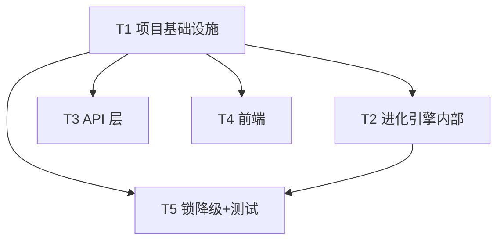

# SkillForge 增量架构设计 · v2.3.0-evo → 2.4.0-evo

> 文档版本：ARCH-EVO2-4.0（增量）　|　负责人：架构师 高见远（software-architect）
> 配套图：`docs/class-diagram-evo2-4.mermaid`、`docs/sequence-diagram-evo2-4.mermaid`
> 对齐代码：已逐文件核对 `skillforge/*.py`、`frontend/*`、`tests/*`（见任务 §7 引用）。
> 硬约束遵循：零新增 pip 运行时依赖（仅标准库 + 现有 fastapi/uvicorn/pyyaml/tiktoken）；零构建前端（原生 HTML/CSS/JS，手写 SVG）；提交仅 Hyhyhyyy；版本 `2.4.0-evo`；沿用既有接口签名（确需改动在 §8 待明确事项记录）。

---

## 1. 实现方案（Implementation Approach）

### 1.1 核心难点与对策

| 难点 | 对策 |
|------|------|
| R-1 指纹仅扫 SKILL.md，改 scripts/references/assets 检测不到 | 重构 `compute_signatures` 为「全目录复合指纹」：递归文件清单 + 关键文本/配置文件内容哈希 + 全文件 mtime，单值 hex，维持 `{技能:hex}` |
| R-1 升级首跑旧基线（SKILL.md-only hex）必误报 | `skills_signature.json` 增加 `_schema` 版本字段；`load_saved_signatures` 在 schema 不符时返回 `{}`（视作无基线）→ `detect_external_change` 视为首跑，**静默重建基线，不记 `skill_signature_change`** |
| A-4 看板看不到「上次外部变化」 | `server.py` 新增 `GET /api/evolve/pressure`，直接读 `evolution_ledger` 最近一条 `skill_signature_change`（limit=1），零新增存储 |
| A-5 长空转 heartbeat metrics 膨胀 | `evolve.run_evolve` 写 metrics 前判定：no-op 且值无变化且距上一行 < `HEARTBEAT_MIN_INTERVAL_SEC` → 跳过；值变/超间隔必写（连续） |
| B-4 异常点不可下钻 | 前端 `_drawTrend` 为异常 `<circle>` 补 `data-metric/data-idx/data-prev/data-cur/data-ts`；事件委托点击弹出 `#anomalyDetail`，可「定位账本」按 ts 高亮 ledger-row |
| C-4 锁超时未验证无测试 | `filelock.py` 超时分支补 `logger.warning`；`auto_loop._with_filelock` 补 warning；`tests/test_filelock.py` 补超时用例（caplog 校验 warning） |
| D-3 仅探测 ollama 单端点 | `scorer.py` 新增 `probe_candidates(urls)` 按序探测首个可用者；`config.EMBEDDING_CANDIDATE_URLS`（env 可配，默认含 ollama）；`ensure_default_vectorizer(candidate_url=)` 落地 `provider=local-st` + 胜出 api_url |
| R-2 `_ollama_available=None` 独立路径误回退 | `ensure_default_vectorizer` 在 `_ollama_available is None` 时先 `probe_candidates` 设缓存再分支 |
| R-3 无 `pytest.ini` 注册 markers → 告警 | 仓库根新增 `pytest.ini` 注册 a/b/c/d markers（与 `run_regression.sh` 同目录生效） |

### 1.2 框架与库选型（沿用，零新增）

- **后端**：FastAPI（沿用 v2.3），进程内 asyncio 自动循环，`simbank` 单 SQLite 连接复用。
- **向量后端**：`scorer.py` 既有 `LocalTfidfBackend` / `EmbeddingBackend` 抽象沿用；探测沿用标准库 `urllib`（零依赖）。
- **前端**：零构建原生 HTML/CSS/JS，趋势图手写 SVG（沿用 `.trend-svg` / `.trend-anomaly`）。
- **测试**：pytest（开发依赖，已在 `run_regression.sh` 处理缺失兜底），`MockEmbeddingServer`（stdlib http.server + threading）沿用。
- **无新增依赖**：所有改动仅用 Python 标准库（`hashlib/json/pathlib/os/logging`）与既有的 fastapi/uvicorn/pyyaml/tiktoken。

### 1.3 架构模式

- 后端保持「分层编排」：API 层（`server.py`）→ 引擎层（`evolve.py`/`auto_loop.py`）→ 服务层（`skill_signature.py`/`scorer.py`/`simbank.py`）→ 配置（`config.py`）。
- 前端保持「单 `app.js` 命令式渲染 + 全局 `state`」模式，无框架；模态/浮层为纯 DOM 注入。

---

## 2. 文件列表（File List，新建 + 修改，相对路径）

### 2.1 新建文件
| 路径 | 说明 |
|------|------|
| `pytest.ini` | 仓库根：注册 a/b/c/d markers（R-3），消除 `PytestUnknownMarkWarning` |

### 2.2 修改文件
| 路径 | 改动项 |
|------|--------|
| `skillforge/__init__.py` | 版本 `2.3.0-evo` → `2.4.0-evo`（硬约束④） |
| `skillforge/config.py` | 新增 `HEARTBEAT_MIN_INTERVAL_SEC`（默认 60，env 可配）、`EMBEDDING_CANDIDATE_URLS`（默认含 ollama） |
| `skillforge/skill_signature.py` | R-1：复合指纹 `compute_signatures`；`save/load` 增加 `_schema`；`detect_external_change` 静默重建基线 |
| `skillforge/simbank.py` | 新增 `get_last_evolution_metric()`（A-5 取上一行） |
| `skillforge/evolve.py` | A-5：写 metrics 前按间隔节流；R-1 静默重建已内含于 `detect_external_change` |
| `skillforge/scorer.py` | D-3：`probe_candidates(urls)`；R-2：`ensure_default_vectorizer(candidate_url=)` 在 `None` 时先探测 |
| `skillforge/server.py` | A-4：新增 `GET /api/evolve/pressure`；D-3/R-2：`lifespan` 与 `POST /api/config/vectorizer/probe` 改用候选探测 |
| `skillforge/filelock.py` | C-4：超时分支补 `logger.warning` |
| `skillforge/auto_loop.py` | C-4：`_with_filelock` 锁占用分支补 warning 日志 |
| `frontend/index.html` | 使用说明：顶栏「❓ 使用说明」按钮 + `#onboardingModal`；进化视图状态区「上次外部变化」一行；`#anomalyDetail` 浮层容器 |
| `frontend/app.js` | 使用说明首弹/唤起；A-4 拉取 pressure 并渲染；B-4 异常点 `data-*`（渲染期补充）+ 点击浮层 + 定位账本；趋势图异常点补 `data-*` |
| `frontend/style.css` | 使用说明模态/遮罩/内容样式；A-4 状态行；B-4 异常浮层与高亮 |
| `tests/test_filelock.py` | C-4：补超时用例（caplog 校验 `logger.warning`） |
| `tests/test_ollama.py` | D-3/R-2：补 `probe_candidates` 与 `ensure_default_vectorizer` 在 `_ollama_available=None` 路径用例 |
| `tests/test_signature.py` | R-1：补「改非 SKILL.md 文件（scripts/ 等）亦触发 external_change」用例；schema 静默重建用例 |

> 注：`data/skills_signature.json`、`data/vectorizer.json` 由 `data/` 目录整体 `.gitignore` 忽略（运行时生成），**无需入库**；`data/vectorizer.local-st.json` 为内置预设，本次不改。

---

## 3. 数据结构与接口（Data Structures & Interfaces）

> 完整类图见 `docs/class-diagram-evo2-4.mermaid`。以下为关键变更（文字/表格）。

### 3.1 指纹存储格式（R-1，兼容性）
```jsonc
// data/skills_signature.json —— 维持 {技能名: hex}，新增 _schema 元字段
{
  "_schema": 2,                       // 复合指纹版本（v1 = 旧 SKILL.md-only，无 _schema 或 =1）
  "skill_a": "a1b2c3...（64位 hex）",
  "skill_b": "d4e5f6..."
}
```
- `SIGNATURE_SCHEMA = 2`（`skill_signature.py` 模块常量）。
- `load_saved_signatures`：若 `_schema` 缺失或 `!= SIGNATURE_SCHEMA` → 返回 `{}`（无基线，触发静默重建，不误报）。
- `save_signatures`：写入 `{**sigs, "_schema": SIGNATURE_SCHEMA}`。

### 3.2 `skill_signature.py` 接口（修改）
```python
SIGNATURE_SCHEMA: int = 2

def compute_signatures(skills_dir: Path | None = None) -> dict[str, str]:
    """全目录复合指纹：每技能返回单值 hex（{技能名: hex}）。
    组成：递归文件清单(相对路径) + 关键文本/配置内容哈希(SKILL.md/scripts/references/*.json/*.yaml/*.md...)
          + 全部文件 mtime；大二进制仅入清单不入内容哈希。"""

def load_saved_signatures(path: Path | None = None) -> dict[str, str]:
    """读 skills_signature.json；_schema 不符 → 返回 {}（静默重建）。"""

def save_signatures(sigs: dict[str, str], path: Path | None = None) -> None:
    """写 {**sigs, "_schema": SIGNATURE_SCHEMA}。"""

def detect_external_change(skills_dir=None, path=None) -> tuple[dict, bool]:
    """schema 不符 → saved={} → external_change=False（静默重建），不记 skill_signature_change。"""
```

### 3.3 `simbank.py` 新增（A-5）
```python
def get_last_evolution_metric() -> dict | None:
    """返回 evolution_metrics 最新一行（id DESC LIMIT 1）：{id,ts,gold_coverage,f1_acc_before,f1_acc_after} 或 None。"""
```

### 3.4 `scorer.py` 接口（修改/新增，D-3 / R-2）
```python
def probe_candidates(urls: list[str], timeout: float = 1.0) -> str | None:
    """按序 probe_ollama 探测，返回首个可用 url；全不可达返回 None。"""

def probe_ollama(url: str, timeout: float = 1.0) -> bool:
    """保留为单 url 包装（兼容既有调用）。"""

def ensure_default_vectorizer(candidate_url: str | None = None) -> dict:
    """R-2：VECTORIZER_PATH 不存在且 candidate_url 未传且 _ollama_available is None
    → 先 probe_candidates 探测设置缓存；candidate_url 可用 → 落 local-st(api_url=胜出)；否则回退 local-tfidf。"""
```

### 3.5 `server.py` 新增端点（A-4）
```python
@app.get("/api/evolve/pressure")
def get_evolve_pressure() -> dict:
    """返回 {last_change:{added,removed,changed,ts}|null, signature:{skill_count,baseline}}。
    读 simbank.get_ledger(action_type='skill_signature_change', limit=1)，解析 after_val(JSON)+ts。"""
```
响应示例：
```jsonc
{
  "last_change": {"added":["skill_y"],"removed":[],"changed":["skill_x"],
                  "ts":"2026-09-08T12:05:33.123456+00:00"} | null,
  "signature":   {"skill_count": 12, "baseline": "skills_signature.json"}
}
```

### 3.6 `config.py` 新增常量
```python
HEARTBEAT_MIN_INTERVAL_SEC = float(os.environ.get("HEARTBEAT_MIN_INTERVAL_SEC", "60"))
EMBEDDING_CANDIDATE_URLS = [u.strip() for u in os.environ.get(
    "EMBEDDING_CANDIDATE_URLS", "http://localhost:11434/v1/embeddings").split(",") if u.strip()]
```

### 3.7 前端关键 DOM/接口（使用说明 / A-4 / B-4）
- `localStorage` 键：`skillforge_onboarding_v2_4`（值 `"seen"` 表示已看）。
- `#onboardingModal`（含 `.onboarding-overlay` 遮罩、`[data-close]` 关闭入口、「开始使用」按钮）。
- 异常点 `data-*`（`_drawTrend` 渲染期写入）：`data-metric`、`data-idx`、`data-prev`、`data-cur`、`data-ts`。
- `#anomalyDetail`：浮层，含指标名/前点值/本点值/变化幅度（绝对差+百分比）+「定位账本」按钮。
- 进化视图状态区新增 `<span id="lastExternalChange">`。
- 新增 API 调用：`GET /api/evolve/pressure`。

---

## 4. 程序调用流程（Sequence，关键时序）

> 完整时序图见 `docs/sequence-diagram-evo2-4.mermaid`。要点：

1. **使用说明首弹**：`init()` 末尾（DOMContentLoaded 后、不阻塞首屏）→ `initOnboarding()` 读 `localStorage.skillforge_onboarding_v2_4`；未置位 → 显示 `#onboardingModal`；关闭（开始使用/X/遮罩/Esc）→ 置位；顶栏「❓ 使用说明」随时唤起。
2. **A-4 pressure 读取**：前端进化视图 `loadPressure()` → `GET /api/evolve/pressure` → `simbank.get_ledger(action_type="skill_signature_change", limit=1)` → 解析 `after_val`(changeset)+`ts` → 渲染「上次外部变化：(+X/-Y/~Z) @ ts」或「暂无外部变化」。
3. **R-1 指纹比对 + 静默迁移**：`run_evolve` → `detect_external_change()` → `compute_signatures()`（复合指纹）→ `load_saved_signatures()`；若 `_schema` 不符 → `saved={}` → `external_change=False` → 静默重建基线（不记 `skill_signature_change`）；否则 changeset 非空 → 写 `skill_signature_change` 账本。
4. **A-5 节流判定**：`run_evolve` 末尾 → 计算 `is_no_op` → `get_last_evolution_metric()` → 若 `is_no_op` 且值同上一行且间隔 < `HEARTBEAT_MIN_INTERVAL_SEC` → 跳过写 metrics；否则 `log_evolution_metric()`（保证连续）。
5. **D-3 候选探测**：`server.lifespan` → `probe_candidates(config.EMBEDDING_CANDIDATE_URLS)` → 首个可用 url → `set_ollama_available(True)` + `ensure_default_vectorizer(candidate_url=winner)` 落 `local-st`；全不可达 → 回退 `local-tfidf`。

---

## 5. 待明确事项（Anything UNCLEAR）

| # | 事项 | 处理 |
|---|------|------|
| U1 | **mtime 导致跨部署误触发**：R-1 含全文件 mtime，git 克隆/拷贝会改 mtime 从而触发一次再进化（PRD §5 Q2 已拍板含 mtime）。本次按主理人决策实现；若后续想避免「仅 mtime 变而内容不变」的误触发，可改为「仅文件大小/内容哈希变化才计」，但需改 Q2 决策，故不在本次范围。 | 依决策实现，记录为已知权衡 |
| U2 | **`ollama_available` 语义扩展**：D-3 后该字段含义变为「任一本地候选可用」，不再特指 ollama。`resolve_backend_source` 仍返回 `local-st`/`openai`/`local-tfidf` 三态，前端显示不变。 | 设计内已说明，无需改接口 |
| U3 | **`vectorizer.local-st.json` api_url 固定为 ollama**：若胜出候选非 ollama，`ensure_default_vectorizer` 落地时把预设的 `api_url` 重写为胜出 url（仅当不同），保证落地即指向探测到的端点。 | 设计内已处理 |
| U4 | **A-5 浮点比较**：`f1_acc_before/after`、`gold_coverage` 与上一行比较采用容差 `1e-6`（非严格 `==`），避免确定性浮点抖动导致误跳过。 | 设计内已处理 |
| U5 | **B-4「定位账本」关联口径**：异常点按 `data-ts` 与 ledger-row 的 `ts`（前 19 字符匹配 `YYYY-MM-DD HH:MM:SS`）对应；若多行同秒取首个。 | 设计内已处理 |
| U6 | **接口签名改动**：本次仅新增 `GET /api/evolve/pressure`、`probe_candidates()`、`get_last_evolution_metric()`、`ensure_default_vectorizer(candidate_url=)`（向后兼容，默认 None）；既有端点/函数签名不变。 | 无破坏性改动 |

---

## 6. 设计原则落实核对
- **简单性**：指纹/探测/节流均用标准库最小实现；前端模态纯 DOM。
- **模块化**：后端分层不变；R-1/schema 收敛于 `skill_signature`；D-3 收敛于 `scorer`。
- **可测性**：所有新逻辑均下沉到纯函数（`compute_signatures`/`probe_candidates`/`get_last_evolution_metric`），便于单测；既有 a/b/c/d marker 分组不变。

---

## 7. 任务分解（Task Decomposition）

### 7.1 Required Packages（依赖包）
```
# 零新增运行时依赖；开发依赖 pytest 已由 run_regression.sh 兜底。
# 运行时仅标准库 + 既有：fastapi / uvicorn / pyyaml / tiktoken
```
**新增依赖包：无。**

### 7.2 有序任务列表（按实现顺序，含依赖关系）

> 最大任务数 5（硬上限）；每个任务 ≥3 文件；首任务为项目基础设施。

#### T1 · 项目基础设施（配置常量 + 版本 + pytest.ini）　【P0】
- **Source Files**：`pytest.ini`（新建）、`skillforge/__init__.py`、`skillforge/config.py`
- **Dependencies**：无
- **Priority**：P0
- **内容**：`pytest.ini` 注册 a/b/c/d markers（R-3）；版本 `2.3.0-evo → 2.4.0-evo`；`config.py` 新增 `HEARTBEAT_MIN_INTERVAL_SEC`、`EMBEDDING_CANDIDATE_URLS`。

#### T2 · 进化引擎内部（R-1 指纹升级 + A-5 节流）　【P0/P1】
- **Source Files**：`skillforge/skill_signature.py`、`skillforge/simbank.py`、`skillforge/evolve.py`
- **Dependencies**：T1
- **Priority**：P0（R-1）、P1（A-5）
- **内容**：`skill_signature` 复合指纹 + `_schema` 静默重建（R-1）；`simbank.get_last_evolution_metric()`（A-5）；`evolve.run_evolve` 写 metrics 前按间隔节流（A-5）。

#### T3 · API 层（A-4 pressure + D-3 多候选 + R-2 None 边界）　【P0/P1】
- **Source Files**：`skillforge/server.py`、`skillforge/scorer.py`、`tests/test_ollama.py`
- **Dependencies**：T1
- **Priority**：P0（A-4）、P1（D-3、R-2）
- **内容**：`server.py` 新增 `GET /api/evolve/pressure`（A-4）；`scorer.py` 新增 `probe_candidates` 与 `ensure_default_vectorizer(candidate_url=)`（D-3/R-2）；`server.lifespan` 与 `POST /api/config/vectorizer/probe` 改用候选探测（D-3）；`test_ollama.py` 补 `probe_candidates` 与 `None` 路径用例。

#### T4 · 前端（使用说明 + A-4 展示 + B-4 异常下钻）　【P0/P1】
- **Source Files**：`frontend/index.html`、`frontend/app.js`、`frontend/style.css`
- **Dependencies**：T1（localStorage 键/版本感知）
- **Priority**：P0（使用说明）、P0（A-4 展示）、P1（B-4）
- **内容**：`index.html` 顶栏「❓ 使用说明」+ `#onboardingModal` + 状态区「上次外部变化」+ `#anomalyDetail`；`app.js` 首弹/唤起、拉取 pressure、异常点 `data-*` 渲染 + 点击浮层 + 定位账本；`style.css` 模态/浮层/高亮样式。

#### T5 · 锁降级 + 测试补齐（C-4 + R-1 单测）　【P1】
- **Source Files**：`skillforge/filelock.py`、`skillforge/auto_loop.py`、`tests/test_filelock.py`、`tests/test_signature.py`
- **Dependencies**：T1、T2
- **Priority**：P1（C-4）、需 R-1 已落地后补单测
- **内容**：`filelock.py` 超时分支补 `logger.warning`（C-4）；`auto_loop._with_filelock` 补 warning（C-4）；`test_filelock.py` 补超时 caplog 用例（C-4）；`test_signature.py` 补「改非 SKILL.md 文件触发 external_change」+ schema 静默重建用例（R-1）。

### 7.3 任务依赖图（Mermaid）


---

## 8. Shared Knowledge（跨文件约定，供工程师）

- **`_schema` 版本常量**：`skill_signature.SIGNATURE_SCHEMA = 2`；存储键名 `_schema`。
- **localStorage 键**：`skillforge_onboarding_v2_4`（值 `"seen"` = 已看；按版本号命名，升级改键可强制老用户重看）。
- **Env 名**：
  - `HEARTBEAT_MIN_INTERVAL_SEC`（默认 `60`）
  - `EMBEDDING_CANDIDATE_URLS`（逗号分隔，默认 `http://localhost:11434/v1/embeddings`）
  - 既有 `EMBEDDING_PROBE_URL`、`FILELOCK_TIMEOUT_SEC`、`AUTO_EVOLVE_*` 沿用。
- **异常点 data 属性**（B-4 前后端约定）：`data-metric` / `data-idx` / `data-prev` / `data-cur` / `data-ts`。
- **新增 API**：`GET /api/evolve/pressure`（响应 `{last_change, signature}`）。
- **写入顺序约定**：`run_evolve` 始终在末尾处理 heartbeat metrics（节流在写入前判定）；`skill_signature.save_signatures` 在 `run_evolve` 退出前刷新基线。
- **零新增依赖**：任何新代码仅用标准库 + 既有 fastapi/uvicorn/pyyaml/tiktoken；探测用 `urllib`。
- **测试分组**：`tests/` 沿用 `pytest.mark.a/b/c/d`；`pytest.ini` 注册后 `PytestUnknownMarkWarning` 消除，运行 `run_regression.sh` 行为不变。
