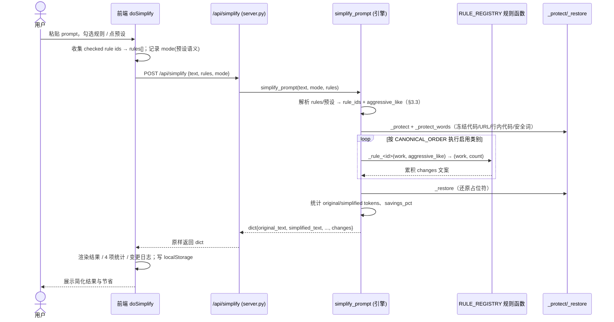
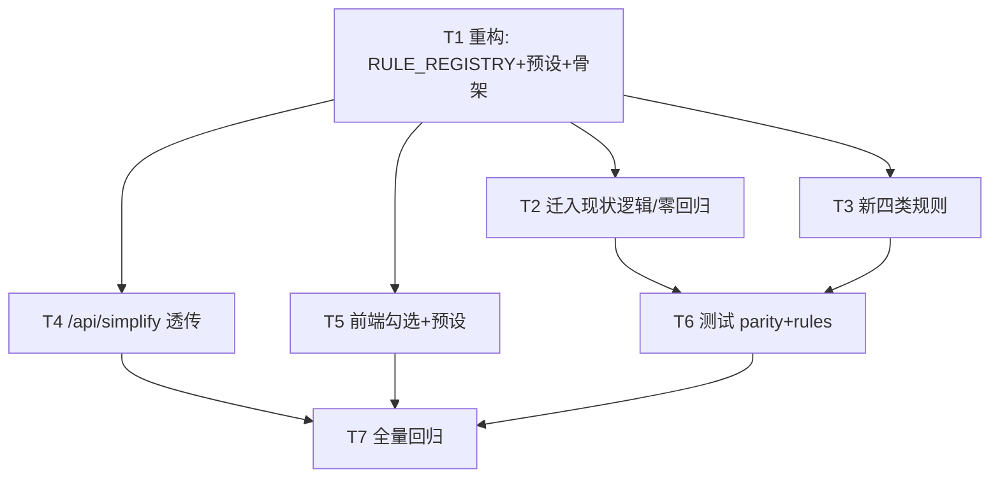

# SkillForge 增量架构设计 · v2.5.0-evo → 2.6.0-evo（ARCH-EVO2-6）

> 文档版本：ARCH-EVO2-6.0（增量）　|　负责人：架构师 高见远（software-architect）
> 配套图：`docs/class-diagram-evo2-6.mermaid`、`docs/sequence-diagram-evo2-6.mermaid`
> 对齐代码：已逐文件深读 `skillforge/prompt_simplifier.py` 全文、`server.py:216-234`、`frontend/app.js:535-614`、`frontend/index.html:85-114`、`tests/test_simplify.py`，并对照 `docs/arch-evo2-4.md` 风格。
> 硬约束遵循：零新增 pip 运行时依赖（仅标准库 + 既有 fastapi/uvicorn/pyyaml/tiktoken）；零构建前端（原生 HTML/CSS/JS）；接口向后兼容；范围仅限通用 Prompt 简化器；不动 `cleaner.py` / `/api/clean` / `/api/apply`。
> 目标版本 `2.6.0-evo`（版本号由主理人在 `skillforge/__init__.py` 处理，本文仅记录）。

---

## 1. 实现方案（Implementation Approach）

### 1.1 核心难点与对策

| 难点 | 对策 |
|------|------|
| D-1 现状「两档硬编码」（`if aggressive:` 分支散落 4 处：填充词表 / 单字请 / 行内角色兜底 5.b / 角色前缀）→ 无法独立开关、无法加新类别 | 抽出 **规则注册表 `RULE_REGISTRY`**（id → {label, fn, default_in_presets}）+ **预设常量 `PRESETS`**；每类一个纯函数 `_rule_<id>(work, aggressive_like) -> (work, count)`；`simplify_prompt` 改为「解析 rules/预设 → 保护 → 按 `CANONICAL_ORDER` 顺序执行启用类别 → 还原 → 统计」的管道。 |
| D-2 零回归硬指标：`rules` 缺省（balanced/aggressive）必须产出与现版**逐字相同**的 `simplified_text` 与 `changes` 文案 | 保留现版执行顺序（空项 → 去重 → 空行 → 填充词 → 角色）作为 `CANONICAL_ORDER` 前 5 位；5 个既有类别的函数体内逻辑**逐字复刻**现版（含 `_CN_FILLERS_*` / `_EN_FILLERS_*` / `_ROLE_PREFIXES` / `_ROLE_PREFIX_CN` / `_EMPTY_BULLET_RE` / `_norm_line`）；`changes` 文案格式与触发条件与现版一致。 |
| D-3 Q3（行内角色兜底 5.b、单字「请」并入分类）与 P0-3（balanced 必须保留行内角色）的张力 | 引入单一布尔 `aggressive_like`：由 `mode` 派生（`mode=="aggressive"` 为 True）。`_rule_role_prefix` 仅当 `aggressive_like` 才做行内兜底；`_rule_politeness` 仅当 `aggressive_like` 才做单字「请」移除。→ balanced 预设（`aggressive_like=False`）逐字复刻现版 balanced；aggressive 预设（`aggressive_like=True`）逐字复刻现版 aggressive；两类均可通过关闭对应 checkbox 被独立关闭（满足 Q3「分类纯净、可独立开关」）。详见 §1.4。 |
| D-4 `examples_trim` 最激进、风险最高：不能截断代码块/行内代码/URL，且需识别「示例引导词」后的多行块 | 在 `_protect` 之后执行（受保护片段已是 `\x00P{n}\x00` 单 token，天然不可被截断）；以「引导词行 + 后续连续非空行块」为单位，超阈值（≥4 行 或 ≥200 字符）折叠为前 3 行 + 标注「（示例已压缩，共 X 行）」；保护 token 行**永远保留**，绝不裁断。默认关闭（不进任何预设）。详见 §3.5。 |
| D-5 前端 radio 升级为「分组勾选 + 保守/激进预设」且向后兼容 `{text, mode}` 老调用 | `index.html` 删除 radio，改为 9 个分组 checkbox + 两个预设按钮；`doSimplify` 收集勾选项为 `rules:[]` 下发，并附带 `mode`（承载 `aggressive_like` 语义）；后端 `rules=None` 时仍按 `mode` 预设执行，老调用零改动。 |

### 1.2 框架与库选型（沿用，零新增）

- **后端**：FastAPI + 标准库（`re`/`json`）+ 既有 `skillforge.tokenizer.count_tokens`（tiktoken cl100k_base，缺失回退字符启发式）。无新运行时依赖。
- **前端**：零构建原生 HTML/CSS/JS，无框架/无图表库；DOM 命令式渲染，延续 `app.js` 全局状态模式。
- **测试**：pytest（沿用 `pytest.mark.a` 分组，与 `tests/test_simplify.py` 同组）；新增两个测试文件。
- **无新增依赖**：所有改动仅用 Python 标准库与既有 fastapi/uvicorn/pyyaml/tiktoken。

### 1.3 架构模式

- 后端保持「分层」：`server.py`（API 层）→ `prompt_simplifier.py`（引擎层，纯函数管道）。
- 规则引擎内部采用「**注册表 + 管道**」模式：`RULE_REGISTRY` 为单一真源（id ↔ 处理函数 ↔ 预设归属），`simplify_prompt` 按 `CANONICAL_ORDER` 驱动启用类别。新增规则只需在注册表加一项 + 一个纯函数，不改主流程。
- 前端保持「单 `app.js` 命令式渲染 + 全局 `state`」模式，无框架；预设/勾选状态用 `localStorage` 记忆。

### 1.4 关键设计决策：`aggressive_like` 语义（解决 Q3 × P0-3 张力）

现状 aggressive 专属的「行内角色前缀兜底（5.b）」与「单字『请』移除」在现版是**硬编码挂在 `mode=="aggressive"` 上的行为**，并非独立开关。Q3 要求把它们并入 `role_prefix` / `politeness` 分类以「可独立开关」。但若直接并入且**无条件执行**，则 balanced 预设（含 `role_prefix`/`politeness`）会意外做行内角色移除 → 破坏 P0-3（与现版 balanced 不等）。

**决策**：每个规则函数签名统一为 `fn(work, aggressive_like) -> (work, count)`。`aggressive_like` 由 `mode` 派生：
- `rules=None` → 按 `mode` 展开预设，`aggressive_like = (mode=="aggressive")`。
- `rules=[...]` 显式传入 → `aggressive_like = (mode=="aggressive")`（前端「激进」预设发 `mode="aggressive"`，「保守」/手动发 `mode="balanced"`）。

仅 `_rule_role_prefix` 与 `_rule_politeness` 在 `aggressive_like=True` 时追加原 aggressive 专属子步骤。其余 7 个类别忽略该参数。

**效果**：
- balanced 预设 ⟹ `aggressive_like=False` ⟹ 行内角色保留、单字「请」保留 → 逐字复刻现版 balanced（P0-3 ✓）。
- aggressive 预设 ⟹ `aggressive_like=True` ⟹ 行内角色兜底 + 单字「请」移除 → 逐字复刻现版 aggressive（P0-3 ✓）。
- 用户关闭 `role_prefix` / `politeness` checkbox ⟹ 对应专属行为一并消失（Q3「独立开关」✓）。
- 用户仅勾 `role_prefix` 且 `mode="balanced"` ⟹ 只做行首角色精简，不做行内兜底（符合直觉）。

> ⚠️ 该决策要求**前端在发送显式 `rules` 时一并带上 `mode`**（反映当前激活的预设），否则 explicit rules 无法触发行内角色兜底与单字「请」。见 §5 待明确事项 U4。

---

## 2. 文件列表（File List，相对路径）

### 2.1 修改文件（核心）
| 路径 | 改动项 |
|------|--------|
| `skillforge/prompt_simplifier.py` | **重构**：抽出 `RULE_REGISTRY` / `PRESETS` / `ALL_RULE_IDS` / `CANONICAL_ORDER`；新增 9 个 `_rule_*` 纯函数；`simplify_prompt(text, mode, rules)` 改管道式；保留并复用 `_protect`/`_protect_words`/`_restore`/`_PROTECT_RE`/`_EMPTY_BULLET_RE`/`_norm_line`/`_collapse_blank_lines`/`_simplify_role` 及全部填充词/角色前缀表。 |
| `skillforge/server.py` | 改 `/api/simplify`（216–234 行）：读取可选 `rules`，透传给 `simplify_prompt(text, mode=mode, rules=rules)`；非法/缺失 `rules` 兜底为 `None`。 |
| `frontend/index.html` | 简化区块（85–114 行）：删除两个 radio，改为 9 个分组 checkbox + 「保守」「激进」预设按钮 + 自定义态指示。 |
| `frontend/app.js` | `initSimplifier`（535–565）接入 checkbox/预设按钮/`localStorage`；`doSimplify`（567–597）收集 `rules` + `mode` 下发；变更日志渲染兼容新 `changes`。 |
| `frontend/style.css` | 新增 checkbox 分组区、预设按钮、自定义态样式。 |

### 2.2 新增文件（测试，零回归）
| 路径 | 说明 |
|------|------|
| `tests/test_simplify_parity.py` | ≥10 条样例断言重构前后 `balanced`/`aggressive` 输出**字符串相等**（含 `changes` 文案）；覆盖 `test_simplify.py` 全部关键场景 + 扩样。 |
| `tests/test_simplify_rules.py` | 每类独立开/关、examples_trim 边界、保护机制不破坏、非法 id / 空数组语义、预设集合静态枚举。 |

### 2.3 已存在 / 记录项（本增量不改动源码，仅引用或记录）
| 路径 | 说明 |
|------|------|
| `docs/prd-evo2-6.md` | 需求源（已存在）。 |
| `docs/arch-evo2-6.md` | 本文（本增量产出）。 |
| `skillforge/__init__.py` | 版本 `2.5.0-evo → 2.6.0-evo` **由主理人处理**（本文记录目标版本，工程师不在本任务改）。 |
| `tests/test_simplify.py` | 既有回归套件（P0-3 直接复用其 7 个用例锁定行为）。 |
| `skillforge/cleaner.py` / `/api/clean` / `/api/apply` | **不在范围**，本增量不动。 |

---

## 3. 数据结构与接口（Data Structures & Interfaces）

> 完整类图见 `docs/class-diagram-evo2-6.mermaid`。以下为关键定义（设计级，非源码）。

### 3.1 规则注册表、预设与单一真源

```python
# —— 规则 id 集合的单一真源（导出供前端 checkbox 对应）——
ALL_RULE_IDS: list[str] = [
    "politeness", "role_prefix", "empty_items", "duplicate_lines",
    "blank_lines", "meta_comment", "hedging", "redundant_adverbs", "examples_trim",
]

# —— 类别执行顺序（前 5 位与现版执行顺序逐字一致，保障 P0-3）——
CANONICAL_ORDER: list[str] = [
    "empty_items", "duplicate_lines", "blank_lines",
    "politeness", "role_prefix",
    "meta_comment", "hedging", "redundant_adverbs", "examples_trim",
]

# —— 预设 ↔ rules 映射（依主理人拍板 Q1）——
PRESETS: dict[str, list[str]] = {
    "balanced":   ["politeness", "role_prefix", "empty_items",
                   "duplicate_lines", "blank_lines", "meta_comment"],
    "aggressive": ["politeness", "role_prefix", "empty_items",
                   "duplicate_lines", "blank_lines", "meta_comment",
                   "hedging", "redundant_adverbs"],
    # examples_trim 不进任何预设，默认关闭，需手动勾（Q1/Q2）
}

# —— 规则注册表：id -> {label, fn, default_in_presets} ——
RULE_REGISTRY: dict[str, dict] = {
    "politeness":        {"label": "礼貌/客气填充词", "fn": _rule_politeness,        "default_in_presets": True},
    "role_prefix":       {"label": "冗长角色前缀精简", "fn": _rule_role_prefix,       "default_in_presets": True},
    "empty_items":       {"label": "空列表项/空编号",  "fn": _rule_empty_items,       "default_in_presets": True},
    "duplicate_lines":   {"label": "重复指令合并",     "fn": _rule_duplicate_lines,   "default_in_presets": True},
    "blank_lines":       {"label": "空行折叠",         "fn": _rule_blank_lines,       "default_in_presets": True},
    "meta_comment":      {"label": "元评论/过渡句",    "fn": _rule_meta_comment,      "default_in_presets": True},   # Q1：进保守
    "hedging":           {"label": "弱语气词",         "fn": _rule_hedging,           "default_in_presets": False},  # 仅激进
    "redundant_adverbs": {"label": "冗余副词",         "fn": _rule_redundant_adverbs, "default_in_presets": False},  # 仅激进
    "examples_trim":     {"label": "过长示例压缩",     "fn": _rule_examples_trim,     "default_in_presets": False},  # 默认关
}
```

- `ALL_RULE_IDS` / `PRESETS` / `RULE_REGISTRY` 从 `prompt_simplifier` 导出（`__all__` 包含），前端 checkbox 的 `id` 与之严格对应（共享知识 §7）。
- `default_in_presets` 仅作文档/自检用；预设集合以 `PRESETS` 常量静态枚举为准（P1-7 验收：可静态枚举写入文档）。

### 3.2 规则函数签名（统一）

```python
RuleFn = Callable[[str, bool], tuple[str, int]]   # (work, edits_count)

def _rule_politeness(work: str, aggressive_like: bool) -> tuple[str, int]:       # 用 aggressive_like 做单字「请」
def _rule_role_prefix(work: str, aggressive_like: bool) -> tuple[str, int]:      # 用 aggressive_like 做行内兜底 5.b
def _rule_empty_items(work: str, aggressive_like: bool) -> tuple[str, int]:
def _rule_duplicate_lines(work: str, aggressive_like: bool) -> tuple[str, int]:
def _rule_blank_lines(work: str, aggressive_like: bool) -> tuple[str, int]:
def _rule_meta_comment(work: str, aggressive_like: bool) -> tuple[str, int]:
def _rule_hedging(work: str, aggressive_like: bool) -> tuple[str, int]:
def _rule_redundant_adverbs(work: str, aggressive_like: bool) -> tuple[str, int]:
def _rule_examples_trim(work: str, aggressive_like: bool) -> tuple[str, int]:
```

- 除 `politeness`/`role_prefix` 外，其余 7 个忽略 `aggressive_like` 参数（签名统一，便于注册表调度）。
- 每个函数返回 `(new_work, count)`；`count` 用于生成 `changes` 文案。

### 3.3 `simplify_prompt` 签名变更

```python
def simplify_prompt(
    text: str,
    mode: str = "balanced",
    rules: list[str] | None = None,
) -> dict:
    """返回 dict 键不变：original_text, simplified_text, original_tokens,
    simplified_tokens, tokens_saved, savings_pct, changes。"""
```

**规则解析语义（关键）**：
1. `rules is None` → 按 `mode` 展开预设：`rule_ids = PRESETS.get(mode, PRESETS["balanced"])`；`aggressive_like = (mode == "aggressive")`。**与现版逐字一致**（P0-3）。
2. `rules` 为 `list` → 仅保留**合法 id**（∈ `ALL_RULE_IDS`），去重、按 `CANONICAL_ORDER` 排序；**非法 id 静默忽略，不 500**（P0-1）。`aggressive_like = (mode == "aggressive")`。
3. `rules == []`（或全为非法 id）→ 视为「仅保护 + 空行折叠」：`rule_ids = ["blank_lines"]`（P0-1 验收②「只做保护 + 空行折叠」）。
4. `rules` 为非空显式集合且**不含** `blank_lines` → `blank_lines` 不执行（P1-5：「任一类别单独关闭时对应处理被跳过」）。

> 注意 `rules=[]` 与 `rules=["politeness"]` 的差别（见 §7 共享知识）：空数组→保底含 `blank_lines`；显式非空不含 `blank_lines`→不折叠空行。

### 3.4 `/api/simplify` 请求 / 响应

```jsonc
// 请求体（POST /api/simplify）
{
  "text": "原始 prompt 文本（必填，可空串）",
  "mode": "balanced",          // 可选；缺省 balanced；同时承载 aggressive_like 语义
  "rules": ["politeness", "role_prefix", "..."]   // 可选；list[str]|null；非法 id 忽略
}

// 响应：原样返回 simplify_prompt 结果（结构不变）
{
  "original_text": "...", "simplified_text": "...",
  "original_tokens": 0, "simplified_tokens": 0,
  "tokens_saved": 0, "savings_pct": 0.0,
  "changes": ["移除 3 处礼貌/冗余填充词", "..."]
}
```

- 向后兼容：旧调用方仅传 `{text}` / `{text, mode}` → `rules=None` → 预设行为，响应与现版一致（P0-1 验收①）。
- `rules` 非 list（如字符串/数字）→ 后端兜底为 `None`，不 500。
- 空 `text` → 优雅返回全零/空串（沿用现版逻辑，不动）。

### 3.5 `examples_trim` 算法（Q2，伪代码级，绝不截断受保护片段）

```
引导词集合 LEAD_WORDS = {
  "例如","例如：","比如","比如：","举个例子","举个例","诸如","譬如","示例如下","例子如下","具体如下",
  "e.g.","for example","for instance","for examples","such as"
}   # 中文按子串匹配；英文大小写不敏感、词界匹配

函数 _rule_examples_trim(work, _):
  行 = work.split("\n")
  out = []
  i = 0
  while i < len(行):
    line = 行[i]
    if 行[i] 含引导词(且其后为空或接续内容):
        # 收集示例块：从 i+1 起连续非空、且非「独立保护块起始」的行
        block = []
        j = i + 1
        while j < len(行) and 行[j].strip() != "":
            block.append(行[j]); j += 1
        # 保护 token 行（\x00P{n}\x00 / \x00K{n}\x00）永远保留，不计入可裁切额度
        total = len(block)
        chars = sum(len(x) for x in block)
        if total >= 4 或 chars >= 200:
            保留 = block[:3]                       # 前 3 行
            # 若第 4 行起存在保护 token 行，仍追加保留（绝不裁断代码/URL）
            保留 += [x for x in block[3:] if 是保护token行(x)]
            out.append(line)                       # 引导词行保留
            out += 保留
            out.append(f"（示例已压缩，共 {total} 行）")
            i = j
        else:
            out.append(line); out += block; i = j
    else:
        out.append(line); i += 1
  返回 "\n".join(out), 触发块数
```

- **保护不可破坏**：因在 `_protect` 之后执行，代码块/行内代码/URL 已是 `\x00P{n}\x00` 单 token，不会因「多行列表」被截断；块内保护行永远保留。
- **阈值**：≥4 行 或 ≥200 字符（任一满足即压缩）。
- **标注文案**：`（示例已压缩，共 X 行）`（`X` = 示例块原始行数）。是否计入 token 统计见 §5 U1。
- **默认关闭**：不进 `PRESETS`，需手动勾（Q1/Q2）。
- **边界**：代码块内注释里的「例如」（被保护为单 token）不受影响；非示例长段落（无引导词）不误截。

### 3.6 类图（Mermaid，详见 `docs/class-diagram-evo2-6.mermaid`）

要点：`SimplifierConfig` 聚合 9 个 `RuleEntry`（`RULE_REGISTRY`）；`SimplifyPipeline.simplify_prompt` 读取 `PRESETS`/`CANONICAL_ORDER` 并调度 `Protect` 与规则函数。见独立 `.mermaid` 文件。

---

## 4. 程序调用流程（Sequence，关键时序）

> 完整时序图见 `docs/sequence-diagram-evo2-6.mermaid`。要点（前端 → 后端 → 引擎）：



文字要点：
1. 前端 `doSimplify` 读取勾选 → 组装 `rules`（空则 `[]`）+ `mode` → `POST /api/simplify`。
2. `simplify_prompt` 先按 §3.3 解析出 `rule_ids` 与 `aggressive_like`。
3. **保护阶段**（`_protect`/`_protect_words`）永远最先执行，冻结代码块/URL/行内代码/含「请」安全词。
4. **规则阶段**：按 `CANONICAL_ORDER` 顺序，仅对 `rule_ids` 中的类别调用 `_rule_<id>`；每个返回 `(work, count)` 累积进 `changes`。
5. **还原阶段**：`_restore` 还原占位符；`blank_lines` 启用时做末次 `_collapse_blank_lines().strip()`（复刻现版 step 6，保障 P0-3）。
6. 统计 token 节省，原样返回；前端渲染 + `localStorage` 记忆。

---

## 5. 待明确事项（Anything UNCLEAR）

| # | 事项 | 处理建议 |
|---|------|----------|
| U1 | **`examples_trim` 标注文案是否计入 token 统计 / `X` 取保护前还是保护后行数**：`（示例已压缩，共 X 行）` 是输出一部分，`count_tokens` 自然计入；`X` 建议取示例块**保护前原始行数**（更直观）。 | 建议：标注计入统计、`X` 取原始行数；若主理人希望 `X` 不含保护行请明示。 |
| U2 | **P2-3 各类别 token 拆解本轮回不回**：PRD 列 P2-3「可选，依赖 P2-2」。本轮若做 P2-2（变更日志按类标注）需先有「类别溯源」数据结构。 | 建议：**本轮回 P2-2 的溯源数据准备**（每个 change 携带 category 字段），但不强制前端渲染条形；P2-3 渲染推到下一轮或直接合并进本轮 T5 末步（低成本）。需主理人拍板。 |
| U3 | **P2-2 变更日志按类标注会与 P0-3「changes 文案格式不变」冲突**：若写成 `"移除 3 处礼貌填充词 [politeness]"`，会改变 `rules=None` 时的输出字符串 → 破坏零回归。 | 建议：**category 标签仅在 `rules` 显式传入时附加**；`rules=None`（预设）模式保持现版纯文本格式，确保 P0-3。需主理人确认。 |
| U4 | **前端是否发送 `mode` 以承载 `aggressive_like`**：若前端仅发 `{text, rules}`（不带 `mode`），显式勾选（含 `role_prefix`）无法触发「行内角色兜底 / 单字请」，激进体验打折。 | 建议：前端「激进」预设发 `{text, rules:[...7类], mode:"aggressive"}`；「保守」/手动发 `mode:"balanced"`。需主理人拍板。 |
| U5 | **`meta_comment`/`hedging`/`redundant_adverbs` 词典范围**：中文弱语气/过渡句极其开放，初版难穷尽。 | 建议：首版覆盖 PRD §3 列举的高频词（种子词典），后续按用户反馈迭代，不追求穷尽；本设计给出种子词表（见 §3 注册表 label + PRD §3）。 |
| U6 | **`examples_trim` 引导词是否含「如下/具体如下」**：现 `tests/test_simplify.py` 用「示例如下：」，但该用例走现有保护逻辑、`examples_trim` 默认关，不影响回归。 | 建议：把「示例如下/例子如下/具体如下/such as」也纳入 `LEAD_WORDS`（见 §3.5）。 |
| U7 | **`rules=[]` vs `rules=["politeness"]` 的空白行语义差异**（§3.3 第 3/4 条）：空数组保底含 `blank_lines`，显式非空不含则不折叠。 | 已定为设计内行为，记录于此供评审；若主理人认为应统一（空数组也完全不折叠），请明示。 |

---

## 6. 任务分解（Task Decomposition）

> 说明：本增量按主理人显式下达的 T1–T7 结构拆解（共 **7** 个任务）。该数量超过通用模板默认的 5 任务上限，系主理人在任务指派中**明确枚举并要求**所致，故按显式指派执行；依赖与优先级严格遵循指派意图。

### 6.1 Required Packages（依赖包）

```
# 零新增运行时依赖；开发依赖 pytest 已沿用（tests/ 组 a）。
# 运行时仅标准库 + 既有：fastapi / uvicorn / pyyaml / tiktoken
```

**新增依赖包：无。**

### 6.2 有序任务列表（按实现顺序，含依赖）

#### T1 · 重构 prompt_simplifier：RULE_REGISTRY + 预设常量 + 规则函数骨架　【P0】
- **Source Files**：`skillforge/prompt_simplifier.py`
- **Dependencies**：无
- **Priority**：P0
- **内容**：建立 `ALL_RULE_IDS` / `CANONICAL_ORDER` / `PRESETS` / `RULE_REGISTRY` 四个常量并导出；定义 9 个 `_rule_<id>(work, aggressive_like)` 函数骨架（含统一签名）；确定 `simplify_prompt(text, mode, rules)` 管道骨架与 `aggressive_like` 解析逻辑（§3.3）。暂将现有硬编码逻辑整体迁移进对应函数（见 T2），保证可运行。

#### T2 · 迁入现状硬编码逻辑，保证 balanced/aggressive 零回归　【P0-3】
- **Source Files**：`skillforge/prompt_simplifier.py`
- **Dependencies**：T1
- **Priority**：P0（P0-3）
- **内容**：把现版 `_CN_FILLERS_*`/`_EN_FILLERS_*`/`_ROLE_PREFIXES`/`_ROLE_PREFIX_CN`/`_EMPTY_BULLET_RE`/`_norm_line`/`_collapse_blank_lines`/`_simplify_role` 及「单字请」「5.b 行内兜底」**逐字迁入**对应 `_rule_*` 函数；按 §1.4 用 `aggressive_like` 控制 5.b / 单字请；`changes` 文案格式与触发条件与现版一致（删除 N 个空列表项 / 合并 N 条重复指令 / 移除 N 处礼貌填充词 / 精简 N 处角色描述 / 无需变更）。验收：`tests/test_simplify.py` 7 用例全过；`balanced`/`aggressive` 输出与重构前逐字相等。

#### T3 · 实现 4 个新类别 meta_comment / hedging / redundant_adverbs / examples_trim　【P1-1~P1-4】
- **Source Files**：`skillforge/prompt_simplifier.py`
- **Dependencies**：T1、T2
- **Priority**：P1
- **内容**：新增四类词典与处理函数；`meta_comment`/`hedging`/`redundant_adverbs` 为短语级安全移除（不破坏主干），与既有 `politeness` 去重不重复计数；`examples_trim` 按 §3.5 算法（引导词 + 多行块 + 阈值 + 前 3 行 + 标注 + 保护不可截断），默认关闭。验收：新类别独立开/关生效；保护机制不破坏（P0-2）。

#### T4 · 改造 /api/simplify 接收 rules 并透传　【P0-1】
- **Source Files**：`skillforge/server.py`
- **Dependencies**：T1（需 `simplify_prompt` 新签名与 `rules` 语义）
- **Priority**：P0（P0-1）
- **内容**：`/api/simplify`（216–234）读取可选 `rules`，非 list 兜底 `None`，调用 `simplify_prompt(text, mode=mode, rules=rules)`；响应结构不变。验收：旧调用 `{text}`/`{text, mode}` 行为一致；非法 id / 空数组不 500（P0-1 验收①②③）。

#### T5 · 前端 index.html + app.js + style.css：分组勾选 + 预设 + localStorage + 变更日志标注　【P1-6 / P2-1 / P2-2】
- **Source Files**：`frontend/index.html`、`frontend/app.js`、`frontend/style.css`
- **Dependencies**：T1（需 `ALL_RULE_IDS`/`PRESETS` 静态枚举供 checkbox 对应）、T3（examples_trim 文案）
- **Priority**：P1（P1-6）、P2（P2-1 记忆、P2-2 标注，按 U2/U3 决策）
- **内容**：`index.html` 删除 radio，加 9 个分组 checkbox（label 含中文名 + 英文 id）+「保守」「激进」预设按钮 + 自定义态；`app.js` 接入勾选/预设/`localStorage` 记忆、`doSimplify` 收集 `rules`+`mode` 下发（见 U4）、变更日志渲染兼容新 `changes`（P2-2 仅显式 rules 时加类别标签）；`style.css` 分组/按钮/自定义态样式。验收：默认按保守勾选；点激进一键套用；手动改勾选转自定义态；请求体 `{text, rules}`（+`mode`）。

#### T6 · 测试：test_simplify_parity（零回归）+ test_simplify_rules（分类规则）　【P0-3 / P0-2 / P1-5】
- **Source Files**：`tests/test_simplify_parity.py`（新增）、`tests/test_simplify_rules.py`（新增）
- **Dependencies**：T1、T2、T3（需四类函数与解析语义落地）
- **Priority**：P0（P0-3 零回归）、P0（P0-2 保护）、P1（P1-5 独立开关）
- **内容**：
  - `test_simplify_parity.py`：≥10 条样例，(input, balanced_expected, aggressive_expected) 硬编码快照（取自现版 2.5 行为），断言重构后字符串相等（含 `changes`）；复用 `test_simplify.py` 关键场景（midline 角色、代码/URL 保护等）。
  - `test_simplify_rules.py`：每类独立开/关（fixture 验证跳过）、`examples_trim` 边界（阈值/保护不可截断/标注）、保护机制不破坏（代码块/URL/行内代码逐字节不变）、非法 id 忽略、`rules=[]`→仅保护+空行、预设集合 `PRESETS` 静态枚举断言。

#### T7 · 全量回归：pytest -q 必须 0 失败　【P0 收口】
- **Source Files**：（无新增；执行级）`pytest -q` 全量
- **Dependencies**：T1、T2、T3、T4、T5、T6
- **Priority**：P0（收口验收）
- **内容**：运行全量 `pytest -q`，确认 `tests/test_simplify.py` + `test_simplify_parity.py` + `test_simplify_rules.py` + 既有套件全部 0 失败；`/api/simplify` 新旧调用方无回归。

### 6.3 任务依赖图（Mermaid）



---

## 7. Shared Knowledge（跨文件约定，供工程师）

- **规则 id 单一真源**：`prompt_simplifier.ALL_RULE_IDS`（导出）；前端 9 个 checkbox 的 `id` 必须与之一一对应（politeness / role_prefix / empty_items / duplicate_lines / blank_lines / meta_comment / hedging / redundant_adverbs / examples_trim）。新增类别必须同步改两侧。
- **预设常量**：`PRESETS = {"balanced": [...6类...], "aggressive": [...8类...]}`（`examples_trim` 不进任何预设，默认关）。前端预设按钮与后端 `mode` 映射一一对应。
- **`aggressive_like` 派生**：由 `mode=="aggressive"` 得出；仅 `_rule_role_prefix` / `_rule_politeness` 使用，用于原 aggressive 专属（行内角色兜底 5.b / 单字「请」）。`balanced` 预设天然 `False` → 逐字复刻现版 balanced（P0-3 基石）。
- **规则解析语义**（§3.3）：`rules=None`→预设；`rules=list`→仅留合法 id、按 `CANONICAL_ORDER` 排序、非法忽略；`rules=[]`/全非法→`["blank_lines"]`（保护+空行）；非空显式不含 `blank_lines`→不折叠空行。
- **保护机制顺序铁律**：所有新增规则**必须在 `_protect`/`_protect_words` 之后、`_restore` 之前**作用于脱敏文本；新增词典不得匹配占位符 `\x00P{n}\x00` / `\x00K{n}\x00` 内部。
- **`changes` 文案兼容**：`rules=None`（预设）模式保持现版纯文本格式（保障 P0-3）；仅当 `rules` 显式传入时，可按 U3 决策附加 `[category]` 标签。
- **前端请求体**：推荐 `{text, rules:[...], mode}`（`mode` 承载 `aggressive_like`，见 U4）；后端对缺 `rules`/非 list 兜底 `None`，绝不 500。
- **localStorage 键**：建议 `skillforge_simplify_v2_6`，存 `{rules:[...], mode}`，进入页面恢复；版本号入键便于升级重置。
- **零新增依赖**：仅标准库 + 既有 fastapi/uvicorn/pyyaml/tiktoken；token 复用 `skillforge.tokenizer.count_tokens`。
- **测试分组**：新增测试归入 `pytest.mark.a`（与 `test_simplify.py` 同组），`pytest -q` 全量 0 失败为收口标准。

---

## 8. 设计原则落实核对

- **简单性**：注册表 + 管道用最小抽象；新增规则只需「注册表一项 + 一个纯函数」，主流程零改动。
- **模块化**：规则引擎收敛于 `prompt_simplifier`；API 层仅透传；前端仅 UI，不改后端契约。
- **零回归**：`CANONICAL_ORDER` 前 5 位与现版执行顺序逐字一致 + 既有逻辑逐字迁入 + `test_simplify_parity.py` 快照锁版本。
- **可测性**：所有规则为纯函数 `(work, aggressive_like) -> (work, count)`，便于单测；保护/还原为独立函数；新增 `test_simplify_rules.py` 覆盖独立开关与边界。
- **保护不破**：`_protect/_restore` 始终包裹全部规则；`examples_trim` 显式保留保护 token 行。
