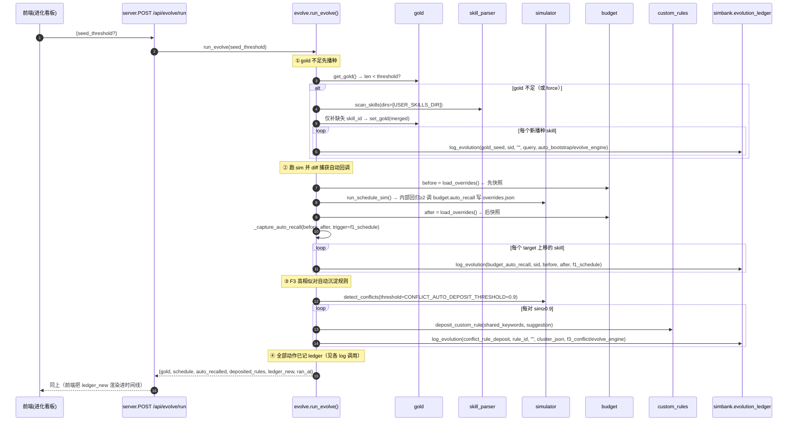
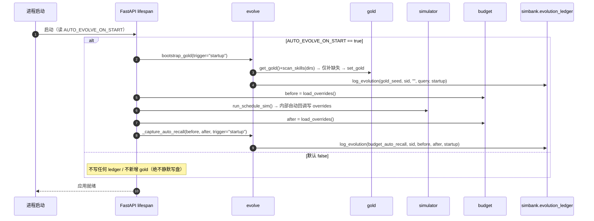
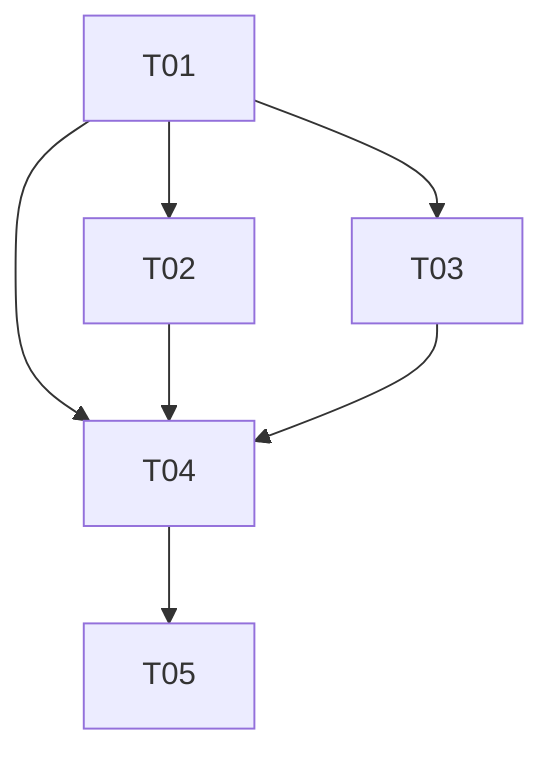

# SkillForge 自进化增量架构设计 v2.1（自主进化引擎 + 进化账本）

> 文档版本：ARCH-EVO2-1.0　|　架构师：高见远（software-architect）
> 适用范围：在 v2.0-evo 已交付的「数据驱动自进化闭环」（F1 调度模拟 / F2 成本仿真 / F3 冲突检测 + 回归自动回调预算 + 冲突规则沉淀）之上，增量实现 **GOAL-1 真实信号（Gold 自动播种）/ GOAL-2 自主运行（evolve 引擎 + 开机自启）/ GOAL-3 可追溯（进化账本）**。
> 约束：本文档仅产出架构与任务分解，**不写实现代码**。v2.0 已确定内容（arch-evo.md / PRD §6 的 Q1–Q8、D1–D7）继续沿用，不再重议。必读：`docs/arch-evo.md`（v2.0 闭环）、`docs/prd-evo2.md`、以及 `skillforge/*.py` 真实签名（本文所有调用均对齐真实代码）。

---

## 1. 实现方案 + 框架选型

### 1.1 核心难点与解法

| 难点 | 现状（来自真实代码） | 解法 |
|------|----------------------|------|
| **自动回调不可见** | `simulator.run_schedule_sim()` 内部对回归≥2 技能调用 `budget.auto_recall(sk)` 写 `skill_budget_overrides.json`，但**函数返回值不含被回调技能**（仅返回 `accuracy_*`/`per_skill`/`regressed_skills`） | 引擎在调用 `run_schedule_sim` **前后各快照一次** `budget.load_overrides()`，diff 出 `target` 变化的 `skill_id` 及 before/after（详见 §2.2 与 §7.1） |
| **账本落点** | v2.0 三张表（`scheduling_sim`/`cost_sim`/`sim_regressions`）全部经 `simbank.py` 的 `_conn()` 单连接写入 | 在 `simbank.py` **追加** `evolution_ledger` 表 + `log_evolution()/get_ledger()/build_report()`，**不新建 `ledger.py`**，复用同一 `DB_PATH` 单连接，避免多连接并发冲突 |
| **Gold 真实信号** | `gold.get_gold()`/`set_gold()` 已支持「文件优先 + 校验落盘」；`skill_parser.scan_skills()` 当前无 `dirs` 参数（写死 `SKILLS_DIRS`） | `scan_skills(dirs=None)` 新增可选参数；`evolve.bootstrap_gold()` 调 `scan_skills(dirs=[USER_SKILLS_DIR])` → 启发式生成 query → 仅追加缺失 `skill_id` → `set_gold(merged)` |
| **校准器零依赖** | `scorer` 已有 `LocalTfidfBackend` 与 `EmbeddingBackend`，均暴露 `similarity(a,b)` | 取 local-tfidf 相似度最高的前 N 对，分别用两后端 `similarity()` 打分，用 **stdlib `statistics.correlation`** 算 Pearson、用归一化平均序差算排序分歧（**零新增 pip 依赖**） |
| **开机自启可控** | `server.py` 当前是裸 `FastAPI(...)`，无 lifespan/startup | 新增 FastAPI `lifespan`，读 `AUTO_EVOLVE_ON_START`（默认 False），为 true 时跑一次 bootstrap + 一次 `run_schedule_sim` 并 diff 记账 |

### 1.2 框架与库选型

- **后端**：沿用 **FastAPI（0.115.0）+ uvicorn**，零构建源码布局（`skillforge/`）。
- **前端**：沿用**原生 HTML/CSS/JS**（零构建），新增「进化」视图，复用现有 `card`/`kv`/`badge`/`btn`/`tag`/`conflict-card`/`kpi` 组件。
- **持久化**：复用 `DATA_DIR/skillforge.db`（SQLite），仅**新增 `evolution_ledger` 一张表**；`skill_budget_overrides.json`/`custom_rules.json`/`gold_samples.json` 复用 v2.0 文件，仅被引擎**追加**写入。

### 1.3 依赖结论（重要）

> **本次增量零新增 pip 依赖。**
> `requirements.txt` 维持 `fastapi / uvicorn / pyyaml / tiktoken` 不变。新增能力（SQLite 新表、JSON 配置、自动回调 diff、本地/远程打分对比、Markdown 报告）均可用 Python 标准库（`json`/`sqlite3`/`math`/`statistics`/`datetime`/`urllib`）+ 现有依赖完成。
> ⚠️ `statistics.correlation`（Pearson）需 **Python ≥ 3.10**；本仓库 `run.sh`/`Dockerfile` 已用 3.10+，实现时在该函数外围做「方差为零 → 返回 `None` 并备注」的防御。

### 1.4 架构模式（增量叠加）

```
                scan_skills(dirs)          get_gold / set_gold
   skill_parser ───────────┐        gold ───────────┐
                           │                        │
   scorer (local/embedding)│   budget (overrides)   │   custom_rules (deposit)
              │            │        │               │        │
              ▼            ▼        ▼               ▼        ▼
   ┌────────────────── evolve.py（自主进化引擎 + 编排层）──────────────────┐
   │  bootstrap_gold │ calibrate │ run_evolve │ _capture_auto_recall        │
   └───────────────────────────────────┬──────────────────────────────────┘
                                        │ 写
                                        ▼
              simbank.evolution_ledger（新增表 + log_evolution/get_ledger/build_report）
                                        │
                              server.py（5 新端点 + 2 改造 + lifespan）
                                        │
                              原生前端 进化看板（E6）
```

---

## 2. 新增/修改文件列表（相对路径）

> 所有路径相对项目根 `skill-forge/`。`skillforge/` 为后端包，`frontend/` 为前端，`data/`（`DATA_DIR`）为运行时持久化目录。

### 2.1 后端新增模块（`skillforge/`）

| 文件 | 职责 | 关键签名（对齐现有代码） |
|------|------|--------------------------|
| `skillforge/evolve.py` | **自主进化引擎 + 编排层** | `bootstrap_gold(force=False, threshold=config.GOLD_SEED_THRESHOLD, trigger="auto_bootstrap") -> dict`；`calibrate(limit=config.CALIBRATION_SAMPLE_PAIRS) -> dict`；`run_evolve(seed_threshold=None) -> dict`；`_capture_auto_recall(before: dict, after: dict, trigger: str) -> list[dict]` |
| `skillforge/ledger.py` | ❌ **不新建**。账本并入 `simbank.py`（见 §2.2），避免与 v2.0 三表多连接冲突 | — |

### 2.2 后端修改模块（`skillforge/`）

| 文件 | 修改点 | 前后 diff 说明 |
|------|--------|----------------|
| `skillforge/config.py` | 新增常量（见下） | **新增**（不改动现有常量）：`USER_SKILLS_DIR`、`GOLD_SEED_THRESHOLD=3`、`CONFLICT_AUTO_DEPOSIT_THRESHOLD=0.9`、`CALIBRATION_SAMPLE_PAIRS=30`、`EVOLVE_AUTO_DEPOSIT_F1_RULE=False`、`AUTO_EVOLVE_ON_START`（读 `os.environ.get("AUTO_EVOLVE_ON_START","false").lower()=="true"`，每次调用求值，不缓存） |
| `skillforge/simbank.py` | ① `_SCHEMA` 追加 `evolution_ledger` 建表 SQL；② 新增 `log_evolution()/get_ledger()/build_report()` | **追加**，沿用 `_conn()` 单连接 + `executescript` 建表；不改 `scheduling_sim`/`cost_sim`/`sim_regressions` 任何代码 |
| `skillforge/skill_parser.py` | `scan_skills(dirs: list[Path] | None = None)` 新增可选 `dirs` 参数 | **仅改签名**：`dirs is None` 时回退 `SKILLS_DIRS`（v2.0 行为不变）；bootstrap 传 `dirs=[config.USER_SKILLS_DIR]` 只扫用户目录。`get_skill_by_id` 等不变 |
| `skillforge/gold.py` | **无需改** | evolve 用 `get_gold()` + 合并 + `set_gold(merged)` 完成追加播种（复用既有校验） |
| `skillforge/custom_rules.py` | **无需改** | evolve 复用 `deposit_custom_rule(keyword_cluster, suggestion)`；`suggestion` 取自 `detect_conflicts` 的 `suggestion` 字段 |
| `skillforge/budget.py` | **无需改**（手动覆盖账本写在 `server.py` 端点处补记） | `load_overrides()/effective_target()/auto_recall()/manual_recall()` 全部复用 |
| `skillforge/scorer.py` | **无需改** | `LocalTfidfBackend`/`EmbeddingBackend` 的 `similarity()` 与 `get_vectorizer()` 直接复用；calibrate 同时 `new LocalTfidfBackend()` 与 `EmbeddingBackend(api_url=...)` |
| `skillforge/simulator.py` | **无需改** | `run_schedule_sim()`（内部自动回调，不返回被回调技能——由引擎 diff 捕获）、`detect_conflicts(threshold=...)` 全部复用 |
| `skillforge/server.py` | ① 新增 FastAPI `lifespan`（E5 开机 hook）；② 新增 5 端点（§6）；③ `PUT /api/sim/budget`、`PUT /api/rules/custom` 落点补记账本 | **局部追加/改造**，不改动现有端点行为 |
| `skillforge/__init__.py` | 版本号 `__version__ = "2.1.0-evo"` | `2.0.0-evo` → `2.1.0-evo` |

**config.py 新增常量明细：**

```python
# ---- 自进化 v2.1 增量配置 ----
import os
USER_SKILLS_DIR = Path(os.environ.get("USER_SKILLS_DIR",
                        str(Path(os.path.expanduser("~/.workbuddy/skills")))))
GOLD_SEED_THRESHOLD = 3                      # gold 样本 < 此值则 run_evolve 自动播种
CONFLICT_AUTO_DEPOSIT_THRESHOLD = 0.9        # F3 sim ≥ 此值自动沉淀为规则（P0）
CALIBRATION_SAMPLE_PAIRS = 30                # 校准采样技能对数（取 local-tfidf 最高相似度前 N）
EVOLVE_AUTO_DEPOSIT_F1_RULE = False          # F1 回归技能规则自动沉淀（P1，默认关闭）
def auto_evolve_on_start() -> bool:          # 开机自启开关，每次调用求值，不缓存
    return os.environ.get("AUTO_EVOLVE_ON_START", "false").lower() == "true"
```

### 2.3 前端修改（`frontend/`，E6）

| 文件 | 修改点 |
|------|--------|
| `frontend/index.html` | 顶部导航新增「进化」(`nav-evolve`)；新增 `<section id="view-evolve">` 骨架（账本时间线容器 `#ledger-timeline` + 按钮行 `.btn-row` + 校准面板 `#calibration-panel`） |
| `frontend/app.js` | 新增 `bindEvolveNav()`、`renderEvolve()`：对接 §6 新端点；`loadLedger`/`bootstrapGold`/`runEvolve`/`loadCalibration`/`exportReport` 五个 handler；复用 `api()/toast()/el()/esc()`；报告下载用 Blob → `evolution_report.md` |
| `frontend/style.css` | 复用既有变量与组件；仅补充 `.ledger-row` / `.ledger-badge` 等少量类，不引入新设计语言 |

### 2.4 运行时持久化（非代码，运行时生成）

| 文件 | 说明 |
|------|------|
| `data/skillforge.db`（新增表 `evolution_ledger`） | 进化账本（E1） |
| `data/gold_samples.json` | 自动播种后**追加**用户真实技能样本（E2），既有的不删不改 |
| 无新增 JSON | 预算/规则复用 v2.0 既有 `skill_budget_overrides.json` / `custom_rules.json`，仅被引擎追加写入 |

---

## 3. 数据模型

### 3.1 SQLite 新增表 `evolution_ledger`（复用 `skillforge.db`，建表 SQL）

> 直接采用 PRD §5.1 字段；并入 `simbank.py` 的 `_SCHEMA`（`CREATE TABLE IF NOT EXISTS` 幂等）。

```sql
CREATE TABLE IF NOT EXISTS evolution_ledger (
    id          INTEGER PRIMARY KEY AUTOINCREMENT,
    ts          TEXT NOT NULL,                         -- ISO-8601 UTC
    action_type TEXT NOT NULL,                         -- gold_seed | budget_auto_recall | budget_manual_override | conflict_rule_deposit | calibration | (P1: budget_clear | rule_remove)
    object      TEXT,                                  -- skill_id 或 rule_id；校准为 'scorer'
    before_val  TEXT,                                  -- 变更前值（标量或 JSON 字符串）
    after_val   TEXT,                                  -- 变更后值
    trigger     TEXT,                                  -- f1_schedule | f3_conflict | manual | evolve_engine | auto_bootstrap | startup
    note        TEXT
);

CREATE INDEX IF NOT EXISTS idx_ledger_ts        ON evolution_ledger(ts);
CREATE INDEX IF NOT EXISTS idx_ledger_action    ON evolution_ledger(action_type);
CREATE INDEX IF NOT EXISTS idx_ledger_object    ON evolution_ledger(object);
```

**`action_type` / `trigger` 取值速查（与 PRD §5.1 一致）：**

| action_type | object | before_val / after_val 示例 | 典型 trigger |
|-------------|--------|------------------------------|--------------|
| `gold_seed` | `skill_id` | before=`""` / after=`"<query>"` | `auto_bootstrap` / `evolve_engine` |
| `budget_auto_recall` | `skill_id` | before=`"60"` / after=`"80"` | `f1_schedule` / `startup` |
| `budget_manual_override` | `skill_id` | before=`"60"` / after=`"100"` | `manual` |
| `conflict_rule_deposit` | `rule_id`(CONFLICT-NN) | before=`""` / after=`"<keyword_cluster JSON>"` | `f3_conflict` / `manual` / `evolve_engine` |
| `calibration` | `scorer` | before=`""` / after=`"corr=0.82;rank_div=0.15"` | `manual` / `evolve_engine` |

### 3.2 账本读写函数签名（`simbank.py` 内）

```python
def log_evolution(action_type: str, object: str, before_val: str,
                  after_val: str, trigger: str, note: str = "") -> dict:
    """写一行 evolution_ledger；返回该行 dict（含自增 id、ts）。沿用 _conn()。"""

def get_ledger(limit: int = 50, action_type: str | None = None,
               object: str | None = None) -> dict:
    """分页 + 过滤查询。返回 {count, entries:[{id,ts,action_type,object,before_val,after_val,trigger,note}]}。
    limit 夹紧到 [1,200]；action_type/object 为空表示不过滤；按 ts DESC。"""

def build_report(format: str = "markdown", since: str | None = None,
                 until: str | None = None) -> str | dict:
    """按时间窗（since/until 为 ISO 字符串，None 表示不限）汇总。
    format='json'  → {generated_at, summary:{total, by_action_type}, entries}
    format='markdown' → 标题 + 各 action_type 计数表 + 时间线列表（供前端 Blob 下载 evolution_report.md）。"""
```

---

## 4. 程序调用流程（Mermaid 时序图）

> 完整时序图另存 `docs/sequence-diagram.mermaid`；类图另存 `docs/class-diagram.mermaid`。

### 4.1 自主进化引擎 `run_evolve()` 编排



### 4.2 开机自启 Hook（lifespan）



### 4.3 校准器 `calibrate()`（E3，P1）

```mermaid
sequenceDiagram
    autonumber
    participant U as 前端
    participant S as server.GET /api/evolve/calibration
    participant E as evolve.calibrate(limit)
    participant SC as scorer
    participant L as simbank.evolution_ledger

    U->>S: ?limit=
    S->>E: calibrate(limit)
    E->>SC: 读 vectorizer.json：backend=="embedding" 且配 api_url?
    alt 未配置
        E-->>S: {available:false, reason:"embedding 后端未配置 api_url..."}
    else 已配置
        E->>SC: LocalTfidfBackend().similarity 对所有技能对打分
        E->>E: 取 local-tfidf 相似度最高前 limit 对
        loop 每对
            E->>SC: local.similarity(a,b) → sim_local
            E->>SC: EmbeddingBackend(api_url).similarity(a,b) → sim_emb
        end
        E->>E: Pearson(statistics.correlation) + 归一化平均序差(rank_divergence)
        E->>E: 取 |sim_local−sim_emb| 最大的前若干对
        E->>L: log_evolution(calibration, "scorer", "", "corr=..;rank_div=..", manual)
        E-->>S: {available:true, sample_pairs, correlation, rank_divergence, top_divergent_pairs, ran_at}
    end
```

---

## 5. 任务分解（有序、含依赖、按实现顺序）

> 粒度细化到工程师可直接落地；每个任务含**关键落地要点**。优先级 P0=必交付 / P1=重要。
> 任务依赖图见 §5 末 Mermaid。

| 任务 | 名称 | 依赖 | 优先级 | 落地要点（关键步骤） |
|------|------|------|--------|----------------------|
| **T01** | 基础设施：config 常量 + `evolution_ledger` 表与三函数 + `scan_skills(dirs)` + 版本号 | — | P0 | ① `config.py` 新增 `USER_SKILLS_DIR`/`GOLD_SEED_THRESHOLD`/`CONFLICT_AUTO_DEPOSIT_THRESHOLD`/`CALIBRATION_SAMPLE_PAIRS`/`EVOLVE_AUTO_DEPOSIT_F1_RULE`/`auto_evolve_on_start()`；② `simbank.py` 的 `_SCHEMA` 追加 `evolution_ledger` 建表 SQL + 三个索引，`log_evolution()/get_ledger()/build_report()` 沿用 `_conn()` 单连接；③ `skill_parser.scan_skills(dirs=None)` 默认 `SKILLS_DIRS`；④ `__init__.py` → `2.1.0-evo` |
| **T02** | 进化引擎 `evolve.py`：bootstrap_gold + 自动回调 diff 捕获 + run_evolve 编排 | T01 | P0 | **bootstrap_gold(force,threshold,trigger)**：`get_gold()`→`scan_skills(dirs=[USER_SKILLS_DIR])`→`skill_id=s["name"]`→启发式 query（见 §7.2）→仅补 `skill_id` 不在现有 gold 的候选→合并后 `set_gold(merged)`→对每新增项 `log_evolution(gold_seed,...,trigger)`；**_capture_auto_recall(before,after,trigger)**：`before=load_overrides()`→`run_schedule_sim()`→`after=load_overrides()`→diff `target` 上移项，缺覆盖的 before 记 `config.DESC_TARGET_TOKENS`→`log_evolution(budget_auto_recall,...)`；**run_evolve(seed_threshold)**：①gold 不足先 seed ②`_capture_auto_recall` 包住 `run_schedule_sim` ③`detect_conflicts(0.9)` 对 `sim≥0.9` 调 `deposit_custom_rule`+记 `conflict_rule_deposit` ④聚合 `ledger_new` ⑤返回 `{gold,schedule,auto_recalled,deposited_rules,ledger_new,ran_at}`（schedule 直接透传 `run_schedule_sim` 的 `accuracy_*`/`regressed_skills`） |
| **T03** | 校准器 `evolve.calibrate(limit)` | T01 | P1 | ①可用性门：`vectorizer.json` `backend=="embedding"` 且 `embedding.api_url` 非空，否则返回 `{available:false,reason}`（HTTP 200）；②取 `LocalTfidfBackend().similarity` 对所有技能对打分、按相似度降序取前 `limit` 对；③每对分别 `local.similarity`/`EmbeddingBackend(api_url).similarity`→`sim_local`/`sim_emb`；④`statistics.correlation(sim_local_seq, sim_emb_seq)` 算 Pearson（方差为零→`corr=None` 并备注），归一化平均序差算 `rank_divergence`；⑤取 `\|sim_local−sim_emb\|` 最大的前 5 对为 `top_divergent_pairs`；⑥`log_evolution(calibration,"scorer","","corr=..;rank_div=..",manual)`；返回 PRD §5.2 结构 |
| **T04** | server 端点 + 开机 hook | T02, T03 | P0 | ①新增 `lifespan`：`auto_evolve_on_start()` 为 true 时顺序执行 `bootstrap_gold(trigger="startup")`→`before=load_overrides()`→`run_schedule_sim()`→`after=load_overrides()`→`evolve._capture_auto_recall(before,after,"startup")`，异常吞掉仅记录（默认 false 不写盘）；②新增 5 端点：`GET /api/evolve/ledger`、`GET /api/evolve/report`、`POST /api/evolve/bootstrap-gold`、`GET /api/evolve/calibration`、`POST /api/evolve/run`（契约见 §6，全部复用 `evolve`/`simbank`）；③改造 `PUT /api/sim/budget`：`before=effective_target(skill_id)` 快照→`manual_recall`→`log_evolution(budget_manual_override, sid, str(before), str(after), manual)`；④改造 `PUT /api/rules/custom`：`deposit_custom_rule` 后 `log_evolution(conflict_rule_deposit, rule_id, "", cluster_json, manual)` |
| **T05** | 前端进化看板 E6 + P1 收口 | T04 | P0/P1 | E6（P0）：`index.html` 导航+`#view-evolve` 骨架；`app.js` `bindEvolveNav()`/`renderEvolve()` 对接 5 端点，时间线渲染 `ledger_new`，「🌱播种/▶运行/🔬校准/📤报告」按钮，报告 Blob 下载 `evolution_report.md`，未配 embedding 时校准面板显示「未启用」而非报错。P1：F1 回归规则自动沉淀开关（`EVOLVE_AUTO_DEPOSIT_F1_RULE` 透传）、账本清理/回滚（`budget_clear`/`rule_remove`）、报告时间窗（`since`/`until`）、看板趋势卡（累计动作/自动回调技能数/沉淀规则数/最近进化时间） |

### 5.1 任务依赖图



---

## 6. 接口契约

> 复用 PRD §5.2 的端点契约（不重写），此处**仅补充 PRD 未覆盖的实现细节与边界**。

### 6.1 复用 PRD §5.2 的端点（契约原文为准）

| 端点 | 说明 | 本设计补充实现细节 |
|------|------|--------------------|
| `GET /api/evolve/ledger` | 分页 + `action_type`/`object` 过滤 | 调用 `simbank.get_ledger(limit, action_type, object)`；`limit` 夹紧 `[1,200]`；返回 `{count, entries}`，`entries` 字段与 PRD §5.2 示例一致 |
| `GET /api/evolve/report` | `format=markdown\|json` + P1 `since`/`until` | `markdown` 由 `simbank.build_report` 生成字符串（供前端 Blob 下载 `evolution_report.md`）；`json` 返回 `{generated_at, summary:{total, by_action_type}, entries}`；`summary.by_action_type` 与各条目一一对应 |
| `POST /api/evolve/bootstrap-gold` | `{force?}` | 调 `evolve.bootstrap_gold(force=force, trigger="auto_bootstrap")`；仅追加缺失 `skill_id`，幂等；`force=true` 忽略 `GOLD_SEED_THRESHOLD` 仍只补缺失项 |
| `GET /api/evolve/calibration` | `?limit=` | 调 `evolve.calibrate(limit or CALIBRATION_SAMPLE_PAIRS)`；未配 embedding 返回 `{available:false}`（HTTP 200），前端提示而非报错 |
| `POST /api/evolve/run` | `{seed_threshold?}` | 调 `evolve.run_evolve(seed_threshold)`；返回 PRD §5.2 五段 + `ran_at`；`auto_recalled` 来自 overrides diff，`ledger_new` 为本轮 `log_evolution` 返回的条目数组 |

### 6.2 改造端点的账本补充

| 端点 | 补充行为 |
|------|----------|
| `PUT /api/sim/budget` | 调用前快照 `before=effective_target(skill_id)`；`manual_recall` 后 `log_evolution("budget_manual_override", skill_id, str(before), str(entry["target"]), "manual", "手动回调压缩预算")` |
| `PUT /api/rules/custom` | `deposit_custom_rule` 成功后 `log_evolution("conflict_rule_deposit", obj["id"], "", json.dumps(obj["keyword_cluster"], ensure_ascii=False), "manual", "手动沉淀冲突规则")` |

> 注：`run_evolve` 直接调 `custom_rules.deposit_custom_rule` + `log_evolution(...,"f3_conflict"/"evolve_engine")`，**不经过 HTTP 端点**，故与手动端点不会重复记账。

### 6.3 启动开关

- 环境变量 `AUTO_EVOLVE_ON_START`（默认 `false`）。仅 `true` 时在 `lifespan` 启动期执行一次 `bootstrap_gold(trigger="startup")` + 一次 `run_schedule_sim` + diff 记账（`trigger="startup"`）。默认不写任何 `evolution_ledger`、不新增 gold。

---

## 7. 共享知识（跨文件约定）

### 7.1 自动回调 diff 捕获约定（核心难点 1）

```
调用方（run_evolve / 开机 hook）必须按「先快照 → 跑 sim → 后快照 → diff」顺序：

  before = budget.load_overrides()                 # dict: skill_id -> {target, reason, regress_count, updated_at}
  simulator.run_schedule_sim()                      # 内部对回归≥2 技能调 budget.auto_recall 写 overrides.json
  after  = budget.load_overrides()

  for skill_id in after:
      before_target = before.get(skill_id, {}).get("target", config.DESC_TARGET_TOKENS)  # 首次无覆盖→默认 60
      after_target  = after[skill_id]["target"]
      if after_target != before_target and after_target > before_target:                 # 仅记「上移」的回调
          log_evolution("budget_auto_recall", skill_id,
                        str(before_target), str(after_target), trigger, "调度回归自动回调")

边界与约定：
  - auto_recall 公式：new_target = min(DESC_HARD_TOKENS, effective_target + BUDGET_RECALL_STEP(20))。
    故首次回调 before=DESC_TARGET_TOKENS(60)→after=80；再回调→100；封顶 120 后不再变化（diff 不记，避免刷屏）。
  - 仅比较「target 上移」：手动回调（下调）不在此路径产生 budget_auto_recall 条目（手动走 budget_manual_override）。
  - run_schedule_sim 进程内同步执行，diff 在进程内原子；跨进程并发风险见 §8 R。
```

### 7.2 bootstrap_gold 幂等 + query 启发式约定（核心难点 3）

> **〔實施勘误 · v2.1.1 修正〕** 阈值门原按总 gold 数判定，v2.1.1 修正为按「已装用户技能覆盖率」判定，内置 24 条合成 gold 不再屏蔽真实用户技能播种。原「阈值门」（非 force 且 `len(get_gold()) >= GOLD_SEED_THRESHOLD`
> 直接 `seeded:0`）已废弃。原因：`gold.get_gold()` 首次调用会自填 24 条内置样本，导致该门在任何
> 默认环境永远触发、真实用户技能（`USER_SKILLS_DIR`）永不播种。改采**覆盖率语义**：仅针对
> `USER_SKILLS_DIR` 中「`skill_id` 缺失于现有 gold」的技能播种，全部覆盖则 `seeded:0`。`force`
> 仅保留接口兼容，两种分支行为一致（都只补缺失项）。`run_evolve` 与开机 `lifespan` 改为无条件调用
> `bootstrap_gold(trigger=...)`（开机传 `force=True`），由其自判断是否需要播种。

```
幂等约定：
  - 以「现有 gold 的 skill_id 集合」为准，仅追加不在其中的候选；已存在一律 skipped，绝不改/删既有样本。
  - id 分配：从现有 gold 的 "g(\d+)" 取最大序号 +1 起，按 "g%02d" 递增，避免与 set_gold 的位置默认 id 冲突。
  - 覆盖率门（替代旧阈值门）：USER_SKILLS_DIR 中所有真实技能的 skill_id 均已存在于 gold 时，直接返回 {seeded:0,...}，不重复写盘。
  - force=true：仅接口兼容，覆盖率语义下两种分支行为一致（都只补缺失 skill_id，不删不改）。

query 启发式（对齐 PRD §3.2）：
  desc = s["frontmatter"].get("description") or ""
  first_sentence = re.split(r"[。.\n]", desc)[0]         # 取首句
  query = 去填充词(first_sentence)
  if len(query.strip()) < 8 或 desc 为空:
      query = s["name"]                                   # 回退为技能名
  query = query.strip()[:40]                              # 裁剪 ≤40 字
  skill_id = s["name"]                                    # D1：= frontmatter.name，缺失回退目录名
```

### 7.3 calibrate 算法约定（核心难点 4）

```
输入：技能对集合（默认取 LOCAL-TFIDF 相似度最高的前 limit 对，保证有区分度，D4）。
对每个对 (a,b)：
    sim_local = LocalTfidfBackend().similarity(da, db)     # 纯 TF 余弦，[0,1]
    sim_emb   = EmbeddingBackend(api_url).similarity(da, db)   # 远程稠密向量余弦
序列：L = [sim_local_i], E = [sim_emb_i]
相关性（correlation）：
    - 优先 Pearson：若 L、E 任一方差为零（全部相等）→ corr=None，note="序列无方差，相关性无意义"
    - 否则 statistics.correlation(L, E)   # Python ≥3.10 标准库；零新增依赖
    - （可选）Spearman：对 L、E 分别 rank 后再 Pearson；实现零依赖，按需启用
排序分歧（rank_divergence）：
    - rank_L = 按 sim_local 降序的排名(1..n)；rank_E = 按 sim_emb 降序的排名
    - rank_divergence = mean(|rank_L_i − rank_E_i|) / (n−1)   # 标量 [0,1]，0=排序完全一致
    - （备选）top-k 重叠率：1 − |top-k(L) ∩ top-k(E)| / k，k=min(limit,10)
分歧最大对（top_divergent_pairs）：
    - 按 |sim_local − sim_emb| 降序取前 5（或 min(5, n)）
账本：log_evolution("calibration", "scorer", "", f"corr={corr};rank_div={rank_div}", trigger)
```

### 7.4 复用的现有接口（签名已核对）

| 模块 | 复用函数 | 真实签名 |
|------|----------|----------|
| `gold` | `get_gold()` / `set_gold(samples)` | `get_gold()->list`；`set_gold(samples)->list`（校验后写盘，缺 query/skill_id 抛 ValueError） |
| `budget` | `load_overrides()` / `effective_target(sid)` / `auto_recall(sid)` / `manual_recall(sid, target?)` | 见 `budget.py` |
| `custom_rules` | `deposit_custom_rule(kc, suggestion, rule?, severity?)` | 返回 `{id:"CONFLICT-NN", dim, keyword_cluster, rule, severity, source}` |
| `simulator` | `run_schedule_sim(backend_name?, use_llm?)` / `detect_conflicts(threshold?, backend_name?)` | `run_schedule_sim` 内部自动回调但不返回被回调技能；`detect_conflicts` 返回 `{threshold, backend, pairs:[{skill_a,skill_b,similarity,shared_keywords,suggestion}]}` |
| `scorer` | `get_vectorizer()` / `LocalTfidfBackend` / `EmbeddingBackend` | 均暴露 `similarity(a,b)` |
| `simbank` | `_conn()` / `log_schedule_sim` / `bump_regression` | 新增 `log_evolution/get_ledger/build_report` |

---

## 8. 风险与待明确

| 项 | 风险 / 待明确 | 缓解 / 建议 |
|----|---------------|-------------|
| **R（并发安全）** | **自动回调 diff 捕获在并发下是否安全**：`before/run_schedule_sim/after` 三段之间若另一进程同时写 `skill_budget_overrides.json`，diff 可能误归因或漏记 | `run_evolve` 与开机 hook 均为进程内同步调用，单次运行内安全；跨进程（极少，模拟为低频人工触发）不保证原子。缓解：① 仅在引擎编排路径内做 diff，不在别处并发写 overrides；② 若需更强保证，可对 overrides 文件加文件锁（fcntl/msvcrt），列为后续增强，MVP 不阻塞 |
| **R（gold query 质量）** | 启发式取 description 首句作 query，对「无 description / 首句过短 / 营销腔」技能质量受限，可能降低 F1 命中率 | 回退为 `skill_id`（技能名）作 query（PRD §3.2）；且 gold 仅作「评估信号」，UI 明确标注「模拟估计」；用户可经 `POST /api/sim/gold` 覆盖修正（D5 只追加不覆盖） |
| **R（校准样本对选择）** | 仅取 local-tfidf 相似度最高的前 N 对，可能偏向「高相似冲突对」，对「低相似但 embedding 分歧大」的对覆盖不足 | D4 已拍板「取最高相似度前 N 以保证区分度」；若后续需更全面，可改为「全量随机采样 + 高分加权」，列为增强。Pearson 对非线性单调关系不敏感——可加 Spearman 作为互补（§7.3 已留口） |
| R-embedding 依赖 | calibrate 走远程 embedding API，可能超时/失败 | `EmbeddingBackend._emb` 已含超时（30s）与回退；calibrate 在获取 sim_emb 失败时应整体返回 `{available:false, reason:"embedding 调用失败:..."}` 而非 500 |
| R-账本膨胀 | 长期运行 `evolution_ledger` 行数增长 | 复用 `limit` 分页 + `action_type`/`object` 过滤；P1 报告时间窗；后续可加清理（P1-2 `budget_clear`/`rule_remove`，仅记动作不删历史行，留痕） |
| R-开机意外写入 | `AUTO_EVOLVE_ON_START=true` 可能无预期写盘 | 默认 `false`；仅显式置 true 才写（trigger=`startup`）；绝不静默写盘（D3） |

---

> 交付物：`docs/arch-evo2.md`（本文档）。配套 Mermaid：`docs/sequence-diagram.mermaid`（run_evolve / 开机 hook / calibrate 三时序）、`docs/class-diagram.mermaid`（模块类图）。本文覆盖实现方案（零新增依赖）、文件列表（含 diff 逻辑）、`evolution_ledger` 建表 SQL、调用时序、任务分解 T01–T05、接口契约补充、共享知识（diff/幂等/calibrate 约定）、风险事项，可直接作为工程师落地指南。
