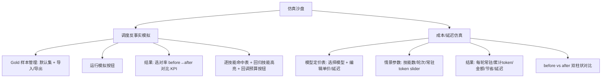
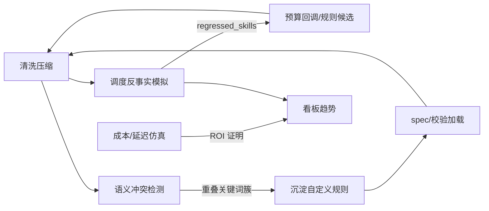

# SkillForge 自进化增量 PRD（v2.0 增量规划）

> 文档版本：PRD-EVO-1.0　|　负责人：产品经理 许清楚（software-product-manager）
> 适用范围：在现有 SkillForge v1「格式校验 / 语义清洗 / 冗余压缩 / 调用追踪」能力之上，新增三大仿真与分析功能，并预留"随时自进化改进"的扩展闭环。
> 约束：本文档仅定义产品需求与架构扩展点，**不产出实现代码**。

---

## 1. 产品目标与本次增量范围

### 1.1 核心目标

SkillForge v1 解决了"描述混乱 → 无效 token 浪费"的单向压缩问题，但存在三个盲区，导致优化是"黑盒"且"一刀切"：

1. **压缩是否伤调度**——我们压短了 description，但 Agent 据此选技能的准确率是否下降？无人验证。
2. **节省无法换算价值**——token 省了多少，但"省了多少钱、快了多少"用户无感，难以向管理者/自己证明 ROI。
3. **技能之间互相打架**——多个技能描述语义重叠，Agent 调度时随机命中其一，造成协同紊乱，v1 完全未覆盖。

本次增量目标：**把 SkillForge 从"单向压缩工具"升级为"可度量、可仿真、可自进化"的 Skill 资产优化工作台**。

### 1.2 增量范围（三大功能 + 闭环）

| 编号 | 功能 | 一句话价值 |
|------|------|-----------|
| F1 | 调度反事实模拟器（Scheduling Counterfactual Simulator） | 量化"压缩是否损害调度准确率"，下降则建议回调预算，而非一味压短 |
| F2 | Token→成本/延迟仿真器（Cost/Latency Simulator） | 把 token 节省折算为金额与延迟，slider 情景推演，证明优化 ROI |
| F3 | 技能语义冲突检测（Semantic Conflict Detector） | 跨技能检测描述重叠，标记冲突对并给出"合并/差异化"建议 |

**自进化闭环（贯穿三功能）**：模拟与检测的结果必须能反哺清洗预算、校验规则、标准规范与可插拔后端，形成数据驱动的自动调参闭环（详见 §5）。

### 1.3 明确不做（Out of Scope）

- 不实现真实的 Agent 调度器或真实 LLM 调用回路（仅用**离线相关性打分器**模拟）。
- 不做多用户/权限体系（维持个人工作台定位）。
- 不替换既有四标签（概览/校验/清洗/追踪）与数据看板，仅在其外新增独立视图。

### 1.4 现状关键约束（来自代码研读，供设计参考）

- 分词后端 `tokenizer.BACKEND`：优先 `tiktoken/cl100k_base`，缺失时回退 `heuristic(chars/4)`；F1/F2/F3 应复用同一 `count_tokens`。
- 清洗预算常量：`config.DESC_TARGET_TOKENS=60`、`DESC_HARD_TOKENS=120`；但 `spec.VALIDATION_RULES` 的 `REDUNDANT-01` 展示文案仍写死 `≤90 / 目标≤40`——**两处口径不一致**，需在 v2 统一（见 §6 待确认问题 Q5）。
- 校验三轴：FORMAT / SEMANTIC / REDUNDANT，状态 `valid/warning/invalid`，健康度 0–100。F3 产出的"冲突"建议未来应沉淀为新的校验维度/规则（见 §5.2）。
- 数据持久化：`config.DATA_DIR`（默认 `./data`）下 SQLite；新增的配置（gold 样本、定价表、阈值、仿真记录）一律落 `DATA_DIR`，保证零额外依赖即可运行。

---

## 2. 用户故事（User Stories）

### F1 调度反事实模拟器

- **US-F1-1**：作为一名个人开发者，我希望内置一组（用户 query → 正确技能）的 gold 样本并支持导入自己的样本，这样我能在不接真实 Agent 的情况下评估"调度准不准"。
- **US-F1-2**：作为一名优化者，我希望用同一个离线打分器分别基于"清洗前 / 清洗后 description 列表"模拟 Agent 选技能的过程，并看到选对率（accuracy）的前后对比，这样我能判断压缩是否伤调度。
- **US-F1-3**：作为一名审慎的优化者，当某个技能清洗后选对率下降时，我希望系统直接提示"建议回调该技能的压缩预算"，而不是机械地把它压得更短。

### F2 Token→成本/延迟仿真器

- **US-F2-1**：作为一名关注成本的用户，我希望维护一份可配置的模型定价表（覆盖 GPT-4o / Claude / 本地模型等），输入技能数量、对话轮次、每轮注入的 skill token 总量，就能看到每轮常驻 token、累计 token、折算金额与节省金额。
- **US-F2-2**：作为一名关注体验的用户，我希望在成本之外还能估算"常驻 token 带来的每轮延迟与累计延迟"，并通过滑块做情景对比，直观看到"压到多少最划算"。

### F3 技能语义冲突检测

- **US-F3-1**：作为一名维护多技能的用户，我希望跨所有技能对 description 做向量相似度计算（优先可配置 embedding API，否则本地字符 n-gram + TF-IDF 余弦、零依赖可运行），自动标出"潜在冲突技能对"。
- **US-F3-2**：当发现冲突对时，我希望系统解释重叠关键词并给出建议（差异化定位 / 合并），帮助我决策如何收敛技能边界。

---

## 3. 需求池（Requirements Pool）

> 优先级：P0=必须（MVP 必交付）/ P1=重要（首版应包含）/ P2=增强（后续迭代）。
> 验收标准均为可测试（可经 API 返回或 UI 断言验证）。

### 3.1 P0 — 必须

**P0-1　Gold 样本管理 [F1]**
- 功能点：内置一份默认 gold 样本集（≥20 条，覆盖常见 query→skill 映射）；支持通过 JSON 导入/导出/覆盖；样本存于 `DATA_DIR/gold_samples.json`。
- 验收：① `GET /api/sim/gold` 返回默认集且 `count≥20`；② `POST /api/sim/gold`（body 为样本数组）后再次 GET 返回更新结果；③ 非法样本（缺 query 或 skill_id）被拒绝并返回 400。

**P0-2　离线相关性打分器（可插拔）[F1/F3 共用]**
- 功能点：定义统一接口 `score(query, description) -> float`，后端可插拔：默认 `local-tfidf`（字符 n-gram + TF-IDF 余弦，零依赖），可选 `embedding`（调用可配置 embedding API）。F1 与 F3 共用同一向量后端实现，避免重复。
- 验收：① 不配置任何外部服务时，`local-tfidf` 可正常返回 0–1 分；② 切换为 `embedding` 后端（配置 API）后，打分走远程且结果仍在 0–1；③ 同一 query+desc 在相同后端下多次打分结果稳定（确定性）。

**P0-3　调度反事实模拟引擎 [F1]**
- 功能点：对每个 gold query，分别用"清洗前 description 列表"与"清洗后 description 列表"（清洗后由 `cleaner.clean_skill` 对当前解析结果生成，默认规则模式）计算所有技能的 `score`，取 top-1 与 gold 正确技能比对；输出整体选对率（before/after）、逐技能命中统计、回归技能清单。
- 验收：① `POST /api/sim/schedule` 返回 `accuracy_before`、`accuracy_after`、`per_skill[]`、`regressed_skills[]`；② 当某技能 after 命中数 < before 命中数时，该技能出现在 `regressed_skills` 且带 `suggestion="建议回调该技能压缩预算"`；③ 使用同一打分器，before/after 仅 description 版本不同（控制变量）。

**P0-4　可配置模型定价表 [F2]**
- 功能点：维护模型定价表（默认内置 GPT-4o、Claude 3.5 Sonnet、本地模型等），每条含 `input_price_per_1k`、`output_price_per_1k`（可选）、`latency_overhead_ms`、`latency_per_token_ms`、`context_window`。存于 `DATA_DIR/pricing.json`，支持读取与更新。
- 验收：① `GET /api/sim/pricing` 返回 ≥3 个模型且字段完整；② `PUT /api/sim/pricing` 新增/修改模型后持久化，重启服务仍生效；③ 本地模型行 `input_price_per_1k=0`（作为对照基线）。

**P0-5　成本/延迟仿真引擎 [F2]**
- 功能点：输入 `model`、`skills_count`、`turns`、`resident_tokens_before`、`resident_tokens_after`（可选 output 估算），输出每轮常驻 token、累计 token、折算金额（before/after）、节省金额、每轮延迟与累计延迟。
- 验收：① `POST /api/sim/cost` 返回上述全部字段且 `saved_amount = cost_before - cost_after`；② `latency_cumul = turns * (overhead + resident_tokens * per_token_ms)` 计算正确；③ 当 `resident_tokens_after < before` 时 `saved_amount > 0` 且 `saved_latency > 0`。

**P0-6　语义冲突检测引擎 [F3]**
- 功能点：对所有已扫描技能的 description 两两计算向量相似度（复用 P0-2 后端），超过阈值（默认 0.7，可配）标记"潜在冲突技能对"，返回相似度、共享关键词（TF-IDF/top 词或共享 n-gram）、建议。
- 验收：① `GET /api/conflicts?threshold=0.7` 返回 `pairs[]`，每对含 `skill_a`、`skill_b`、`similarity`、`shared_keywords[]`、`suggestion`；② 阈值可经 query 参数调整且结果随之变化；③ 零依赖（不配 embedding）时仍能产出结果。

**P0-7　新增"仿真"与"冲突"前端视图 [F1/F2/F3]**
- 功能点：在现有顶部导航（资产 / 数据看板）基础上新增「仿真沙盘」与「冲突检测」两个视图，复用现有 UI 风格（CSS 变量、`card`/`kpi`/`badge` 组件）。
- 验收：① 导航新增两项且可切换；② 仿真沙盘内含"调度模拟"与"成本/延迟"两个子面板；③ 冲突检测视图列出冲突对并提供关键词/建议展示。

### 3.2 P1 — 重要

**P1-1　仿真与真实数据联动 [F1/F2]**
- 功能点：调度模拟的"清洗后"默认直接复用当前技能解析结果经 `cleaner` 生成；成本仿真默认拉取真实 `Σdesc_tokens`（before）与 `Σ清洗后 desc_tokens`（after）作为初始输入，用户可用 slider 覆盖微调。
- 验收：① 成本仿真面板的"常驻 token"初值等于后端 `/api/skills` 全量 `desc_tokens` 之和；② 切换模型后金额与延迟实时刷新。

**P1-2　回归技能一键回调预算 [F1]**
- 功能点：对 `regressed_skills` 提供"回调该技能压缩预算"操作，将该技能的 `target_tokens` 临时上调（写入 `DATA_DIR/skill_budget_overrides.json`），供后续清洗使用，并留痕。
- 验收：① 点击回调后，该技能在 `skill_budget_overrides` 中存在更高 `target`；② 后续 `/api/clean` 对该技能采用回调后的 target（压缩更温和）。

**P1-3　冲突"沉淀为规则"动作 [F3 → 闭环]**
- 功能点：对高频冲突关键词簇，用户可一键"沉淀为新校验规则/标准条目"（生成 `CONFLICT-*` 规则草稿并写入 `DATA_DIR/custom_rules.json`，前端提示待审核）。
- 验收：① 点击沉淀后 `custom_rules.json` 新增一条规则，含 `id/keyword/suggestion`；② 下次 `/api/spec` 与校验可加载该自定义规则（标注 `custom` 来源）。

**P1-4　仿真结果持久化与趋势 [F1/F2]**
- 功能点：每次调度模拟/成本仿真结果写入 `DATA_DIR`（复用 SQLite 或独立 JSONL），在数据看板新增"调度准确率"与"成本节省"趋势卡。
- 验收：① 多次运行模拟后看板出现对应趋势条；② 趋势数据可随真实 apply 事件联动更新。

### 3.3 P2 — 增强

**P2-1　多打分器横向对比 [F1]**：同时跑 `local-tfidf` 与 `embedding` 两种打分器，输出准确率差异，辅助判断是否值得接入 embedding。
**P2-2　情景预设（Scenario Presets）[F2]**：内置"千轮长会话""高频短指令""本地零成本"等预设，一键填充 slider。
**P2-3　冲突聚类视图 [F3]**：将冲突对聚为"技能簇"，可视化簇内重叠主题，辅助整体重构。
**P2-4　可解释调度（Explainability）[F1]**：展示某 query 的 top-3 候选技能及其得分与命中/未命中原因，便于调试 gold 样本与描述质量。
**P2-5　导出报告 [F1/F2/F3]**：一键导出本次增量分析结论（PDF/Markdown），便于归档与汇报。

---

## 4. UI / 交互设计稿

### 4.1 导航与视图组织（扩展现有结构）

现有：导航 = 资产(Assets) | 数据看板(Dashboard)；资产内四标签 = 概览/校验/清洗/追踪。

增量后顶部导航：

```
┌──────────────────────────────────────────────────────────────┐
│  SkillForge                          [资产] [仿真沙盘] [冲突检测] [看板] │
├──────────────────────────────────────────────────────────────┤
│  左栏：技能列表(健康色标)       右栏：当前视图内容              │
└──────────────────────────────────────────────────────────────┘
```

- **仿真沙盘** 为独立视图（不依赖选中技能），内含两个子面板/子标签：`调度反事实模拟` 与 `成本/延迟仿真`。
- **冲突检测** 为独立视图，列出跨技能的冲突对。
- 资产四标签保持不变；数据看板新增两类趋势卡。

### 4.2 「仿真沙盘」布局（Mermaid 流程图示意信息架构）



### 4.3 「调度反事实模拟」面板（ASCII 线框）

```
┌──────────────────────── 调度反事实模拟 ────────────────────────┐
│ [Gold 样本: 内置 24 条 ▼] [导入JSON] [导出]                      │
│ 打分后端: (●) local-tfidf   ( ) embedding-API                   │
│                                                                 │
│ [▶ 运行模拟]                                                    │
│                                                                 │
│ ── 整体选对率 ──────────────────────────────────────────────   │
│  KPI:  清洗前 82%  →  清洗后 88%   (↑ +6pt)                      │
│                                                                 │
│ ── 逐技能对比（仅列命中过 gold 的技能）──────────────────────   │
│  技能            清洗前命中   清洗后命中   状态                   │
│  pdf-reader        8/10         9/10        ✓ 提升              │
│  docx-editor       5/6          3/6         ⚠ 回归 → 建议回调预算 │
│  ...                                                          │
│                                                                 │
│ [⚠ 回归技能: docx-editor] [↩ 回调该技能压缩预算]                │
└─────────────────────────────────────────────────────────────┘
```

### 4.4 「成本/延迟仿真」面板（ASCII 线框）

```
┌──────────────────────── 成本/延迟仿真 ─────────────────────────┐
│ 模型: [GPT-4o ▼]   输入价 $2.5/1M  输出价 $10/1M  延迟 20ms+0.02ms/t │
│        [编辑定价表]                                                │
│                                                                 │
│ 情景参数(slider):                                                │
│  技能数         [====●====] 20                                   │
│  对话轮次       [======●==] 1000                                 │
│  常驻token/轮   [==●======] before 1200 → after 480 (可拖)       │
│                                                                 │
│ ── 结果 ───────────────────────────────────────────────────    │
│  每轮常驻 token :  before 1200  | after 480                      │
│  累计 token     :  before 1.20M | after 0.48M  (省 0.72M)        │
│  折算金额       :  before $3.00  | after $1.20  → 省 $1.80       │
│  每轮延迟       :  before 44ms   | after 29.6ms                  │
│  累计延迟(千轮) :  before 44.0s  | after 29.6s  → 省 14.4s       │
│                                                                 │
│  [before]██████████ $3.00     [after]████ $1.20  (双柱对比)      │
└─────────────────────────────────────────────────────────────┘
```

### 4.5 「冲突检测」面板（ASCII 线框）

```
┌──────────────────────── 冲突检测 ───────────────────────────────┐
│ 向量后端: (●) local-tfidf   ( ) embedding-API                    │
│ 相似度阈值: [0.70 ▼]   [🔄 重新计算]                             │
│                                                                 │
│ 潜在冲突技能对 (3):                                              │
│ ┌──────────────────────────────────────────────────────────┐   │
│ │ docx-editor  ↔  office-writer   相似度 0.83                │   │
│ │ 重叠关键词: 编辑, 文档, 写入, 所见即所得                    │   │
│ │ 建议: 差异化定位（前者偏编辑、后者偏生成）或合并          │   │
│ │ [沉淀为新规则]  [查看两技能描述对比]                        │   │
│ └──────────────────────────────────────────────────────────┘   │
│ ┌──────────────────────────────────────────────────────────┐   │
│ │ pdf-reader  ↔  pdf-extract   相似度 0.76                   │   │
│ │ 重叠关键词: PDF, 读取, 解析                                 │   │
│ │ 建议: 合并（能力高度重叠）                                │   │
│ │ [沉淀为新规则]  [查看两技能描述对比]                        │   │
│ └──────────────────────────────────────────────────────────┘   │
└─────────────────────────────────────────────────────────────┘
```

### 4.6 新增 API 汇总（供架构师参考）

| 方法 | 路径 | 说明 |
|------|------|------|
| GET | `/api/sim/gold` | 获取 gold 样本集 |
| POST | `/api/sim/gold` | 导入/覆盖 gold 样本 |
| POST | `/api/sim/schedule` | 运行调度反事实模拟 |
| GET | `/api/sim/pricing` | 获取模型定价表 |
| PUT | `/api/sim/pricing` | 更新模型定价表 |
| POST | `/api/sim/cost` | 运行成本/延迟仿真 |
| GET | `/api/conflicts?threshold=` | 获取语义冲突对 |
| PUT | `/api/rules/custom` | 沉淀自定义校验规则（闭环） |
| GET/PUT | `/api/config/vectorizer` | 向量后端配置（local-tfidf / embedding） |

---

## 5. 自进化闭环设计（Self-Evolution Closed Loop）

设计原则：**一切反馈可度量、一切扩展可配置、一切沉淀可审计**。三大功能不是终点，而是持续采集信号、驱动参数与规则演进的传感网。

### 5.1 调度模拟结果 → 反哺清洗预算 / 校验规则（数据驱动调参）

- **信号采集**：每次 `/api/sim/schedule` 产生 `regressed_skills[]`（清洗后选对率下降的技能）。这些信号按 `skill_id` 累计写入 `DATA_DIR/sim_log.jsonl`（或 SQLite 新表 `scheduling_sim`）。
- **预算回调（自动化）**：当某技能在 ≥2 次模拟中持续回归，系统自动将其 `target_tokens` 从默认 60 上调一档（如 +20，封顶 `DESC_HARD_TOKENS=120`），写入 `skill_budget_overrides.json`，后续 `/api/clean` 自动采用——实现"不损伤调度前提下的最大压缩"。
- **规则反哺**：若某类描述特征（如过度删触发场景导致回归）在多个技能复现，生成候选校验规则（如 `SEMANTIC-03：清洗后须保留 ≥1 个触发场景词，否则标记 warning`），进入 §5.3 的可审核沉淀流程。
- **可观测**：数据看板新增"调度准确率"趋势，让"压缩—准确率"权衡长期可视。

### 5.2 冲突检测 → 沉淀为新校验规则 / 标准规范条目

- **模式沉淀**：`/api/conflicts` 输出的高频重叠关键词簇（如多技能共现"编辑/文档"），经用户一键"沉淀为新规则"（P1-3）后写入 `DATA_DIR/custom_rules.json`，形如：
  ```json
  { "id": "CONFLICT-01", "dim": "冲突", "keyword_cluster": ["编辑","文档","写入"],
    "rule": "多个技能 description 不应同时高频包含 {编辑,文档,写入}，须差异化定位或合并。",
    "severity": "warning", "source": "conflict-detector" }
  ```
- **规范联动**：`spec.py` 的 `VALIDATION_RULES` 加载时合并 `custom_rules.json`（标注 `source=custom`），前端 `/api/spec` 与校验自动生效，新扫描的技能将提前暴露潜在冲突。
- **标准文档回流**：定期（或手动）将稳定生效的自定义规则整理进 `spec/STANDARD.md`，推进标准版本号（如 v1.0 → v1.1），形成"实践→规范"的正向循环。

### 5.3 可插拔后端设计（配置即扩展）

三大外部依赖均通过配置解耦，新增能力零代码改动：

| 扩展点 | 配置位置 | 默认 | 扩展方式 |
|--------|----------|------|----------|
| 向量/打分后端 | `DATA_DIR/vectorizer.json`（`backend: local-tfidf|embedding` + API 地址/密钥环境变量） | `local-tfidf`（零依赖） | 改配置切换为远程 embedding，F1/F3 同时受益 |
| 模型定价表 | `DATA_DIR/pricing.json` | 内置 GPT-4o/Claude/本地 | 增删模型条目即可 |
| 离线打分器实现 | 注册到 `scorer` 后端接口 | `local-tfidf` | 实现同接口的新后端并配置启用 |
| Gold 样本 | `DATA_DIR/gold_samples.json` | 内置默认集 | 导入自有样本 |
| 清洗预算覆盖 | `DATA_DIR/skill_budget_overrides.json` | 空 | 由闭环自动写入或手动编辑 |

- 所有配置优先读 `DATA_DIR` 文件，环境变量兜底；文件缺失时回退内置默认，**保证零依赖开箱即跑**。
- 切换后端不应改变接口契约（同 `score()` / 同响应结构），从而 F1/F3 共用实现、互不耦合。

### 5.4 闭环总览（Mermaid）



---

## 6. 待确认问题清单（Open Questions）

| 编号 | 问题 | 影响 | 建议默认 / 需主理人决策 |
|------|------|------|------------------------|
| Q1 | **Gold 样本来源与默认集**：内置默认集由谁提供？是否需要覆盖主流 WorkBuddy 内置技能的真实 query 映射？ | 决定 F1 可用性下限 | 建议 v2 内置 ≥20 条"合成 + 典型"样本，并随版本扩充；允许用户导入自有集 |
| Q2 | **默认模型定价数据来源**：GPT-4o / Claude 单价用哪一日的公开价？是否需在 UI 标注"示例价，请以官方为准"？ | 决定 F2 可信度 | 建议内置一份快照价（标注日期）并支持一键编辑；UI 显式免责声明 |
| Q3 | **Embedding 是否默认本地无依赖**：F1/F3 默认走 `local-tfidf` 还是强制远程 embedding？ | 决定零依赖承诺 | 建议**默认 local-tfidf（零依赖可运行）**，配置 embedding API 后自动升级；与现有 tokenizer 回退策略一致 |
| Q4 | **回归判定阈值**：技能"选对率下降"的判定，是用绝对命中数下降，还是 accuracy 下降超过某 delta（如 >5pt）才回调？ | 决定误回调频率 | 建议：单技能命中数下降即标记"回归"，但**自动回调预算仅在该技能累计回归 ≥2 次**时触发，防抖动 |
| Q5 | **DESC 预算口径不一致**：`config`（60/120）与 `spec.VALIDATION_RULES`（40/90）展示不一致，v2 以哪个为准？ | 影响清洗目标与校验文案 | 建议 v2 统一为 `config` 的 60/120 作为真实常量，`spec` 文案改为动态读取常量，消除硬编码 |
| Q6 | **冲突相似度默认阈值**：0.7 是否合适？过高漏报、过低误报 | 决定 F3 召回 | 建议默认 0.7，UI 提供 slider（0.5–0.95）即时重算 |
| Q7 | **仿真结果存储**：复用现有 SQLite 还是独立 JSONL？ | 决定持久化实现 | 建议复用 `DATA_DIR` 下 SQLite 新增表，与现有 tracker 一致，便于看板联动 |
| Q8 | **自定义规则作用域**：`custom_rules` 是否在"校验"标签对全量技能实时生效，还是仅作建议？ | 决定校验器改动范围 | 建议 v2 先在冲突检测侧"建议 + 可沉淀"，沉淀后进入校验（标注 custom），灰度可控 |

---

## 附：验收里程碑建议（供排期）

- **M1（P0 闭环打通）**：F1/F2/F3 引擎 + 配置落盘 + 三个前端视图 + 基础 API。
- **M2（P1 联动与沉淀）**：真实数据联动、回归预算回调、冲突→规则沉淀、看板趋势。
- **M3（P2 增强）**：多打分器对比、情景预设、冲突聚类、可解释调度、报告导出。

> 完成 M1 即可证明"压缩不伤调度 / 节省可量化 / 冲突可发现"三大价值主张，M2 实现自进化闭环，M3 提升可用性与说服力。
