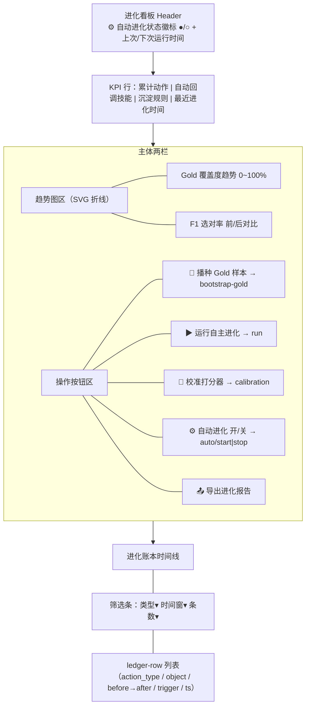

# SkillForge 增量 PRD（v2.1 → v2.2）· 真实信号落地 + 全自动闭环 + 进化可视化

> 文档版本：PRD-EVO2-2.0（增量）　|　负责人：产品经理 许清楚（software-product-manager）
> 适用范围：在 v2.1（commit d3846b1 + 01c0eac，http://127.0.0.1:8008）已交付的「自主进化引擎 + 进化账本」之上，增量升级为 **真实 embedding 生效 / 全自动闭环 / 进化可视化可观测**。
> 本文**仅描述本次变更**，不重写 v2.1 既有 PRD/架构。语言：中文（专有名词保留英文）。

---

## 0. 项目信息（增量）

| 项 | 值 |
|----|----|
| Language | 中文（文档）/ 代码沿用 Python + 原生 HTML/CSS/JS |
| Programming Language | 后端 FastAPI（沿用 v2.1）；前端零构建原生 JS（沿用 v2.1） |
| Project Name | `skill_forge_evo_v2_2` |
| 原始需求复述 | 用户确认「以上全部」4 个方向：①真实 embedding 接入 ②自进化自动化 ③前端进化视图增强 ④补齐文档 + 全量回归 |
| 版本号 | `__version__` 由 `2.1.0-evo` → `2.2.0-evo` |

### 0.1 对齐现状（v2.1 已交付 vs 本次缺口）

| 方向 | v2.1 已交付 | 本次缺口 |
|------|------------|----------|
| **A 真实 embedding** | `EmbeddingBackend`（仅 OpenAI 兼容 API）、`_resolve_vectorizer` 探活回退、`calibrate()` 可用性门 | 不支持本地 sentence-transformers；无 provider 可插拔；0.7 阈值对真实集几乎不命中；校准门硬编码 api_url |
| **B 自动化** | `run_evolve(seed_threshold)` 编排完整；`AUTO_EVOLVE_ON_START` 开机钩子（默认 false，仅跑一次） | 无周期后台任务；无运行/暂停/状态可见；无空转保护 |
| **C 前端增强** | KPI 数字卡、账本时间线（仅 limit 选择）、校准面板、播种/运行/导出按钮 | 无趋势折线图；时间线无类型/时间筛选；gold 覆盖度趋势未采集 |
| **D 文档/回归** | v2.1 PRD/arch/类图/时序图齐备 | 缺 v2.1→v2.2 增量文档与交付报告；缺可重复全量回归测试 |

---

## 1. 产品目标（本次增量目标）

把 v2.1 的「自主进化」从 **「能跑但信号是合成、需手动触发、看板只有数字」** 推进为 **「真实 embedding 信号生效、开机即全自动闭环、进化效果有趋势图可观测、且可经回归测试保障质量」** 的可持续进化系统。（1 句核心：**让自进化在真实技能集上真正闭环、全自动、可观测、可验证。**）

---

## 2. 用户故事（4 方向，每条带验收标准）

### 方向 A · 真实 embedding 接入
- **US-A1（可配置后端）**：作为一名想用真实语义信号的用户，我希望在 `vectorizer.json` 选择 embedding 后端类型（OpenAI 兼容 API / 本地 sentence-transformers / 插件），这样冲突检测与校准能基于真实稠密向量而非纯 TF 余弦。
  - *验收*：① 配 `provider: local-st`（或本地 OpenAI 兼容服务）后，`GET /api/config/vectorizer` 返回对应 backend；② `detect_conflicts` 在该后端下实际产出非空 `pairs`（真实技能集上命中）；③ `GET /api/evolve/calibration` 返回 `available:true`（不再因缺 api_url 返回 false）。
- **US-A2（阈值自适应）**：作为一名审慎用户，我希望切换 embedding 后端后冲突/自动沉淀阈值自动适配新打分尺度，这样不会因「embedding 余弦尺度」而漏报或误报一堆冲突。
  - *验收*：① embedding 后端下默认冲突阈值与自动沉淀阈值使用「稠密向量档」默认值；② 阈值随后端切换自动生效，前端 slider 范围不变（0.5–0.95）。

### 方向 B · 自进化自动化
- **US-B1（全自动闭环）**：作为一名忙碌维护者，我希望系统开机后按设定周期自动跑 `run_evolve`，无需我手动 `POST /api/evolve/run`，这样长期无人值守也能持续进化。
  - *验收*：① 置 `AUTO_EVOLVE_LOOP=true` 启动后，不手动触发也能在账本看到周期性 `gold_seed`/`budget_auto_recall`/`conflict_rule_deposit` 条目（trigger=`auto_loop`）；② 周期可由 `EVOLVE_INTERVAL_MINUTES` 配置。
- **US-B2（状态可见可控）**：作为一名管理者，我希望在进化看板看到自动循环的运行/暂停状态与上次/下次运行时间，并能一键开关，这样放心把自动化交出去。
  - *验收*：① `GET /api/evolve/auto/status` 返回 `{running, last_run, next_run_in_sec, interval_min}`；② `POST /api/evolve/auto/start|stop` 可切换；③ 前端自动进化开关按钮状态与端点一致。

### 方向 C · 前端进化视图增强
- **US-C1（趋势可视化）**：作为一名想看 ROI 的用户，我希望进化看板有「gold 覆盖度」与「F1 选对率（清洗前/后）」两条趋势折线，这样我能直观看到系统随时间是否让信号更全、调度更准。
  - *验收*：① `GET /api/evolve/trends` 返回 `{points:[{ts, gold_coverage, f1_acc_before, f1_acc_after}]}`；② 前端渲染两条 SVG 折线（零构建、无第三方图表库）；③ 数据为空时显示占位提示而非报错。
- **US-C2（时间线可筛选）**：作为一名审计者，我希望账本时间线能按「动作类型 / 时间窗」筛选，这样我能快速定位某类动作（如只看自动回调）或某时间段。
  - *验收*：① 时间线增加类型下拉（全部/gold_seed/budget_auto_recall/conflict_rule_deposit/calibration）与时间窗选择；② 选择后调用 `GET /api/evolve/ledger?action_type=&since=&until=` 并刷新。
- **US-C3（一键触发/校准）**：作为一名使用者，我希望看板保留并完善一键按钮（🌱播种 / ▶运行 / 🔬校准 / ⚙自动进化开关 / 📤导出），分别命中 `bootstrap-gold`/`run`/`calibration`/自动循环端点。
  - *验收*：① 五个按钮均存在且调用正确端点；② 校准按钮在未配 embedding 时仍提示「未启用」而非报错（沿用 v2.1 行为）。

### 方向 D · 文档 + 全量回归
- **US-D1（增量文档）**：作为一名接手者，我希望有 v2.1→v2.2 增量 PRD、架构文档与交付报告，这样能快速理解本次改动。
  - *验收*：① `docs/prd-evo2-2.md` / `docs/arch-evo2-2.md` / `docs/delivery-evo2-2.md` 齐备且与实现一致；② 架构文档含新增后端抽象、自动循环、趋势采集的时序/类图。
- **US-D2（可重复回归）**：作为一名 QA，我希望有一套 `pytest` 全量回归（覆盖 v2.1 既有 + v2.2 新功能），用固定合成技能 fixture 与 mock/离线 embedding，这样 `pytest tests/ -q` 即可重复验证。
  - *验收*：① 提供 `tests/` 与 `run_regression.sh`；② 覆盖 §3 全部 P0 用例；③ 不依赖真实 `~/.workbuddy/skills` 与真实远程 API（embedding 用 mock server 或离线 `all-MiniLM-L6-v2`）。

---

## 3. 需求池（P0 / P1 / P2，标注归属方向 A/B/C/D）

### 3.1 P0 — 必须交付（MVP）

| 编号 | 方向 | 需求 | 验收要点 |
|------|------|------|----------|
| **A-1** | A | **多 provider embedding 后端**：`scorer` 抽象 `VectorizerBackend` 注册，支持 `openai`（现有）/ `local-st`（sentence-transformers）两种 provider；`vectorizer.json` 增加 `provider` 字段（默认 `openai`，缺省回退 `local-tfidf`） | 配 `local-st` 后 `get_vectorizer()` 返回本地稠密后端；`detect_conflicts` 在真实技能集产出非空 pairs；零配置回退行为不变 |
| **A-2** | A | **冲突检测真实命中**：`_resolve_vectorizer` 保留「探活失败回退 local-tfidf」自愈，但默认优先使用已配置 embedding 后端；`CONFLICT_DEFAULT_THRESHOLD` 随后端取「稠密向量档」默认值 | embedding 后端下默认阈值能命中真实高相似对；回退路径仍不抛 500 |
| **A-3** | A | **校准可用性门泛化**：`calibrate()` 门控由「`backend==embedding && api_url`」改为「当前后端是否为稠密向量后端（openai/local-st 任一）」 | 本地 sentence-transformers 后端下 `GET /api/evolve/calibration` 返回 `available:true`；返回的 `reason` 文案泛化 |
| **B-1** | B | **后台周期自动进化**：`server.py` 增加进程内后台周期任务（asyncio 任务或守护线程），按 `EVOLVE_INTERVAL_MINUTES`（默认建议 30）循环调用 `run_evolve(trigger="auto_loop")` | 不手动触发也能周期性写账本；异常吞掉并 `log_evolution(trigger=auto_loop, note=error)` 不中断循环 |
| **B-2** | B | **自动循环开关与状态**：新增 `AUTO_EVOLVE_LOOP`（默认 false）开关 + `GET /api/evolve/auto/status`、`POST /api/evolve/auto/start`、`POST /api/evolve/auto/stop`；进程内互斥锁保证同时仅一个 `run_evolve` 运行 | 状态端点返回 running/last_run/next_run_in_sec；手动点 + 自动循环 + 开机钩子 互斥；默认 false 不静默写盘 |
| **C-1** | C | **趋势图可视化（gold 覆盖度 / F1 选对率）**：新增 `evolution_metrics` 采集点（每次 `run_evolve` 写 `ts, gold_coverage, f1_acc_before, f1_acc_after`）；新增 `GET /api/evolve/trends`；前端用 SVG 折线渲染两条趋势（零构建） | 端点返回按时间升序 points；前端两条折线交互 hover；空数据占位 |
| **C-2** | C | **时间线类型/时间筛选**：进化看板时间线增加「动作类型」下拉 + 「时间窗」选择，调用 `GET /api/evolve/ledger?action_type=&since=&until=` | 类型/时间窗筛选生效；与现有 limit 选择共存 |
| **C-3** | C | **一键按钮完善**：保留 🌱播种(`bootstrap-gold`)/▶运行(`run`)/🔬校准(`calibration`)/📤导出；新增 ⚙自动进化开关按钮（联动 B-2 端点） | 五个按钮调用正确；开关状态与 `auto/status` 一致；校准未启用仍提示不报错 |
| **D-1** | D | **增量文档补齐**：产出 `docs/prd-evo2-2.md`、`docs/arch-evo2-2.md`、`docs/delivery-evo2-2.md` | 含新增后端抽象、自动循环时序、趋势采集、需求池、回归范围 |
| **D-2** | D | **全量回归测试套件**：`tests/`（pytest）覆盖 v2.1 既有 + v2.2 新功能；固定合成技能 fixture；embedding 用 mock server 或离线 MiniLM；`run_regression.sh` 一键运行 | `pytest tests/ -q` 全绿；不依赖真实技能目录/远程 API；覆盖 §3 全部 P0 |

### 3.2 P1 — 重要（首版应包含）

| 编号 | 方向 | 需求 | 验收要点 |
|------|------|------|----------|
| **A-4** | A | **插件式后端注册**：开放 `register_vectorizer(provider, cls)` 钩子，第三方可注入自定义 `VectorizerBackend`（如私有向量服务） | 注册后 `get_vectorizer(provider=xxx)` 返回自定义后端；不影响内置 |
| **A-5** | A | **阈值随后端自适应并持久化**：`vectorizer.json` 可存 `conflict_threshold` / `auto_deposit_threshold` 分后端默认值；前端 slider 标注当前后端档位 | 切换后端自动载入对应默认阈值；用户可在 UI 覆盖 |
| **B-3** | B | **空转 no-op 判定**：`run_evolve` 检测「gold 已全覆盖且本轮无新增回归/冲突」时跳过写 ledger（仍返回结果），避免自动循环刷屏 | 连续无变化运行不新增 ledger 行；返回 `ledger_new:[]` |
| **C-4** | C | **趋势图交互增强**：hover tooltip 显示具体数值/时间；支持时间窗缩放 | tooltip 正确；缩放后重绘 |
| **D-3** | D | **回归脚本 CI 化**：提供 GitHub Actions / 本地 `Makefile test` 入口，输出 HTML/JUnit 报告 | CI 可重复运行；失败明确标注所属方向 |

### 3.3 P2 — 增强（后续可选）

| 编号 | 方向 | 需求 |
|------|------|------|
| **A-6** | A | 多 embedding 后端 A/B 并行对比，自动选优（扩展 calibrate） |
| **B-5** | B | 跨进程文件锁（fcntl/msvcrt）防并发（强化 B-2 互斥） |
| **C-6** | C | 趋势图异常标注（accuracy 暴跌/覆盖度下降高亮告警） |

---

## 4. UI 设计稿（前端进化视图增强后布局）

### 4.1 ASCII 线框

```
┌──────────────────────────────────────────────────────────────────────┐
│ 进化看板                                    [⚙ 自动进化: ●运行中/○暂停] │
│                                           上次运行 12:30 · 下次 ~13:00   │
├──────────────────────────────────────────────────────────────────────┤
│ KPI 行: 累计自进化动作 | 自动回调技能 | 沉淀规则 | 最近进化时间            │
├──────────────────────────────────┬───────────────────────────────────┤
│ 趋势图区（SVG 折线，零构建）        │ 操作按钮区                         │
│ ┌──────────────────────────────┐  │ [🌱 播种 Gold 样本]                │
│ │ Gold 覆盖度趋势 (0~100%)      │  │ [▶ 运行自主进化]                   │
│ │  ····╱‾‾╲___····              │  │ [🔬 校准打分器]                   │
│ └──────────────────────────────┘  │ [⚙ 自动进化 开/关]                 │
│ ┌──────────────────────────────┐  │ [📤 导出进化报告]                  │
│ │ F1 选对率 前(虚)/后(实)       │  │                                    │
│ │  ──  before    ── after       │  │                                    │
│ └──────────────────────────────┘  │                                    │
├──────────────────────────────────┴───────────────────────────────────┤
│ 进化账本时间线                                                       │
│ 筛选: [类型 ▾ 全部/gold_seed/...]  [时间窗 ▾ 全部/今日/本周]  [条数 ▾] │
│ ─────────────────────────────────────────────────────────────────── │
│ [gold_seed]          pdf-reader   ∅ → 解析PDF     auto_bootstrap 12:00 │
│ [budget_auto_recall] docx-editor  60 → 80          f1_schedule    12:05 │
│ [conflict_rule_deposit] CONFLICT-02 …              f3_conflict    12:06 │
│ ...                                                                   │
└──────────────────────────────────────────────────────────────────────┘
```

### 4.2 Mermaid 线框（组件关系）



### 4.3 自动进化循环时序（方向 B 补充，供架构师参考）

```mermaid
sequenceDiagram
    participant Loop as 后台周期任务
    participant Lock as 进程内互斥锁
    participant E as evolve.run_evolve(trigger=auto_loop)
    participant M as 账本 + evolution_metrics
    Loop->>Lock: acquire()
    alt 获得锁
        Loop->>E: run_evolve()
        E->>M: 写 evolution_ledger + 写 evolution_metrics(覆盖度/F1)
        E-->>Loop: 本轮结果(含 ledger_new)
        Loop->>Lock: release()
    else 锁占用（手动/开机运行中）
        Loop-->>Loop: 跳过本轮（防并发）
    end
    Loop->>Loop: sleep(EVOLVE_INTERVAL_MINUTES)
```

---

## 5. 待确认问题（主理人已拍板，见 §6）

| 编号 | 问题 | 候选方案 | 主理人决策 |
|------|------|----------|------------|
| **A1** | embedding 后端选型与依赖策略 | ① 内置 local-st（重依赖）；② 仅扩展 OpenAI 兼容 + 本地兼容服务（零新增依赖）；③ 插件式注册 | **② 零新增依赖**：仅扩展 OpenAI 兼容 provider，本地靠兼容服务（ollama / text-embeddings-inference）接入；P1 加轻量 `register_vectorizer` 钩子 |
| **A2** | 冲突/自动沉淀阈值默认值（随后端） | ① 统一 0.7；② 分后端双默认；③ 运行时自适应 | **② 分后端双默认**：tfidf 0.7 / embedding 0.55；deposit tfidf 0.9 / embedding 0.85 |
| **B1** | 自动触发频率与默认开关 | ① 30min+默认关；② 默认开；③ 仅开机一次 | **①**：`EVOLVE_INTERVAL_MINUTES=30`，`AUTO_EVOLVE_LOOP=false` 默认关；开机钩子 `AUTO_EVOLVE_ON_START` 保留（仍默认 false） |
| **B2** | 空转保护粒度 | ① 完全跳过写盘；② heartbeat 快照 | **① no-op**：连续无变化运行不写 ledger，返回 `ledger_new:[]` |
| **C1** | gold 覆盖度趋势采集方式 | ① 独立 `evolution_metrics` 小表；② ledger 加类型 | **① 独立小表** `evolution_metrics(ts, gold_coverage, f1_acc_before, f1_acc_after)` |
| **C2** | 趋势图渲染技术 | ① 手写 SVG；② 图表库 | **① 手写 SVG 折线**，零依赖 |
| **A3** | 校准门语义 | ① 门控只看后端类型；② 仅 openai 需远程 | **①**：门控从 `api_url` 改为「是否为稠密向量后端（openai/local-st）」，local-st 本地推理即可对比 |

> 以上决策均维持 v2.1「零新增 pip 依赖 / 零构建前端」硬约束。决策不阻塞 P0 启动。

---

## 6. 验收里程碑（排期）

- **M1（P0 闭环打通）**：A-1/A-2/A-3、B-1/B-2、C-1/C-2/C-3、D-1/D-2。达成「真实信号生效 → 全自动闭环 → 趋势可观测 → 可回归验证」。
- **M2（P1 收口）**：A-4/A-5、B-3、C-4、D-3。

> 完成 M1 即把 v2.1 的「半手动、合成信号、看板只有数字」升级为 v2.2 的「真实 embedding 信号、全自动闭环、趋势可视化、可回归」，直接回应 4 个方向的用户诉求。

---
*附：本文已对齐 v2.1 真实代码（`simulator._resolve_vectorizer`、`scorer.EmbeddingBackend`/`get_vectorizer`、`evolve.run_evolve`/`calibrate`、`server.lifespan`、`simbank.get_schedule_trend`/`evolution_ledger`、`frontend/app.js` 的 `renderEvolve`/`renderTrendCards`/`bindEvolveNav`、`style.css` 的 `.ledger-*`/`.kpi-row`），需求与现状一致。*
