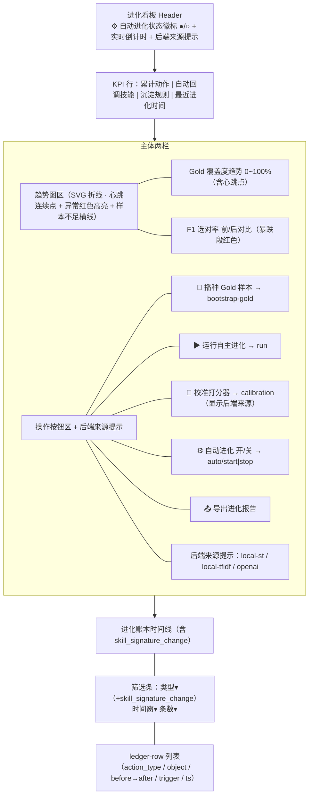
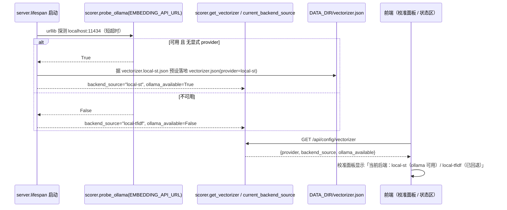
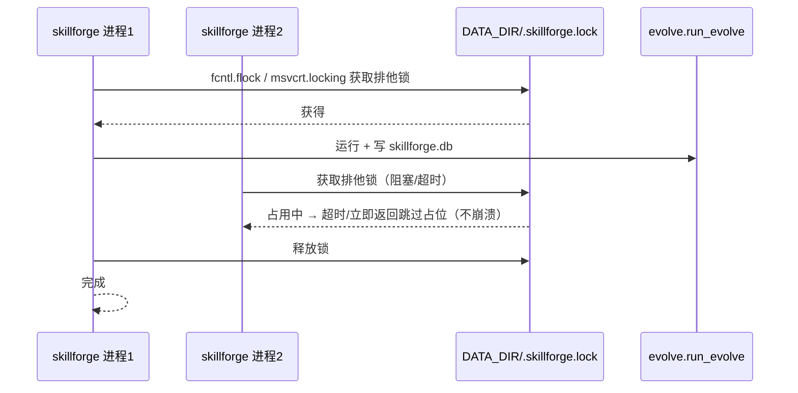

# SkillForge 增量 PRD（v2.2 → v2.3）· 让闭环随时间真正演进 + 看板打磨 + 健壮多实例 + embedding 开箱即用

> 文档版本：PRD-EVO2-3.0（增量）　|　负责人：产品经理 许清楚（software-product-manager）
> 适用范围：在 v2.2（真实 embedding 生效 / 全自动闭环 / 进化可视化可观测 / 全量 pytest 回归，18 项 + 10 项独立验证）之上，增量修复"自进化一次性收敛即空转"的**核心断层**，并打磨趋势图/看板、加固健壮性（多实例文件锁）、让真实 embedding **开箱即用**。
> 本文**仅描述本次变更**，不重写 v2.2 既有内容（真实后端抽象 / 自动循环 / 趋势采集 / 防刷屏 no-op 等已交付项继续沿用）。语言：中文（专有名词保留英文）。
> **硬约束（主理人已拍板，不得违反）**：① 零新增 pip 依赖（仅 Python 标准库 + 现有 fastapi/uvicorn/pyyaml/tikoken）；② 零构建前端（原生 HTML/CSS/JS，趋势图手写 SVG，不引入任何图表库）；③ GitHub 提交仅 Hyhyhyyy，代码不带 agent/CNB 标记；④ 版本号 `__version__` 由 `2.2.0-evo` → `2.3.0-evo`。

---

## 0. 项目信息（增量）

| 项 | 值 |
|----|----|
| Language | 中文（文档）/ 代码沿用 Python + 原生 HTML/CSS/JS |
| Programming Language | 后端 FastAPI（沿用 v2.2）；前端零构建原生 JS（沿用 v2.2） |
| Project Name | `skill_forge_evo_v2_3` |
| 原始需求复述 | 用户确认「全选」4 个方向（AskUserQuestion）：A 让闭环真正随时间演进（进化压力源 + heartbeat）；B 趋势图与看板打磨；C 健壮性与多实例；D 真实 embedding 开箱即用 |
| 版本号 | `__version__` 由 `2.2.0-evo` → `2.3.0-evo` |
| 关键代码事实（已核对 v2.2 源码） | ① `evolve.py:244` `is_no_op = (gold_seeded==0 and not auto_recalled_entries and not deposited_rules)`；`:245-250` 当 `is_no_op` 时**完全不调** `simbank.log_evolution_metric` → no-op 轮次零趋势点；② `auto_loop.py:103` `asyncio.ensure_future(_loop())` 在无运行 loop 上下文抛 `DeprecationWarning`；③ `frontend/app.js:716` `renderTrendChart` 仅处理 `!points.length`，1 个点时 `_drawTrend` 画单点无折线、`<2` 点折线不可见；④ `data/vectorizer.json` 当前不存在，首次使用 embedding 需手写；⑤ `simbank.py` 每 `_conn()` 新建 sqlite 连接，无跨进程锁 |

### 0.1 对齐现状（v2.2 已交付 vs 本次缺口，聚焦核心断层）

| 方向 | v2.2 已交付 | 本次缺口（v2.3 要补） |
|------|------------|----------|
| **A 闭环随时间演进** | 真实 embedding 后端抽象（openai/local-st）、进程内 asyncio 自动循环（默认关）、`evolution_metrics` 趋势采集、SVG 趋势图、防刷屏 no-op 判定（v2.2 B-3） | **核心断层**：no-op 轮次不写 metrics → 自动循环跑再多轮趋势图只有 1 个点（甚至 0 个）；闭环对**外界变化无感知**（用户新装/删除/更新技能不触发再进化）；覆盖度长期停滞无自愈 |
| **B 趋势图/看板打磨** | 双折线 SVG（gold 覆盖度 / F1 前·后）、空数据占位、`⚙自动进化` 开关、状态徽标（●/○ + 上次/下次运行） | 单点/两点折线不可见（无横线/无"样本不足"提示）；无 accuracy 暴跌 / coverage 下降的异常高亮；无下次运行的实时倒计时刷新 |
| **C 健壮性/多实例** | 进程内 `asyncio.Lock` 互斥（防手动/自动/开机三路同跑） | `auto_loop.start()` 用 `asyncio.ensure_future` 抛 DeprecationWarning；**无跨进程文件锁**（多进程并发写 `skillforge.db` / 跑 `run_evolve` 无保护）；测试隔离与 CI 失败归属不够清晰 |
| **D 真实 embedding 开箱即用** | `provider=openai/local-st` 可配、`local-st` 默认指向 `localhost:11434`、calibrate 门控泛化 | 首次使用仍需手写 `vectorizer.json`；无 ollama 可用性探测与自动回退；校准面板不提示"当前后端来源" |

> **一句话断层**：v2.2 把"半手动合成信号"升级为"真实信号 + 全自动 + 可观测"，但**闭环在真实技能集上一次性收敛后即空转**——趋势承诺"随时间演进"落空，且对外界变化无响应。v2.3 即修复这一断层。

---

## 1. 产品目标（本次增量目标）

把 v2.2 的"真实信号、全自动、可观测"从 **「收敛即空转、对外界无感、看板有断点」** 推进为 **「闭环随时间真正连续演进、对真实世界变化有响应、趋势图无断点可告警、多实例安全、真实 embedding 开箱即用」** 的自进化系统。（1 句核心：**让自进化随时间真正演进、可观测、健壮、开箱即用。**）

---

## 2. 用户故事（4 方向，每条带验收标准，对齐 A-1/A-2/A-3、B-1/B-2/B-3、C-1/C-2/C-3、D-1/D-2）

### 方向 A · 让闭环真正随时间演进（进化压力源 + heartbeat）

- **US-A1（进化压力源）**：作为一名真实用户，我希望系统在用户技能集发生增/删/改时（如我新装、卸载、更新技能），自动触发再播种并重新跑进化、写账本，这样闭环对真实世界变化有响应、不会一直空转。
  - *验收*：① 在 `USER_SKILLS_DIR` 新增一个技能文件后，下一轮 `run_evolve`（无论手动还是自动循环）检测到签名变化，触发再播种（该技能进入 gold），并在账本写入一条变化记录（`skill_signature_change`，含新增/删除/更新技能名）；② 删除/更新技能文件同理，覆盖度或账本相应变化；③ 无变化时仍维持 v2.2 的 no-op 不刷屏语义（仅写 heartbeat，见 US-A2）。
- **US-A2（heartbeat 连续时间序列）**：作为一名看板观察者，我希望即使某轮没有实际改动（no-op），趋势图也能留下一个连续的时间点，这样"随时间演进"的承诺不落空。
  - *验收*：① 改造 `run_evolve`：移除「no-op 时跳过写 `evolution_metrics`」逻辑，改为**无论是否 no-op，运行末都写一条 metrics**（值取本轮 `gold_coverage` + 本轮 `schedule_result` 的 `f1_acc_before/after`）；② 自动循环开启后，趋势图出现**连续时间序列**（随轮次增多不止 1 个点）；③ no-op 轮次仍不写 ledger 业务条目（维持不刷屏）。
- **US-A3（低水位再播种）**：作为一名维护者，我希望当 gold 覆盖度低于阈值时系统自动重新播种，避免覆盖度长期停滞在低水位。
  - *验收*：① 新增配置 `GOLD_COVERAGE_LOW_WATERMARK`（默认建议 80，详见 §5）；② `run_evolve` 计算 `gold_coverage` 后若 `< 阈值`，主动再跑 `bootstrap_gold` 并标记本轮非 no-op（至少写 heartbeat metrics）；③ 覆盖度从低水位回升后账本/趋势可见恢复。

### 方向 B · 趋势图与看板打磨

- **US-B1（单点/两点优雅渲染）**：作为一名看板用户，我希望数据点不足 2 个时趋势图显示一条横线 + "样本不足"提示，而不是一片空白或孤零零一个不可见的点。
  - *验收*：① `renderTrendChart` 在 `points.length < 2` 时绘制**水平参考线**（取该点值或基线）并叠加"样本不足，建议运行进化"提示；② `points.length == 0` 维持空占位文案；③ 折线在 ≥2 点时正常渲染（行为不变）。
- **US-B2（异常高亮）**：作为一名审计者，我希望当某轮 `f1_acc_after` 暴跌或 `gold_coverage` 较上一轮下降时，该点/区段用告警色标注并附说明，便于快速定位退化。
  - *验收*：① 相邻点比较：若 `after` 较上一轮降幅 ≥ `ANOMALY_F1_DROP`（默认建议 0.1）或 `gold_coverage` 下降 ≥ `ANOMALY_COV_DROP`（默认建议 5）个百分点，该点在 SVG 上以告警色（`var(--red)`，沿用既有 CSS 变量）描点 + `<title>` 说明原因；② 图例/说明区给出"存在 N 处异常"提示；③ 异常判定不报错、不影响正常点渲染。
- **US-B3（下次运行倒计时）**：作为一名管理者，我希望看板的自动进化状态徽标实时显示"距下次运行 X 分 Y 秒"并自动刷新，且状态徽标与异常高亮状态联动。
  - *验收*：① 前端对 `next_run_in_sec` 做 `setInterval` 倒计时刷新（建议 1s），徽标文案实时递减；② 当后端不可达/异常时徽标降级为暂停态并提示；③ 倒计时与 US-B2 异常徽标在同一状态条内共存不冲突。

### 方向 C · 健壮性与多实例

- **US-C1（消除 DeprecationWarning）**：作为一名开发者，我希望 `auto_loop.start()` 在无显式运行 loop 的调用点不再抛 `DeprecationWarning`，符合 asyncio 规范。
  - *验收*：① `auto_loop.py:103` 由 `asyncio.ensure_future(_loop())` 改为 `asyncio.get_running_loop().create_task(_loop())`；② 在 FastAPI lifespan 内启动不再出现 `DeprecationWarning`；③ 行为等价（仍幂等启动后台任务）。
- **US-C2（跨进程文件锁）**：作为一名多实例部署者，我希望多个 skillforge 进程不会并发写 `skillforge.db` / 跑 `run_evolve`，避免 SQLite 写冲突或重复进化。
  - *验收*：① 新增跨平台文件锁（POSIX `fcntl.flock` / Windows `msvcrt.locking`，均标准库），锁文件 `DATA_DIR/.skillforge.lock`；② `run_evolve`（经 `auto_loop.run_protected` / `run_once`）在写盘/运行前获取锁、完成后释放；③ 第二个进程在锁占用时安全跳过（不阻塞、不崩溃），返回跳过占位。
- **US-C3（测试隔离加固 + CI 归属）**：作为一名 QA，我希望每个测试用例有隔离的数据目录，且 CI 失败时明确标注所属方向（A/B/C/D）。
  - *验收*：① 测试 fixture 为每个用例提供独立临时 `DATA_DIR` 与 `USER_SKILLS_DIR`（不污染真实 `~/.workbuddy/skills`）；② 跨进程锁在测试中可禁用/超时，不造成死锁；③ `run_regression.sh` 与 CI 按方向分组报告（`TestA*`/`TestB*`/`TestC*`/`TestD*` 或 pytest marker），失败输出含方向标签。

### 方向 D · 真实 embedding 开箱即用

- **US-D1（预设本地后端）**：作为一名本地用户，我希望仓库自带一份 `vectorizer.local-st.json` 预设（provider=local-st，api_url 默认 ollama 端点 `http://localhost:11434/v1/embeddings`，model=nomic-embed-text），开箱即指向本地推理，无需手写。
  - *验收*：① 仓库内存在预设文件 `vectorizer.local-st.json`（内容如上）；② 首次启动在无 `vectorizer.json` 时可由 D-2 自动据预设落地为 `vectorizer.json`；③ 手动复制/改名即可生效，零新增依赖。
- **US-D2（ollama 自动探测 + 来源提示）**：作为一名开箱即用用户，我希望系统启动时探测 `localhost:11434` 可用性，可用则默认启用 local-st，否则回退 local-tfidf，并在校准面板/配置端点提示"当前后端来源"。
  - *验收*：① 新增 `scorer.probe_ollama(url)`（标准库 `urllib`，短超时）启动/调用时探测；② 可用且未显式配置时自动落地 `vectorizer.json`（`provider=local-st`）；不可用回退 local-tfidf；③ `GET /api/config/vectorizer` 返回 `backend_source`（local-st/local-tfidf/openai）+ `ollama_available`；④ 前端校准面板与状态区显示"当前后端：local-st（ollama 可用）/ local-tfidf（ollama 未探测到，已回退）"。

---

## 3. 需求池（P0 / P1 / P2，标注归属方向与编号）

> 编号体系说明：本增量 PRD 的 A-1~A-3、B-1~B-3、C-1~C-3、D-1~D-2 **仅指本增量内容**，不沿用 v2.2 已交付的 A-4/A-5 等 P1 项。P0 必须覆盖全部 10 项（A-1/A-2/A-3/B-1/B-2/B-3/C-1/C-2/C-3/D-1/D-2）。

### 3.1 P0 — 必须交付（M1，全部 10 项）

| 编号 | 方向 | 需求 | 验收要点 |
|------|------|------|----------|
| **A-1** | A | **进化压力源（技能签名侦测）**：新增 `skillforge/skill_signature.py`，对 `USER_SKILLS_DIR` 已装技能计算内容签名（默认 sha256 文件内容，可选 mtime 低成本模式），存 `DATA_DIR/skills_signature.json`；`run_evolve` 进入时比对当前签名与已存签名，得到 changeset（added/removed/changed），非空则置 `external_change=True` 并触发再播种 + 写账本变化记录，更新签名 | 新增/删除/更新技能文件后下一轮触发再进化并写 `skill_signature_change` 账本条目；无变化维持 no-op；签名存储不污染真实目录 |
| **A-2** | A | **heartbeat 连续时间序列**：改造 `evolve.run_evolve` 移除「no-op 时不写 `evolution_metrics`」逻辑——无论是否 no-op，运行末都写一条 metrics（取本轮 `gold_coverage` + 本轮 `schedule_result` 的 `f1_acc_before/after`） | 自动循环开启后趋势图出现连续时间序列（不止 1 点）；no-op 仍不写 ledger 业务条目；heartbeat 值取真实本轮状态 |
| **A-3** | A | **低水位再播种**：新增 `GOLD_COVERAGE_LOW_WATERMARK`（默认建议 80）；`run_evolve` 计算 `gold_coverage` 后若 `< 阈值` 主动再跑 `bootstrap_gold` 并标记非 no-op | 覆盖度跌破阈值后自动恢复播种；回升后账本/趋势可见；阈值可配 |
| **B-1** | B | **单点/两点优雅渲染**：`renderTrendChart` 在 `points.length < 2` 时绘制水平参考线 + "样本不足"提示（`==0` 维持空占位） | `<2` 点显示横线与提示而非空白/孤点；`≥2` 点行为不变；折线不可见问题消除 |
| **B-2** | B | **异常高亮**：相邻点比较，`f1_acc_after` 降幅 ≥ `ANOMALY_F1_DROP`（默认 0.1）或 `gold_coverage` 下降 ≥ `ANOMALY_COV_DROP`（默认 5 点）时，该点用告警色描点 + `<title>` 说明，图例给"存在 N 处异常" | 暴跌/下降点醒目；正常点不受影响；不报错 |
| **B-3** | B | **下次运行倒计时**：前端对 `next_run_in_sec` 做 1s 倒计时刷新，徽标实时递减；与 B-2 异常徽标联动共存 | 徽标实时倒计时；后端异常降级为暂停态；与异常高亮不冲突 |
| **C-1** | C | **消除 DeprecationWarning**：`auto_loop.start()` 由 `asyncio.ensure_future(_loop())` 改为 `asyncio.get_running_loop().create_task(_loop())` | 启动不再抛 DeprecationWarning；幂等行为等价 |
| **C-2** | C | **跨进程文件锁**：新增 `skillforge/filelock.py`，跨平台（`fcntl.flock` / `msvcrt.locking`，锁文件 `DATA_DIR/.skillforge.lock`）上下文管理器；`run_evolve` 经 `auto_loop.run_protected`/`run_once` 在运行前获取、完成后释放 | 多进程不并发写库/跑进化；锁占用时安全跳过不崩溃 |
| **C-3** | C | **测试隔离加固 + CI 归属**：每个用例独立临时 `DATA_DIR`/`USER_SKILLS_DIR`；跨进程锁测试可禁用/超时；`run_regression.sh` 与 CI 按方向分组（失败标注 A/B/C/D） | 不污染真实目录；测试无死锁；CI 失败带方向标签 |
| **D-1** | D | **预设本地后端**：仓库内置 `vectorizer.local-st.json`（`provider=local-st`，`api_url=http://localhost:11434/v1/embeddings`，`model=nomic-embed-text`） | 预设文件存在且内容正确；可据其落地 `vectorizer.json`；零新增依赖 |
| **D-2** | D | **ollama 自动探测 + 来源提示**：`scorer.probe_ollama(url)` 探测 `localhost:11434`；可用且未显式配置则自动落地 `vectorizer.json(provider=local-st)`，否则回退 local-tfidf；`GET /api/config/vectorizer` 返回 `backend_source`+`ollama_available`；前端校准面板/状态区显示当前后端来源 | 探测可用→local-st 自动启用；不可用→回退 local-tfidf；端点与面板均提示来源 |

### 3.2 P1 — 重要（M2 收口）

| 编号 | 方向 | 需求 | 验收要点 |
|------|------|------|----------|
| **A-4** | A | **压力源信号可观测**：`GET /api/evolve/pressure`（或并入 `trends`/report）返回最近一次签名 changeset 与时间，前端在时间线/状态区展示"上次外部变化" | 用户可在看板看到最近一次技能集变化触发记录 |
| **A-5** | A | **heartbeat 节流**：当连续 no-op 且值无变化时，可按 `HEARTBEAT_MIN_INTERVAL_SEC` 抽稀写 metrics，避免长跑产生过多近似重复点 | 长空转下 metrics 表不无限膨胀；时间序列仍连续 |
| **B-4** | B | **异常详情面板**：点击异常点弹出具体前后值与变化幅度，支持按时间定位账本条目 | 异常可追溯；与账本联动 |
| **C-4** | C | **锁超时与降级**：跨进程锁获取超时可配置（`FILELOCK_TIMEOUT_SEC`），超时后记录 warning 并安全跳过（不无限等待） | 极端并发/卡死场景下不阻塞进程 |
| **D-3** | D | **多本地后端候选探测**：除 ollama 外，支持探测其它本地 OpenAI 兼容端点（可配候选列表），首选可用者 | 更灵活的开箱即用后端选择 |

### 3.3 P2 — 增强（后续可选）

| 编号 | 方向 | 需求 |
|------|------|------|
| **B-5** | B | 趋势图支持时间窗缩放 + hover tooltip 增强（延续 v2.2 C-4 交互） |
| **C-5** | C | 进程崩溃恢复：重启后据 `skills_signature.json` 与最后 metrics 续跑，无需全量重算 |
| **D-4** | D | 远端 OpenAI 兼容服务的可用性探测与健康检查（与 local-st 并列） |

---

## 4. UI 设计稿（前端进化视图增强后布局，体现心跳点 / 异常高亮 / 倒计时 / embedding 后端来源）

### 4.1 ASCII 线框

```
┌──────────────────────────────────────────────────────────────────────────┐
│ 进化看板                          [⚙ 自动进化: ●运行中]                     │
│           状态徽标: 下次运行 ~12:30 (实时倒计时 04:51) · 后端: local-st(ollama可用)│
├──────────────────────────────────────────────────────────────────────────┤
│ KPI 行: 累计自进化动作 | 自动回调技能 | 沉淀规则 | 最近进化时间            │
├──────────────────────────────────┬───────────────────────────────────────┤
│ 趋势图区（SVG 折线，零构建）        │ 操作按钮区                            │
│ ┌──────────────────────────────┐  │ [🌱 播种 Gold 样本]                   │
│ │ Gold 覆盖度趋势 (0~100%)      │  │ [▶ 运行自主进化]                      │
│ │  ··●──●──●──●──●··  (心跳连续点)│  │ [🔬 校准打分器]                      │
│ │   ↑异常点(红)                  │  │ [⚙ 自动进化 开/关]                    │
│ └──────────────────────────────┘  │ [📤 导出进化报告]                     │
│ ┌──────────────────────────────┐  │ 后端来源提示: local-st / local-tfidf  │
│ │ F1 选对率 前(虚)/后(实)       │  │                                       │
│ │  ── before   ── after         │  │                                       │
│ │   (暴跌段红色高亮 + "样本不足"提示)│ │                                     │
│ └──────────────────────────────┘  │                                       │
├──────────────────────────────────┴───────────────────────────────────────┤
│ 进化账本时间线（含 skill_signature_change 变化记录）                        │
│ 筛选: [类型 ▾ 全部/gold_seed/.../skill_signature_change] [时间窗 ▾] [条数 ▾]│
│ ─────────────────────────────────────────────────────────────────────── │
│ [gold_seed]            new-skill    ∅ → ...           auto_loop    12:00   │
│ [skill_signature_change] +new-skill / -old-skill       pressure     12:05  │
│ [conflict_rule_deposit] CONFLICT-02 …                 f3_conflict   12:06  │
│ ...                                                                         │
└──────────────────────────────────────────────────────────────────────────┘
```

### 4.2 Mermaid 线框（组件关系，更新）



### 4.3 进化压力源 + heartbeat 闭环时序（A-1/A-2/A-3）

```mermaid
sequenceDiagram
    participant Loop as 后台周期任务 / 手动触发
    participant Sig as skill_signature（签名比对）
    participant E as evolve.run_evolve
    participant M as simbank(evolution_ledger + evolution_metrics)

    Loop->>Sig: 计算当前 USER_SKILLS_DIR 签名
    Sig->>Sig: 与 skills_signature.json 比对 → changeset(added/removed/changed)
    alt changeset 非空（外部变化）
        Sig-->>E: external_change=True
        E->>E: bootstrap_gold 再播种（新技能入 gold）
        E->>M: log_evolution(skill_signature_change, 变化清单, trigger)
        E->>M: log_evolution_metric(gold_coverage, f1_before, f1_after)  %% 非 no-op
    else 无变化
        E->>E: 计算 gold_coverage
        alt coverage < LOW_WATERMARK（A-3）
            E->>E: 主动再 bootstrap_gold
            E->>M: log_evolution_metric(...)  %% 仍写，非 no-op
        else 其它 no-op
            E->>M: log_evolution_metric(...)  %% A-2 heartbeat：始终写 metrics
        end
        Note over E,M: ledger 业务条目仍不写（维持防刷屏）
    end
    Sig->>Sig: 更新 skills_signature.json
```

### 4.4 ollama 自动探测 + 后端来源（D-1/D-2）



### 4.5 跨进程文件锁（C-2，补充）



---

## 5. 待确认问题（假设先行，均不阻塞 P0；主理人可拍板）

| 编号 | 问题 | 候选/建议（先行默认） | 主理人决策 |
|------|------|----------------------|------------|
| **Q1** | heartbeat 写入频率（A-2） | 每轮都写（最简单、保证连续）；P1 A-5 再加抽稀（`HEARTBEAT_MIN_INTERVAL_SEC`） | **建议：每轮都写**，M1 先打通连续序列，A-5 后续优化 |
| **Q2** | 低水位阈值默认值（A-3） | `GOLD_COVERAGE_LOW_WATERMARK=80`（覆盖度 <80% 触发再播种）；也可取 100（任何缺失即补） | **建议 80**（留余量，避免频繁全量重播种），可配 |
| **Q3** | 跨进程锁粒度（C-2） | 锁文件 `DATA_DIR/.skillforge.lock`，仅包裹 `run_evolve` 写盘/运行；与进程内 `asyncio.Lock` 共存 | **建议：锁 run_evolve 整体**，不锁读操作；超时短（C-4 `FILELOCK_TIMEOUT_SEC` 默认 5s） |
| **Q4** | 技能签名算法（A-1） | 默认 sha256 文件内容（准确感知"更新"）；可选 mtime 低成本模式 | **建议：内容 sha256 默认**（技能文件小），mtime 作 P1 选项 |
| **Q5** | 异常高亮阈值（B-2） | `ANOMALY_F1_DROP=0.1`（after 降幅）、`ANOMALY_COV_DROP=5`（覆盖率下降百分点） | **建议**上述默认，前端可常量调 |
| **Q6** | 变化记录 action_type 命名（A-1） | 新增 `skill_signature_change`（与既有 gold_seed/budget_auto_recall/conflict_rule_deposit/calibration 并列） | **建议 `skill_signature_change`**，筛选下拉同步加项 |
| **Q7** | 预设文件落点（D-1） | 仓库根或 `data/vectorizer.local-st.json`；首次启动由 D-2 复制为 `vectorizer.json` | **建议放 `data/` 下作为预设模板**，不自动覆盖用户已存在的 `vectorizer.json` |
| **Q8** | ollama 探测超时（D-2） | `urllib` 超时 1s；仅启动/lifespan 与"显式刷新"时探测，不每次 run_evolve 探测 | **建议 1s 超时 + 仅启动探测**，结果缓存 |

> 以上均为非阻塞假设；M1（P0 十项）与 M2（P1 收口）排期不受影响，工程师可按本设计默认实现后再微调。

---

## 6. 验收里程碑（排期）

- **M1（P0 闭环演进打通）**：A-1/A-2/A-3、B-1/B-2/B-3、C-1/C-2/C-3、D-1/D-2。达成"闭环随时间连续演进（heartbeat + 压力源 + 低水位）→ 趋势图无断点可告警 → 多实例安全 → embedding 开箱即用"，直接回应 4 个方向的用户诉求（含核心断层修复）。
- **M2（P1 收口）**：A-4/A-5、B-4、C-4、D-3。达成"压力源可观测 + heartbeat 抽稀 + 异常详情 + 锁超时降级 + 多候选探测"。

> 完成 M1 即把 v2.2「收敛即空转、对外界无感、看板有断点」升级为 v2.3「闭环真正随时间演进、可观测可告警、健壮多实例、embedding 开箱即用」。

---

*附：本文已对齐 v2.2 真实代码（`evolve.py:244` no-op 不写 metrics、`auto_loop.py:103` ensure_future、`frontend/app.js:716` renderTrendChart `<2` 点不可见、`simbank.py` 无跨进程锁、`data/vectorizer.json` 缺失、`scorer.py` provider 解析），需求与现状一致；约束遵循零新增 pip 依赖 / 零构建前端 / 提交仅 Hyhyhyyy / 版本 `2.3.0-evo`。*
