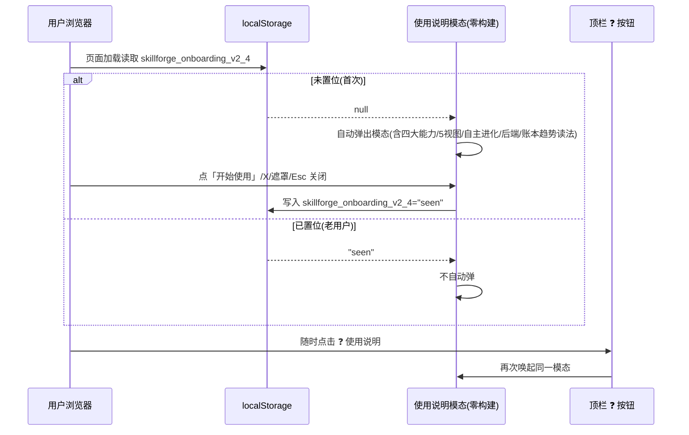
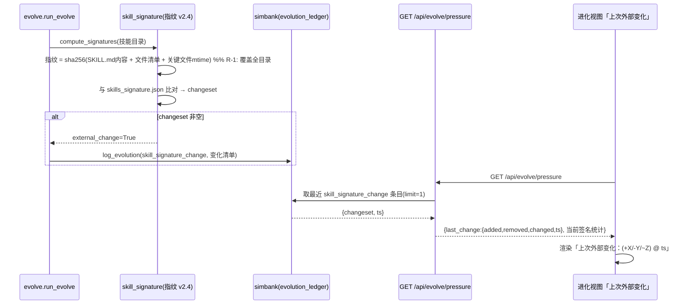
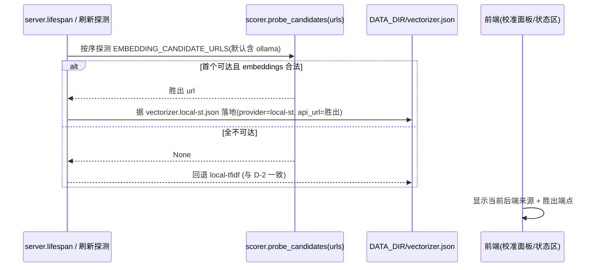

# SkillForge 增量 PRD（v2.3 → v2.4）· 上手引导 + M2 收口 + 盲区加固

> 文档版本：PRD-EVO2-4.0（增量）　|　负责人：产品经理 许清楚（software-product-manager）
> 适用范围：在 v2.3（进化压力源 + heartbeat 连续趋势 + 低水位再播种 + 趋势图单点/异常/倒计时 + 跨进程文件锁 + ollama 探测+预设落地）之上，增量交付「开始使用时可见的使用说明」、收口 v2.3 §3.2 的 M2 backlog（A-4/A-5/B-4/C-4/D-3），并修复深度读码发现的三处真实盲区（R-1/R-2/R-3）。
> 本文**仅描述本次变更**，不重写 v2.3 既有内容（真实后端抽象 / 自动循环 / 趋势采集 / 防刷屏 no-op / 跨进程锁 / 签名侦测 / heartbeat / 低水位 / 异常高亮 / 倒计时 / ollama 探测等已交付项继续沿用）。语言：中文（专有名词保留英文）。
> **硬约束（主理人已拍板，不得违反）**：① 零新增 pip 运行时依赖（仅 Python 标准库 + 现有 fastapi/uvicorn/pyyaml/tiktoken）；② 零构建前端（原生 HTML/CSS/JS，趋势图手写 SVG，不引入任何图表库）；③ GitHub 提交仅 Hyhyhyyy，代码不带 agent/CNB 标记（落地由主理人执行）；④ 版本号 `__version__` 由 `2.3.0-evo` → `2.4.0-evo`；⑤ 沿用既有接口签名，确需改动须在架构文档记录（见 §5）。

---

## 0. 项目信息（增量）

| 项 | 值 |
|----|----|
| Language | 中文（文档）/ 代码沿用 Python + 原生 HTML/CSS/JS |
| Programming Language | 后端 FastAPI（沿用 v2.3）；前端零构建原生 JS（沿用 v2.3） |
| Project Name | `skill_forge_evo_v2_4` |
| 原始需求复述 | 用户指令（verbatim）：「请继续迭代，开始使用的时候加一个使用说明，之后其他的请自行继续进行全面深入分析、查缺补漏、强化巩固和迭代升级。」即：① 新增开始使用时可见的「使用说明」；② 主理人授权自主全面深入分析、查缺补漏、强化巩固、迭代升级 |
| 版本号 | `__version__` 由 `2.3.0-evo` → `2.4.0-evo` |
| 关键代码事实（已核对 v2.3 源码） | ① `skillforge/skill_signature.py:32` `skill_md = d / "SKILL.md"` → `compute_signatures`（`:20`）**仅扫描每个技能子目录下的 `SKILL.md`** 算 sha256，改其它文件（scripts/references/assets/）而不动 SKILL.md 检测不到变化（R-1）；② `skillforge/scorer.py:370` `if _ollama_available:` 判定，模块级缓存 `_ollama_available: bool|None = None`（`:30`）在独立调用路径为 None 时走回退 local-tfidf 分支而非先探测（R-2）；③ `skillforge/server.py` 现有 evolve 端点仅有 `ledger/trends/report/bootstrap-gold/calibration/run/auto/*`，**无 `/api/evolve/pressure`**（A-4 需新增）；④ `skillforge/config.py:115` `FILELOCK_TIMEOUT_SEC`（默认 5）常量已预留，`filelock.py:6` 文档声明超时返回 `acquired=False`，但超时行为未验证、无测试（C-4）；⑤ 仓库根与 `tests/` **均无 `pytest.ini`**，`tests/` 使用 `pytest.mark.a/b/c/d` 分组（3/2/2/3 处）但未注册，触发 `PytestUnknownMarkWarning`（R-3）；⑥ 前端 `frontend/index.html` 顶栏含 5 个视图按钮（技能资产/仿真沙盘/冲突检测/数据看板/进化），`app.js` 无既有 modal/overlay 与 localStorage 用法 →「使用说明」为新增模态 + 持久化（使用说明）；⑦ `data/vectorizer.local-st.json` 预设已落地（D-1），`scorer.probe_ollama` 仅探测 `localhost:11434`（D-3 需扩展候选列表） |

### 0.1 对齐现状（v2.3 已交付 vs 本次缺口）

| 方向 | v2.3 已交付 | 本次缺口（v2.4 要补） |
|------|------------|----------|
| **上手/可观测** | 四大能力、5 视图、自主进化、后端来源、账本/趋势图均已实现可用 | 首次进入无引导说明（新用户不知四大能力/5 视图/如何跑自主进化/后端来源与自动进化开关含义/账本与趋势图怎么读）；压力源信号仅写入账本，**看板看不到"上次外部变化"**（A-4） |
| **A 闭环演进** | 进化压力源（SKILL.md 签名）+ heartbeat 连续趋势 + 低水位再播种 | 压力源**盲区**：改非 SKILL.md 文件检测不到（R-1，P0）；长空转 heartbeat metrics 可能膨胀（A-5 节流） |
| **B 趋势图** | 单点/两点渲染 + 异常高亮 + 倒计时 | 异常点**不可下钻**：点击无具体前后值与变化幅度、无法定位账本条目（B-4） |
| **C 健壮性** | 跨进程文件锁（fcntl/msvcrt，超时常量已预留） | 锁超时行为**未验证、无测试**（C-4）；模块级 `_ollama_available=None` 独立路径未先探测即回退（R-2） |
| **D 后端** | ollama 探测 + 预设落地 + 来源提示 | 仅探测 ollama 单端点，缺**多本地候选**探测（D-3） |
| **质量/测试** | 18+10 项 pytest 独立验证全绿 | 无 `pytest.ini` 注册 markers，告警未消除（R-3，P0） |

> **一句话断层**：v2.3 把闭环做"对真实变化有响应、可观测、健壮"，但① 新用户无上手引导、② 压力源对非 SKILL.md 改动是盲区（漏触发再进化）、③ 异常不可下钻、④ 锁超时与多候选后端未收口、⑤ 测试告警未清。v2.4 即补全这些"最后一公里"。

---

## 1. 产品目标（本次增量目标）

在 v2.3「闭环对真实变化有响应、可观测、健壮、embedding 开箱即用」之上，补齐**用户上手引导**、收口 **M2 可观测性/节流/异常下钻/锁降级/多候选后端**，并加固三处真实盲区（**压力源指纹覆盖全目录 / vectorizer 独立路径先探测 / 测试 markers 注册**），让系统对"用户改任意技能文件"都不再漏触发、对异常可溯源、对并发更稳、对测试更干净、对新手更友好。（1 句核心：**上手有引导、盲区全堵上、M2 收好口、测试无告警。**）

---

## 2. 用户故事（每条带验收标准，覆盖 使用说明 / A-4 / A-5 / B-4 / C-4 / D-3 / R-1 / R-2 / R-3）

### 方向 · 上手引导（使用说明，P0）

- **US-S1（开始使用时的使用说明）**：作为一名首次或任意用户，我希望进入工作台时能看到一份简明使用说明，解释本工具四大能力、5 个主视图各自用途、如何运行「自主进化」、后端来源（local-st/local-tfidf/openai）与「自动进化」开关含义、进化账本/趋势图怎么读，且可关闭、刷新不再反复弹（可由顶栏随时再唤起）。
  - *验收*：① 零构建前端在 `frontend/index.html` 顶栏新增「❓ 使用说明」按钮；② 首次进入（`localStorage` 键 `skillforge_onboarding_v2_4` 未置位）自动弹出模态说明，关闭（按钮「开始使用」/「X」/点击遮罩/Esc）后置位 localStorage，后续刷新不再自动弹；③ 模态内容覆盖四大能力、5 视图、自主进化运行方式、后端来源与自动进化开关、账本/趋势图读法（见 §4.1）；④ 任意时刻点击顶栏「❓ 使用说明」可再次唤起同一模态；⑤ 全程纯 HTML/CSS/JS，不引入任何库。

### 方向 A · 闭环演进（可观测 + 节流 + 盲区）

- **US-A4（压力源信号可观测）**：作为一名看板观察者，我希望在进化视图看到"上次外部变化"——最近一次技能集增/删/改的清单与时间，这样能直观确认压力源是否真的在侦测外界变化。
  - *验收*：① `skillforge/server.py` 新增 `GET /api/evolve/pressure`，返回最近一次 `skill_signature_change` 账本条目的解析 changeset（added/removed/changed 名称）+ 时间，以及当前签名统计（技能数/基线路径）；② 无历史变化时返回 `last_change=null`；③ 前端进化视图状态区新增「上次外部变化：(+新增X / -删除Y / ~修改Z) @ 时间」一行（无则显「暂无外部变化」）；④ 接口签名新增、不改动既有端点。
- **US-A5（heartbeat 节流）**：作为一名长跑运维者，我希望连续 no-op 且值无变化的轮次按 `HEARTBEAT_MIN_INTERVAL_SEC` 抽稀写 metrics，避免 metrics 表随时间无限膨胀，但时间序列仍连续。
  - *验收*：① 新增常量 `HEARTBEAT_MIN_INTERVAL_SEC`（默认建议 60，env 可配）；② `run_evolve` 写 heartbeat metrics 前，若「本轮 gold_coverage 与 f1 前后值均与上一行 metrics 相同」且「距上一行写入 < 该间隔」，则跳过本行写入；③ 任一值真正变化、或间隔已超阈值时**必写**，保证趋势图时间轴连续不中断；④ no-op 仍不写 ledger 业务条目（维持防刷屏语义）。
- **US-R1（压力源指纹覆盖全目录，P0）**：作为一名技能作者，我希望系统在我改动技能目录下的任意文件（SKILL.md、scripts/、references/、assets/ 等）而不动 SKILL.md 时，也能侦测到变化并触发再进化，不再漏触发。
  - *验收*：① `compute_signatures` 由"仅 SKILL.md 内容 sha256"扩展为"对技能目录的更稳定指纹"：以 SKILL.md 内容哈希 + 目录内文件清单（相对路径）+ 关键文件 mtime 组合求单值 hex；② 任一被追踪文件（含新增大文件、改 scripts/）增删改均使该技能指纹变化，下一轮触发再播种 + `skill_signature_change` 账本；③ 存储格式维持 `{技能名: hex}`（兼容既有 `skills_signature.json`），升级后首跑的基线迁移策略见 §5 Q1（架构师在 arch 文档记录，非阻塞）；④ 仅用标准库（hashlib/json/pathlib/os），零新增依赖。

### 方向 B · 趋势图（异常下钻）

- **US-B4（异常详情面板）**：作为一名审计者，我希望点击趋势图上的异常点弹出具体前后值与变化幅度，并能按时间定位到对应账本条目，便于溯源退化原因。
  - *验收*：① 复用 v2.3 异常高亮点（B-2 红色点）增加可点击交互；② 点击后弹出浮层（或侧栏）展示该点指标名、前一点值、本点值、变化幅度（绝对差 + 百分比）；③ 若该异常轮次有关联 ledger 条目（如 `skill_signature_change`/`gold_seed`），提供"定位账本"入口跳转/高亮对应行；④ 浮层可关闭，不影响正常渲染与倒计时。

### 方向 C · 健壮性（锁降级 + vectorizer 探测）

- **US-C4（锁超时与降级）**：作为一名多实例部署者，我希望跨进程锁获取超时（`FILELOCK_TIMEOUT_SEC`）后不无限等待，而是记录 warning 并安全跳过该轮进化。
  - *验收*：① 复用 v2.3 已预留 `FILELOCK_TIMEOUT_SEC`（默认 5）；② 验证 `filelock.py` 超时行为：获取超时后 `__enter__` 返回 `acquired=False`，`run_protected`/`run_once` 据此记录 warning 并安全跳过（返回跳过占位，不崩、不阻塞）；③ 补充针对超时路径的单元测试（模拟锁被占用超时）确认降级正确；④ 行为不改动既有成功路径。
- **US-R2（vectorizer 独立路径先探测，P1）**：作为一名独立调用者，我希望 `ensure_default_vectorizer()` 在 `_ollama_available` 为 None（非 lifespan 启动的独立路径）时先探测 ollama 再决定后端，而不是默默回退 local-tfidf。
  - *验收*：① `scorer.ensure_default_vectorizer` 在 `_ollama_available is None` 时主动调用 `probe_ollama`（沿用 D-2 探测，短超时）设置缓存后再分支；② 探测可用 → 落 local-st 预设，不可用 → 落 local-tfidf；③ 既有 `_ollama_available` 已为真/假路径行为不变；④ 补充测试覆盖 `None` 路径（mock 探测可用/不可用）。

### 方向 D · 后端（多候选探测）

- **US-D3（多本地后端候选探测）**：作为一名本地用户，我希望系统除 ollama 外还能探测其它本地 OpenAI 兼容端点（可配候选列表），首选可用者作为默认后端。
  - *验收*：① 新增可配候选端点列表（建议 env `EMBEDDING_CANDIDATE_URLS` 逗号分隔，默认含 `http://localhost:11434/v1/embeddings`）；② 启动/显式刷新时按序探测候选，首个可达且返回合法 embeddings 响应者胜出，写入/落地 `vectorizer.json`（`provider=local-st`）；③ `resolve_backend_source`/`GET /api/config/vectorizer` 返回胜出端点；④ 探测逻辑沿用标准库 `urllib` 短超时，零新增依赖；⑤ 全部不可达回退 local-tfidf（与 D-2 一致）。

### 方向 · 质量（测试 markers，P0）

- **US-R3（注册 pytest markers 消除告警）**：作为一名 QA/开发者，我希望仓库有 `pytest.ini` 注册 a/b/c/d 分组 marker，运行 `pytest` 不再出现 `PytestUnknownMarkWarning`。
  - *验收*：① 仓库根新增 `pytest.ini`，`[pytest]` 段注册 `markers = a/b/c/d`（与 `tests/` 实际用法一致）；② `pytest` 运行无障碍告警（`PytestUnknownMarkWarning` 消除）；③ `run_regression.sh` 同目录生效，CI 行为不变；④ 不改动测试代码分组语义，仅注册消除告警。

---

## 3. 需求池（P0 / P1，标注归属方向与编号）

> 编号体系（本次增量）：**使用说明**（上手引导，P0）、**A-4 / A-5**（A 方向可观测/节流）、**B-4**（B 异常下钻）、**C-4**（C 锁降级）、**D-3**（D 多候选）、**R-1 / R-2 / R-3**（深度读码发现的真实盲区）。P0 必须覆盖：使用说明、A-4、R-1、R-3；P1 覆盖：A-5、B-4、C-4、D-3、R-2。

### 3.1 P0 — 必须交付（M1）

| 编号 | 方向 | 需求 | 验收要点 |
|------|------|------|----------|
| **使用说明** | 上手 | **开始使用时的使用说明**：零构建前端模态，解释四大能力/5 视图/自主进化运行/后端来源与自动进化开关/账本与趋势图读法；首次自动弹、可关闭、localStorage 持久化避免反复弹、顶栏「❓ 使用说明」随时唤起 | 首进自动弹 → 关闭后置位 localStorage → 刷新不再弹；顶栏按钮可再唤起；纯 HTML/CSS/JS 无库 |
| **A-4** | A | **压力源信号可观测**：新增 `GET /api/evolve/pressure` 返回最近一次 `skill_signature_change` 账本条目的 changeset + 时间 + 当前签名统计；前端进化视图展示「上次外部变化」 | 看板可见最近一次技能集变化清单与时间；无变化显「暂无外部变化」；不改动既有端点 |
| **R-1** | A | **压力源指纹覆盖全目录**：`compute_signatures` 由仅 SKILL.md 内容哈希扩展为「SKILL.md 内容 + 文件清单 + 关键文件 mtime」稳定指纹（单值 hex），改任意文件均触发；维持 `{技能:hex}` 格式兼容 | 改 scripts/references/assets 等非 SKILL.md 文件也能触发再进化 + 账本；零新增依赖；升级首跑基线迁移见 §5 Q1 |
| **R-3** | 质量 | **注册 pytest markers**：仓库根新增 `pytest.ini` 注册 a/b/c/d，消除 `PytestUnknownMarkWarning` | `pytest` 运行无该告警；CI/run_regression 行为不变；不改测试分组语义 |

### 3.2 P1 — 重要（M2 收口）

| 编号 | 方向 | 需求 | 验收要点 |
|------|------|------|----------|
| **A-5** | A | **heartbeat 节流**：新增 `HEARTBEAT_MIN_INTERVAL_SEC`（默认 60），连续 no-op 且值无变化时按间隔抽稀写 metrics，值变/超间隔必写 | 长空转 metrics 不无限膨胀；趋势图时间轴仍连续；no-op 不写 ledger |
| **B-4** | B | **异常详情面板**：点击趋势图异常点弹出前后值与变化幅度，可定位关联账本条目 | 异常可下钻溯源；与账本联动；浮层可关不影响渲染 |
| **C-4** | C | **锁超时与降级**：验证 `filelock.py` 超时（`FILELOCK_TIMEOUT_SEC` 默认 5）返回 `acquired=False`，超时记录 warning 并安全跳过；补超时单测 | 锁占用超时后不阻塞不崩，安全跳过；超时路径有测试覆盖 |
| **D-3** | D | **多本地后端候选探测**：新增可配候选端点列表（默认含 ollama），按序探测首选可用者落地 local-st，全不可达回退 local-tfidf | 除 ollama 外可探测其它本地 OpenAI 兼容端点；返回胜出端点；零新增依赖 |
| **R-2** | C | **vectorizer 独立路径先探测**：`ensure_default_vectorizer` 在 `_ollama_available is None` 时先 `probe_ollama` 再分支；补 None 路径测试 | 独立调用不再误回退 local-tfidf；可用→local-st，不可用→local-tfidf；已为真/假路径不变 |

---

## 4. UI 设计稿（仅本次新增/变更部分）

### 4.1 ASCII 线框 · 使用说明模态（零构建，P0）

```
┌──────────────────────────────────────────────────────────────────────┐
│ 顶栏 (topbar)                                                          │
│ [技能资产][仿真沙盘][冲突检测][数据看板][进化]      [❓ 使用说明] (新增) │
└──────────────────────────────────────────────────────────────────────┘

        ┌──────────── 使用说明（首次自动弹，可关闭）────────────┐
        │ SkillForge · 个性化 Skill 资产优化工作台                │
        │ ─────────────────────────────────────────────────────  │
        │ ① 本工具做什么（四大能力）                              │
        │   · 格式校验：检查 SKILL.md 结构/字段规范                │
        │   · 语义清洗：去噪、统一表述、消歧                       │
        │   · 冗余压缩：合并重复、精简资产                         │
        │   · 调用效果追踪：记录真实调用与命中                     │
        │ ② 5 个主视图                                            │
        │   · 技能资产：浏览/校验你的技能仓库                     │
        │   · 仿真沙盘：反事实调度 / 成本延迟仿真                 │
        │   · 冲突检测：技能间规则冲突与消解                      │
        │   · 数据看板：KPI 与覆盖度总览                          │
        │   · 进化：自主进化闭环 + 趋势 + 账本                    │
        │ ③ 如何运行「自主进化」                                  │
        │   · 进化视图点「▶ 运行自主进化」手动跑一轮              │
        │   · 或开「⚙ 自动进化」开关，后台周期自跑               │
        │ ④ 后端来源 与 自动进化开关                              │
        │   · 后端：local-st(ollama) / local-tfidf / openai       │
        │   · 「自动进化」开=后台周期自跑；关=仅手动              │
        │ ⑤ 进化账本 / 趋势图 怎么读                              │
        │   · 账本：每次进化动作的时间线（含外部变化记录）        │
        │   · 趋势图：Gold 覆盖度 / F1 选对率 随时间连续演进      │
        │     （红点=异常，可点击看详情）                         │
        │                              [ 开始使用 ]                │
        └────────────────────────────────────────────────────────┘
        遮罩层点击 / Esc / X 均可关闭；关闭后置位 localStorage
```

### 4.2 ASCII 线框 · 进化视图新增「上次外部变化」+ 异常详情（A-4 / B-4）

```
┌──────────────────────────────────────────────────────────────────────┐
│ 进化看板                      [⚙ 自动进化: ●运行中]                     │
│ 状态区: 下次运行 ~12:30 (倒计时 04:51) · 后端: local-st(ollama可用)     │
│ ★ 上次外部变化: (+新技能X / -旧技能Y / ~改技能Z) @ 08-09 12:05   (A-4) │
├───────────────────────────────────┬──────────────────────────────────┤
│ 趋势图区（SVG 折线）               │ 操作按钮区                       │
│ Gold 覆盖度趋势 0~100%             │ [🌱 播种][▶ 运行][🔬 校准]       │
│  ··●──●──●─🔴──●··  (红点=异常,可点击)│ [⚙ 自动进化][🔄 刷新探测]      │
│        ↑点击红点 → 浮层(B-4):       │ 后端来源提示: local-st/...       │
│        ┌─ 异常详情 ──────────┐      │                                  │
│        │ 指标: F1 选对率(后)  │      │                                  │
│        │ 前: 0.92 → 后: 0.78 │      │                                  │
│        │ 变化: -0.14 (-15.2%)│      │                                  │
│        │ [定位账本条目]       │      │                                  │
│        └─────────────────────┘      │                                  │
├───────────────────────────────────┴──────────────────────────────────┤
│ 进化账本时间线（含 skill_signature_change，可据 B-4 高亮定位）          │
└──────────────────────────────────────────────────────────────────────┘
```

### 4.3 Mermaid · 使用说明首弹与时序（使用说明）



### 4.4 Mermaid · 压力源可观测（A-4）+ R-1 指纹计算



### 4.5 Mermaid · 多候选后端探测（D-3）



---

## 5. 待确认问题（假设先行，均不阻塞；主理人可拍板）

| 编号 | 问题 | 候选/建议（先行默认） | 主理人决策 |
|------|------|----------------------|------------|
| **Q1** | R-1 指纹升级后首跑的基线迁移（原 `skills_signature.json` 存的是旧 SKILL.md-only hex，与新全目录指纹必不同，会误报 `skill_signature_change`） | 首次运行检测到指纹 schema 版本变化则**静默重建基线**（不记 `skill_signature_change`）；在 `skills_signature.json` 增加 `_schema` 版本字段区分；架构师在 arch 文档记录迁移 | **建议静默重建基线**，升级当轮不误报 |
| **Q2** | R-1 指纹覆盖范围（是否递归扫描 assets/ 等大二进制；mtime 参与方式） | 递归所有文件清单（相对路径）+ 关键文本/配置文件（SKILL.md、scripts/、references/、*.json/*.yaml）内容哈希 + 全部文件 mtime；大二进制仅纳入清单不参与内容哈希 | **建议默认全目录清单 + 关键文件内容 + 全 mtime**，零新增依赖 |
| **Q3** | A-4 pressure 数据来源（直接读 ledger 最新条目 vs 单独 status 文件） | 直接读 `evolution_ledger` 中最近 `skill_signature_change`（limit=1）+ 当前签名统计，**零新增存储** | **建议直接读 ledger**，不改存储结构 |
| **Q4** | A-5 节流默认间隔 `HEARTBEAT_MIN_INTERVAL_SEC` | 默认 60 秒（env 可配）；保证「值真正变化」或「间隔超阈值」时必写，时间轴连续 | **建议 60s**，节流不破连续 |
| **Q5** | D-3 候选列表来源 | env `EMBEDDING_CANDIDATE_URLS`（逗号分隔），默认含 `http://localhost:11434/v1/embeddings`；沿用 `probe_ollama` 探测逻辑 | **建议 env 可配 + 默认含 ollama** |
| **Q6** | R-3 `pytest.ini` 落点 | 仓库根（pytest 自动发现，`run_regression.sh` 同目录生效），注册 `markers = a\nb\nc\nd` | **建议放仓库根** |
| **Q7** | 使用说明 localStorage 键与版本耦合 | 键 `skillforge_onboarding_v2_4`：版本升级后若说明内容大改可改键让老用户再看一次 | **建议按版本号命名键** |

> 以上均为非阻塞假设；M1（P0：使用说明/A-4/R-1/R-3）与 M2（P1：A-5/B-4/C-4/D-3/R-2）排期不受影响，工程师可按本设计默认实现后再微调。

---

## 6. 验收里程碑（排期）

- **M1（P0 上手 + 盲区 + 可观测 + 测试干净）**：使用说明、A-4、R-1、R-3。达成"首进有引导、压力源覆盖全目录不再漏触发、看板可见上次外部变化、pytest 无告警"，直接回应用户「加使用说明」诉求与两处 P0 级真实盲区。
- **M2（P1 收口）**：A-5、B-4、C-4、D-3、R-2。达成"heartbeat 节流、异常可下钻、锁超时降级、多候选后端、vectorizer 独立路径先探测"，收口 v2.3 §3.2 M2 全部 backlog 并补完剩余盲区。

> 完成 M1+M2 即把 v2.3「闭环对真实变化有响应、可观测、健壮」升级为 v2.4「上手有引导、盲区全堵、M2 收口、测试无告警」的自进化工作台。

---

*附：本文已对齐 v2.3 真实代码（`skill_signature.py:32` 仅扫 SKILL.md、`scorer.py:370` 的 `_ollama_available` None 分支、`server.py` 无 `/api/evolve/pressure`、`config.py:115` `FILELOCK_TIMEOUT_SEC` 已预留且 `filelock.py:6` 超时语义、`tests/` 无 `pytest.ini` 注册 a/b/c/d markers、前端 5 视图无既有 modal/localStorage），需求与现状一致；约束遵循零新增 pip 依赖 / 零构建前端 / 提交仅 Hyhyhyyy / 版本 `2.4.0-evo` / 沿用既有接口签名（确需改动在 arch 文档记录）。*
