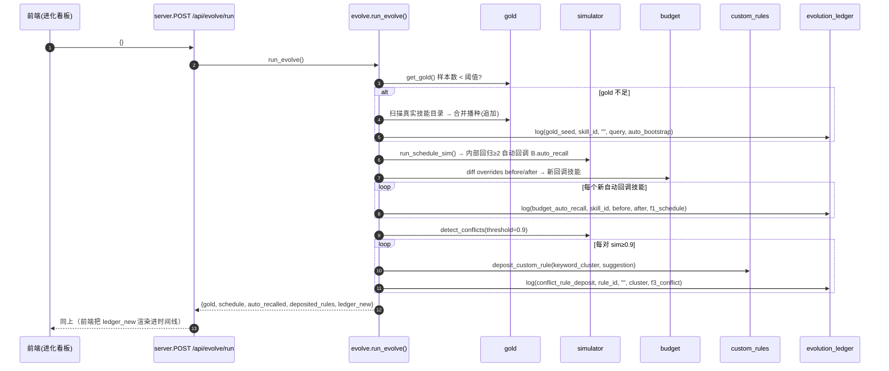

# SkillForge 自进化增量 PRD（v2.1 · 自主进化引擎 + 进化账本）

> 文档版本：PRD-EVO2-1.0　|　负责人：产品经理 许清楚（software-product-manager）
> 适用范围：在 v2.0-evo 已交付的"数据驱动自进化闭环"（F1 调度模拟 / F2 成本仿真 / F3 冲突检测 + 回归自动回调预算 + 冲突规则沉淀）之上，增量升级为**自主、可追溯、有真实信号**的进化系统。
> 约束：本文档**仅描述"做什么、为什么、接口长什么样"，不写实现代码**。v2.0 已确定内容（PRD §6 的 Q1–Q8 默认决策）继续沿用，不再重议。

---

## 1. 背景与增量目标

### 1.1 现状与痛点

v2.0-evo 已打通闭环：F1 检测到调度回归 → 累计 ≥2 自动回调预算（`skill_budget_overrides.json`）；F3 检测到高相似技能对 → 用户一键沉淀为自定义校验规则（`custom_rules.json`）。但三大盲区使"自进化"仍是**半手动、缺真信号、不可溯源**：

| 痛点 | 现状 | 后果 |
|------|------|------|
| **只能手动触发** | 闭环仅在用户点"运行模拟"时跑一次 | 不点就不演化，长期停滞 |
| **F1 信号源是合成的** | `gold_samples.json` 默认内置 24 条合成+典型样本，与用户**真实安装技能集**不一定匹配（R2） | 命中率低、闭环"空转"、自动回调不触发 |
| **动作不可溯源** | 预算回调/规则沉淀散落于多个 JSON，无统一时间线 | 无法回答"系统替我改了什么、为什么、谁触发" |
| **打分器选错难发现** | 默认 `local-tfidf`，何时该升级 embedding 无依据 | 离线打分偏差长期潜伏（R1） |

### 1.2 增量目标（3 个正交目标）

1. **GOAL-1 真实信号（Real Signal）**：开机即对用户真实技能目录自动播种 gold 样本，让闭环一开机就有与本人技能集匹配的评估信号，告别"合成样本空转"。
2. **GOAL-2 自主运行（Autonomous）**：新增"自主进化引擎"把"播种 → 模拟 → 沉淀 → 写账"串成一次调用，并支持开机自启（受开关控制），从手动闭环升级为可持续进化。
3. **GOAL-3 可追溯（Traceable）**：新增"进化账本"统一记录每一次自进化动作（谁、何时、改了谁、前后值、触发源），并支持导出进化报告，使一切沉淀可审计。

### 1.3 明确不做（Out of Scope）

- 不引入新的打分后端（沿用 `local-tfidf` / `embedding`）。
- 不做多用户/权限；不做真实 Agent 调度回路（维持离线模拟）。
- 不改 v2.0 已有的"仿真沙盘 / 冲突检测"视图与三张 SQLite 表，仅新增 `evolution_ledger` 表。
- 不自动覆写用户已精心维护的 gold 样本或自定义规则（自动播种/沉淀均为**追加**，不删不改既有条目）。

---

## 2. 用户故事（User Stories）

体现"自主 / 可追溯 / 真实信号"三主题。

- **US-E1（真实信号）**：作为一名个人开发者，我希望 SkillForge 在我首次打开时自动读取我真实安装的技能，为它们生成"这个技能大概被怎么调用"的 gold 样本，这样调度模拟立刻基于**我自己的技能集**而非一堆合成样本，我不必先手动导入才看到价值。
- **US-E2（自主）**：作为一名忙碌的维护者，我希望点一下"运行自主进化"就把"补信号 → 跑调度模拟 → 把高置信冲突自动沉淀成规则 → 把预算回调记下来"全部做完，而不是在三个面板间来回点，让我能在喝咖啡时让系统自己优化。
- **US-E3（可追溯）**：作为一名审慎的优化者，我希望随时打开"进化"看板看到一条时间线——系统什么时候替我回调了哪个技能的预算、沉淀了哪条规则、播种了哪些 gold——每一条都能看到**改之前 / 改之后**和触发原因，这样我放心把自动化交出去。
- **US-E4（校准）**：作为一名想用 embedding 的用户，我希望系统横向对比"本地 TF-IDF"和"我的 embedding"对同一批技能对的打分分歧度，告诉我离线打分到底偏不偏、该不该切后端，而不是盲切。
- **US-E5（溯源导出）**：作为一名需要汇报的人，我希望一键导出一份进化报告（Markdown/JSON），里面是这段时间系统替我做过的所有优化动作与效果汇总，便于归档与向自己/他人证明 ROI。

---

## 3. 增量需求池（Requirements Pool）

> 优先级：P0=必须（MVP 必交付）/ P1=重要（首版应包含）。验收均为可经 API 返回或 UI 断言验证。
> 编号 E1–E6 对应任务书 1–6 项。

### 3.1 P0 — 必须

**E1　进化账本（Evolution Ledger）**
- 功能点：在 `skillforge.db` 新增 `evolution_ledger` 表，记录每类自进化动作的时间戳、动作类型、对象、before/after 值、触发源、备注。覆盖动作：`budget_auto_recall`（F1 回归自动回调）、`budget_manual_override`（手动覆盖预算）、`conflict_rule_deposit`（沉淀冲突规则）、`gold_seed`（gold 播种）、`calibration`（校准）。
- 持久化：在现有动作落点（evolve 引擎 / `PUT /api/sim/budget` / `PUT /api/rules/custom` / bootstrap）写入账本；闭环中"回归自动回调"发生在 `run_schedule_sim` 内部，引擎以**前后 diff `skill_budget_overrides.json`** 捕获新回调并补记账本。
- REST：`GET /api/evolve/ledger`（分页、可按 `action_type`/`object` 过滤）、`GET /api/evolve/report`（导出 Markdown/JSON 进化报告）。
- 验收：① 任意一次上述动作后 `GET /api/evolve/ledger` 能看到对应条目且 `before_val`/`after_val`/`trigger` 非空；② `GET /api/evolve/report?format=markdown` 返回非空 Markdown 且含各 `action_type` 计数；③ 报告 JSON 的 `summary.by_action_type` 与各条目一致。

**E2　真实信号引导（Gold 自动播种）**
- 功能点：扫描用户真实技能目录（默认 `C:\Users\lenovo\.workbuddy\skills`，由新增配置 `USER_SKILLS_DIR` 控制），为每个已装技能生成一个候选 gold 样本：`skill_id = s["name"]`（见 §6 设计决策 D1，通常等于目录名）；`query` 由 description 首句启发式提取（见下方启发式）；`skill_id` 已存在于 `gold_samples.json` 的**跳过**（追加不覆盖）。当 gold 样本数 < `GOLD_SEED_THRESHOLD`（默认 3）时自动播种。
- `query` 启发式（产品级）：取 frontmatter `description` → 以 `。`/`.`/`\n` 切首句 → 去填充词；若首句过短（<8 字）或 description 为空，回退为 `s["name"]` 作 query；最终裁剪 ≤40 字。
- REST：`POST /api/evolve/bootstrap-gold`（可选 `{force?:bool}`，force=true 时忽略阈值强制按缺失技能补种）。
- 验收：① 删除 `gold_samples.json` 后调用 bootstrap，`GET /api/sim/gold` 的 `count` ≥ 已装技能数且 `skill_id` 均能在当前技能集命中；② 再次 bootstrap 不重复追加已存在 `skill_id`（幂等）；③ `force=true` 仅对缺失项补种，不删不改既有样本。

**E3　校准器（Calibration）**
- 功能点：仅当 `vectorizer.json` 后端为 `embedding` 且已配 `api_url` 时可用。抽样若干技能对（默认 `CALIBRATION_SAMPLE_PAIRS=30`，取 `local-tfidf` 相似度最高的前 N 对以保证有区分度），分别计算 `local-tfidf` 相似度与 `embedding` 相似度，输出**相关性**（Pearson/Spearman 均可，标量）与**排序分歧**（两组打分排序的 top-k 重叠率或平均序差），并列出分歧最大的若干对（`|sim_local − sim_emb|` 最大）。
- REST：`GET /api/evolve/calibration`（可选 `?limit=`）。
- 副作用：校准动作本身记入账本（`action_type=calibration`，`object="scorer"`，`before_val/after_val` 存分歧度摘要），作为"离线打分校准"痕迹。
- 验收：① embedding 未配置时返回 `{available:false, reason:...}`（HTTP 200，前端提示）；② 配置后返回 `correlation`、`rank_divergence`、`top_divergent_pairs[]`（含 `sim_local`/`sim_emb`/`diff`）；③ 调用后账本出现 `calibration` 条目。

**E4　自主进化引擎 `evolve.py`**
- 功能点：`POST /api/evolve/run` 串联执行：① 若 gold 不足则先播种（复用 E2）；② 跑 F1 调度模拟（复用 `simulator.run_schedule_sim`，其内部已实现回归≥2 自动回调）；③ 对 F3 高置信冲突（`sim ≥ CONFLICT_AUTO_DEPOSIT_THRESHOLD=0.9`）尝试自动沉淀规则（复用 `custom_rules.deposit_custom_rule`）；④ 把本轮所有自进化动作写入进化账本；⑤ 返回本轮账本新增条目与汇总。
- 复用：引擎**不重复造轮子**，只编排 `gold` / `simulator` / `simbank` / `budget` / `custom_rules`，并补记 `evolution_ledger`。
- 验收：① 空 gold + 有高相似技能对时，单次 `POST /api/evolve/run` 后：账本同时出现 `gold_seed` 与 `conflict_rule_deposit` 条目，`custom_rules.json` 新增对应规则；② 返回体含 `gold / schedule / deposited_rules / ledger_new` 四段；③ 引擎不修改 v2.0 既有 `scheduling_sim` 等表写入行为。
- **F1 回归技能的自动沉淀**（任务书 ③"对 F1 回归的技能…尝试自动沉淀规则"）处理见 §6 设计决策 D2：默认**仅自动回调预算**并记账本；F1 回归技能的规则自动沉淀作为 P1，**默认关闭**（受 `EVOLVE_AUTO_DEPOSIT_F1_RULE=false`），避免噪声规则，不阻塞 MVP。

**E5　开机自启 Hook**
- 功能点：在 `server.py` 的 lifespan/startup 增加受开关控制的钩子，默认关闭：`AUTO_EVOLVE_ON_START=true` 时启动即执行一次 gold 播种 + 一次基线 F1 模拟并写账本；默认 false，避免无预期写入。
- 验收：① 不设变量启动 → 启动过程**不**写任何 `evolution_ledger` / 不新增 gold；② 设 `AUTO_EVOLVE_ON_START=true` 启动 → 账本出现 `gold_seed` 与 `budget_auto_recall`/`schedule` 相关条目（trigger=`startup`）。

**E6　前端·进化看板**
- 功能点：顶部导航新增「进化」视图，复用现有 CSS 组件（`card`/`kv`/`badge`/`btn`/`tag`/`conflict-card`/`kpi`），不引入新设计语言。看板含：① 账本时间线（动作类型/对象/before→after/触发源/时间）；② 「🌱 播种 Gold 样本」按钮；③ 「▶ 运行自主进化」按钮；④ 「🔬 校准打分器」展示分歧（相关性/排序分歧 + 分歧最大对）；⑤ 「📤 导出进化报告」按钮（下载 `.md`）。
- 验收：① 导航出现「进化」且可切换；② 点"运行自主进化"后时间线新增 `gold_seed`/`conflict_rule_deposit` 等条目；③ 点"导出"下载到 `evolution_report.md`；④ 校准面板在未配 embedding 时显示"未启用"提示而非报错。

### 3.2 P1 — 重要

**P1-1　F1 回归技能规则自动沉淀（默认关闭）**：`EVOLVE_AUTO_DEPOSIT_F1_RULE=true` 时，对 F1 回归技能（其清洗后 description 缺失触发场景词）尝试沉淀一条 `SEMANTIC`/`REDUNDANT` 候选规则并记账本；默认 false（见 D2）。
**P1-2　账本清理/回滚**：提供"清除某条预算覆盖/规则"的入口并记账本（`action_type=budget_clear`/`rule_remove`），避免 R3（覆盖长期滞留）。
**P1-3　报告时间窗**：`GET /api/evolve/report?since=&until=` 支持按时间窗导出，便于周/月汇报。
**P1-4　看板趋势卡**：进化看板顶部 KPI（累计自进化动作数 / 自动回调技能数 / 沉淀规则数 / 最近一次进化时间）。

---

## 4. 对现有文件的影响清单

### 4.1 后端新增模块（`skillforge/`）

| 文件 | 职责 |
|------|------|
| `skillforge/evolve.py` | **自主进化引擎 + 编排层**。实现 `bootstrap_gold(force)`、`calibrate(limit)`、`run_evolve()`；调用 `gold`/`simulator`/`simbank`/`budget`/`custom_rules` 并补写 `evolution_ledger`；扫描真实技能目录（复用 `scan_skills(dirs=...)`）。 |
| `skillforge/ledger.py`（或并入 `simbank.py`） | 进化账本模型与读写：`log_evolution(action_type, object, before_val, after_val, trigger, note)`、`get_ledger(limit, action_type, object)`、`build_report(format, since, until)`。建议并入 `simbank.py` 复用 `DB_PATH` 单连接模式（与 v2.0 一致）。 |

### 4.2 后端修改模块（`skillforge/`）

| 文件 | 修改点 |
|------|--------|
| `skillforge/config.py` | 新增：`USER_SKILLS_DIR`（默认 `~/.workbuddy/skills`）、`GOLD_SEED_THRESHOLD=3`、`CONFLICT_AUTO_DEPOSIT_THRESHOLD=0.9`、`CALIBRATION_SAMPLE_PAIRS=30`、`EVOLVE_AUTO_DEPOSIT_F1_RULE=False`、`AUTO_EVOLVE_ON_START`（读环境变量，默认 False）。 |
| `skillforge/simbank.py` | 新增 `evolution_ledger` 表 + 以上账本读写函数（或放新 `ledger.py`）。 |
| `skillforge/skill_parser.py` | `scan_skills(dirs=None)` 支持可选 `dirs` 参数（默认 `SKILLS_DIRS`），供 bootstrap 只扫用户目录。 |
| `skillforge/gold.py` | 无需改；evolve 引擎用 `get_gold()` + 合并 + `set_gold(merged)` 完成追加播种（复用既有校验）。 |
| `skillforge/custom_rules.py` | 无需改；evolve 引擎复用 `deposit_custom_rule()`。 |
| `skillforge/budget.py` | 无需改；手动覆盖（`manual_recall`）的账本写入在 `server.py` 端点处补记。 |
| `skillforge/server.py` | ① 新增 5 个端点（见 §5）；② 在 `PUT /api/sim/budget`、`PUT /api/rules/custom` 落点补记账本；③ 增加 FastAPI `lifespan` 启动钩子（E5）。 |
| `skillforge/__init__.py` | 版本号升至 `2.1.0-evo`。 |

### 4.3 前端修改（`frontend/`）

| 文件 | 修改点 |
|------|--------|
| `frontend/index.html` | 顶部导航新增「进化」(`nav-evolve`) 按钮；新增 `<section id="view-evolve">` 视图骨架（账本时间线容器 + 按钮行 + 校准面板容器）。 |
| `frontend/app.js` | 新增 `bindEvolveNav()`、`renderEvolve()`（账本时间线 + 各按钮 handler：`loadLedger` / `bootstrapGold` / `runEvolve` / `loadCalibration` / `exportReport`）；对接 §5 新端点；复用 `api()/toast()/el()/esc()`。 |
| `frontend/style.css` | 复用既有变量与组件；仅补充少量承载账本时间线的类（如 `.ledger-row`、`.ledger-badge`），不引入新设计语言。 |

### 4.4 运行时持久化（非代码，运行时生成）

| 文件 | 说明 |
|------|------|
| `data/skillforge.db`（新增表 `evolution_ledger`） | 进化账本（E1） |
| `data/gold_samples.json` | 自动播种后追加用户真实技能样本（E2） |
| 无新增 JSON | 预算/规则复用 v2.0 既有 `skill_budget_overrides.json` / `custom_rules.json`，仅被引擎追加写入 |

---

## 5. 关键接口 / 数据契约草案

### 5.1 进化账本表 `evolution_ledger`（SQLite，复用 `skillforge.db`）

```sql
CREATE TABLE IF NOT EXISTS evolution_ledger (
    id          INTEGER PRIMARY KEY AUTOINCREMENT,
    ts          TEXT NOT NULL,                         -- ISO-8601 UTC
    action_type TEXT NOT NULL,                         -- gold_seed | budget_auto_recall | budget_manual_override | conflict_rule_deposit | calibration | (P1: budget_clear | rule_remove)
    object      TEXT,                                  -- skill_id 或 rule_id；校准为 'scorer'
    before_val  TEXT,                                  -- 变更前值（标量或 JSON 字符串）
    after_val   TEXT,                                  -- 变更后值
    trigger     TEXT,                                  -- f1_schedule | f3_conflict | manual | evolve_engine | auto_bootstrap | startup
    note        TEXT
);
```

`action_type` / `trigger` 取值速查：

| action_type | object | before_val / after_val 示例 | 典型 trigger |
|-------------|--------|------------------------------|--------------|
| `gold_seed` | `skill_id` | before=`""` / after=`"<query>"` | `auto_bootstrap` / `evolve_engine` |
| `budget_auto_recall` | `skill_id` | before=`"60"` / after=`"80"` | `f1_schedule` / `evolve_engine` |
| `budget_manual_override` | `skill_id` | before=`"60"` / after=`"100"` | `manual` |
| `conflict_rule_deposit` | `rule_id`(CONFLICT-NN) | before=`""` / after=`"<keyword_cluster>"` | `f3_conflict` / `evolve_engine` |
| `calibration` | `scorer` | before=`""` / after=`"corr=0.82;rank_div=0.15"` | `manual` / `evolve_engine` |

### 5.2 新增 REST 端点

> 复用既有：`GET /api/sim/gold`、`POST /api/sim/gold`、`GET /api/conflicts`、`GET /api/sim/schedule`、`PUT /api/sim/budget`、`PUT /api/rules/custom`、`GET /api/config/vectorizer`。统一 `{...}` JSON；错误沿用 `HTTPException(detail=...)`。

**GET `/api/evolve/ledger`**
- Query：`limit=50`（默认 50，最大 200）、`action_type?`、`object?`
- 响应：
```json
{
  "count": 12,
  "entries": [
    { "id": 1, "ts": "2025-09-08T12:00:00+00:00", "action_type": "budget_auto_recall",
      "object": "docx-editor", "before_val": "60", "after_val": "80",
      "trigger": "f1_schedule", "note": "调度回归累计≥2 自动回调" },
    { "id": 2, "ts": "2025-09-08T12:05:00+00:00", "action_type": "gold_seed",
      "object": "pdf-reader", "before_val": "", "after_val": "解析 PDF 提取文字",
      "trigger": "auto_bootstrap", "note": "播种真实技能 gold 样本" }
  ]
}
```

**GET `/api/evolve/report`**
- Query：`format=markdown|json`（默认 `markdown`）、`since?`、`until?`（P1-3）
- `format=json` 响应：
```json
{
  "generated_at": "2025-09-08T12:10:00+00:00",
  "summary": { "total": 12, "by_action_type": { "gold_seed": 5, "budget_auto_recall": 3, "conflict_rule_deposit": 2, "calibration": 1 } },
  "entries": [ "（同 /api/evolve/ledger 的 entries）" ]
}
```
- `format=markdown` 响应：返回 `text/markdown` 字符串（标题 + 各 `action_type` 计数表 + 时间线列表），前端用 Blob 下载为 `evolution_report.md`。

**POST `/api/evolve/bootstrap-gold`**
- 请求体（可选）：`{ "force": false }`
- 响应：
```json
{
  "seeded": 8, "skipped": 16, "total": 24,
  "samples": [ { "id": "g25", "query": "解析 PDF 提取文字", "skill_id": "pdf-reader" } ],
  "note": "已为 8 个缺失技能播种 gold 样本（既有样本未改动）"
}
```
- 语义：仅追加 `skill_id` 不在当前 gold 中的候选样本；`force=true` 忽略 `GOLD_SEED_THRESHOLD` 仍只补缺失项。

**GET `/api/evolve/calibration`**
- Query：`limit=30`（取样技能对数）
- 未配置 embedding 响应（HTTP 200）：
```json
{ "available": false, "reason": "embedding 后端未配置 api_url，无法横向对比；当前仅 local-tfidf" }
```
- 已配置响应：
```json
{
  "available": true,
  "sample_pairs": 30,
  "correlation": 0.82,
  "rank_divergence": 0.15,
  "top_divergent_pairs": [
    { "skill_a": "docx-editor", "skill_b": "office-writer", "sim_local": 0.41, "sim_emb": 0.88, "diff": 0.47 }
  ],
  "ran_at": "2025-09-08T12:20:00+00:00"
}
```

**POST `/api/evolve/run`**
- 请求体（可选）：`{ "seed_threshold": 3 }`（缺省用 `GOLD_SEED_THRESHOLD`）
- 响应：
```json
{
  "gold": { "seeded": 8, "total": 24 },
  "schedule": {
    "accuracy_before": 0.80, "accuracy_after": 0.86,
    "regressed_skills": [ { "skill_id": "docx-editor", "hits_before": 5, "hits_after": 3 } ]
  },
  "auto_recalled": [ { "skill_id": "docx-editor", "before": "60", "after": "80" } ],
  "deposited_rules": [ { "id": "CONFLICT-02", "skill_a": "docx-editor", "skill_b": "office-writer", "keyword_cluster": ["编辑","文档"] } ],
  "ledger_new": [ "（本轮写入的 evolution_ledger 条目，结构同 §5.2 /ledger）" ],
  "ran_at": "2025-09-08T12:30:00+00:00"
}
```
- 副作用：gold 不足时播种、F1 模拟（内部回归≥2 自动回调）、F3 sim≥0.9 自动沉淀规则、全部动作写账本。

### 5.3 调用时序（Mermaid：自主进化引擎）



---

## 6. 待确认问题（已用合理默认拍板，不阻塞）

| 编号 | 问题 | 决策（默认，已拍板） |
|------|------|----------------------|
| **D1** | 自动播种的 `skill_id` 用"技能目录名"还是 `s["name"]`？F1 的 `run_schedule_sim` 用 `g["skill_id"] in before`（before 的 key = `s["name"]`）判定命中。 | **默认 `skill_id = s["name"]`**（= frontmatter.name，缺失时回退目录名）。绝大多数技能不显式定义 `name`，故实际等于目录名，满足任务书"技能目录名"要求且保证 F1 立即命中。若确需严格按 `dir_name`，后续扩展 `get_skill_by_id` 式双匹配，标记为可选。 |
| **D2** | 任务书 ③"对 F1 回归的技能…尝试自动沉淀规则"如何落地？ | **默认仅自动回调预算并记账本**；F1 回归技能的规则自动沉淀列为 **P1 且默认关闭**（`EVOLVE_AUTO_DEPOSIT_F1_RULE=false`），仅当其清洗后 description 缺触发场景词时才候选沉淀，避免噪声规则。F3 高置信冲突（sim≥0.9）自动沉淀为 **P0**。 |
| **D3** | 开机自启是否会意外写入？ | 默认 `AUTO_EVOLVE_ON_START=false`；仅显式置 true 才在 lifespan 执行播种+基线 F1 模拟并写账（trigger=`startup`）。绝不静默写盘。 |
| **D4** | 校准采样哪些技能对？ | 默认取 `local-tfidf` 相似度**最高**的前 `CALIBRATION_SAMPLE_PAIRS=30` 对（保证有区分度，避免全低相似度对导致相关性无意义）。 |
| **D5** | 自动播种是否覆盖用户既有 gold？ | **只追加、不覆盖**：按 `skill_id` 去重，已存在则跳过。手动 `POST /api/sim/gold` 仍可由用户整体覆盖（维持 v2.0 行为）。 |
| **D6** | 账本与 v2.0 三张表关系？ | 独立新表 `evolution_ledger`，不改动 `scheduling_sim`/`cost_sim`/`sim_regressions`；账本聚焦"自进化动作"语义，模拟明细仍存原表。 |
| **D7** | 校准的"分歧度"用哪个指标？ | 同时输出 `correlation`（两打分序列的相关系数，标量）与 `rank_divergence`（排序 top-k 重叠率或平均序差，标量）；二者任一偏低即提示 local-tfidf 与 embedding 不一致，作为切后端依据。具体相关系数算法（Pearson/Spearman）由架构师在实现时选定，PRD 不锁定。 |

---

## 7. 验收里程碑建议（供排期）

- **M1（P0 闭环打通）**：E1 账本表+读写、E2 gold 播种、E3 校准、E4 evolve 引擎、E5 开机 hook、E6 进化看板；达成"开机有真信号 → 一键自主进化 → 全程可追溯"。
- **M2（P1 收口）**：F1 规则自动沉淀开关、账本清理/回滚、报告时间窗、看板趋势卡。

> 完成 M1 即把 v2.0 的"手动、合成信号、不可溯源"闭环升级为"自主、真实信号、可追溯"的进化系统，直接回应核心痛点。
